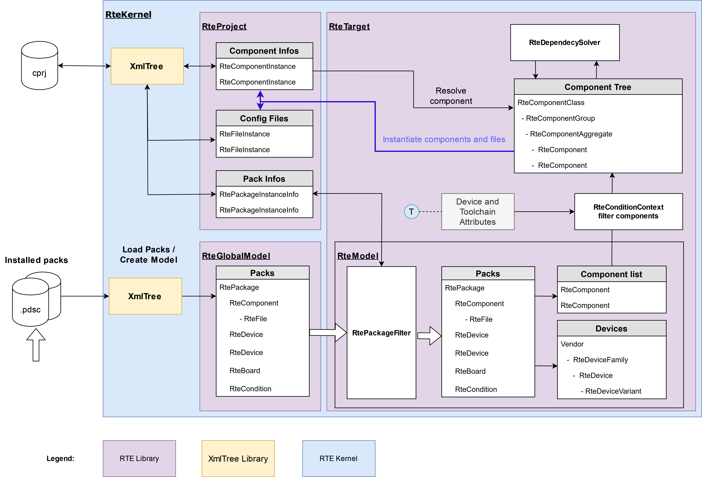
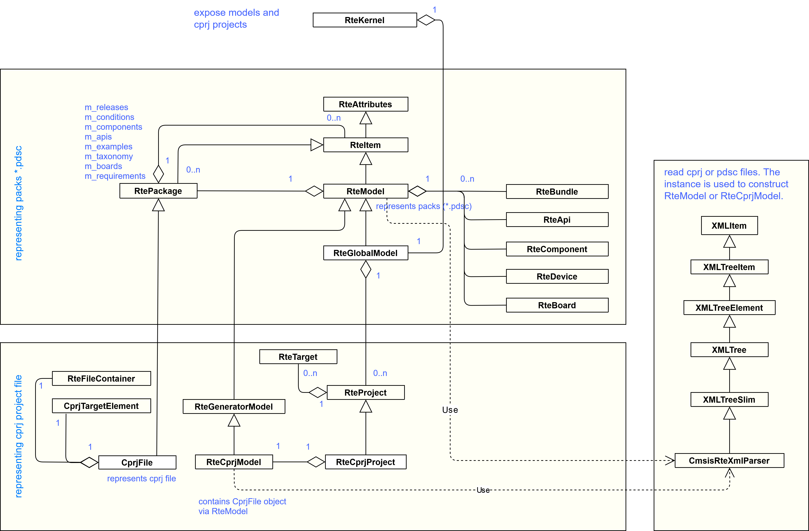
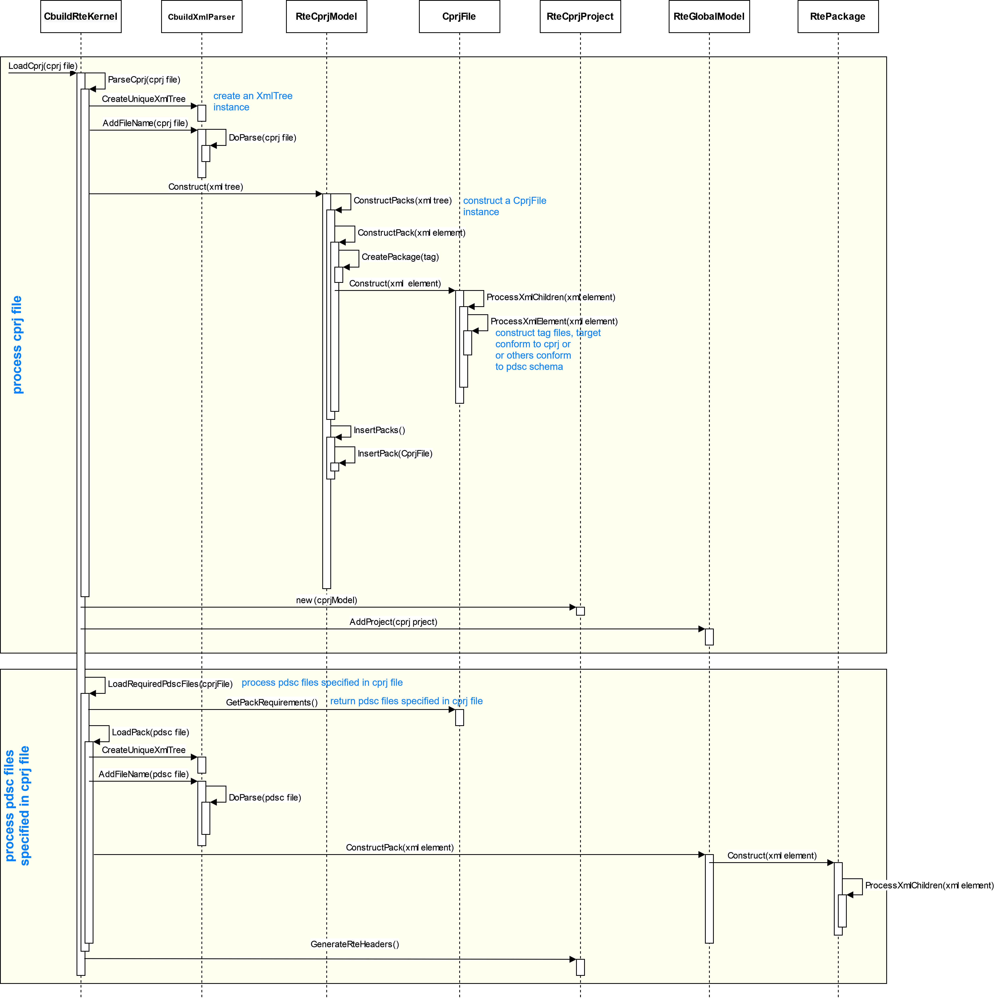
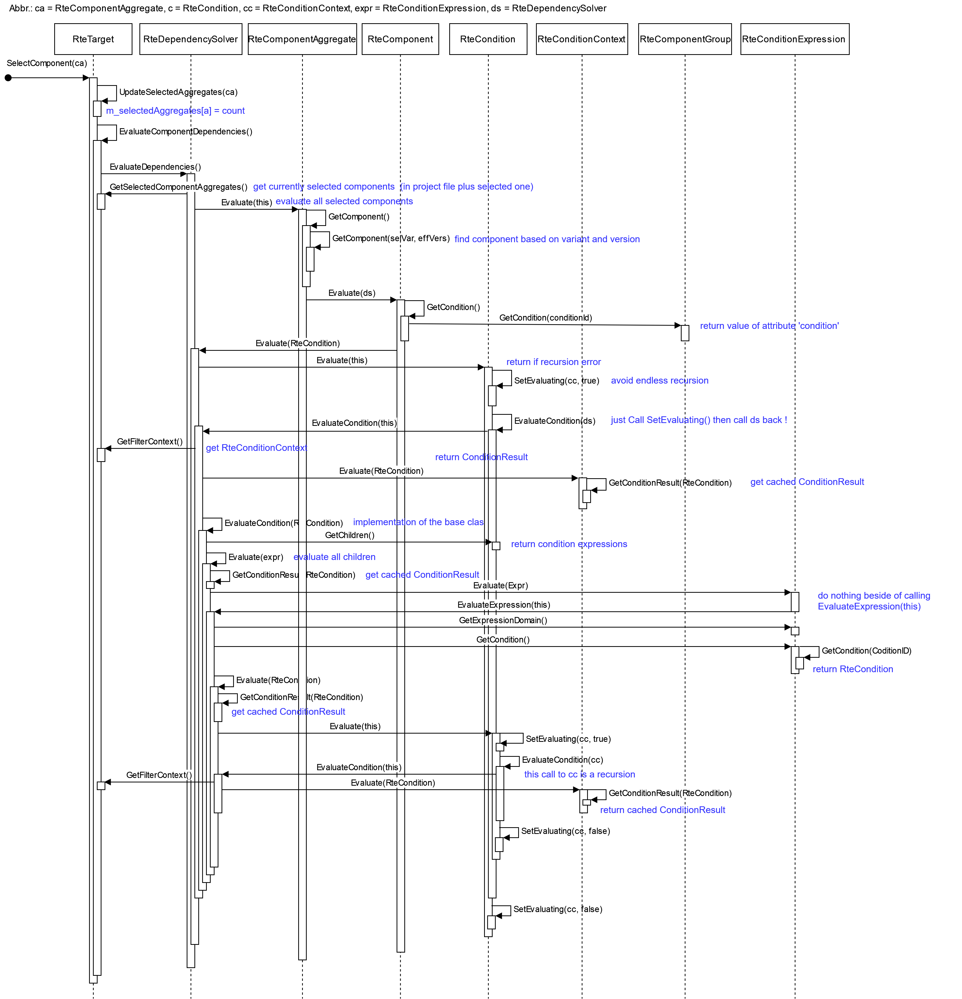

# RTE Model Library Overview

## Contents

[Scope and Terminology](#scope-and-terminology)

[RTE Model library tasks](#rte-model-library-tasks)

[Major classes](#major-classes)

[Processing version information](#processing-version-information)

- [Pack version](#pack-version)

- [Component version](#component-version)

- [API version](#api-version)

- [File version](#file-version)

- [Board revision](#board-revision)

[Condition Evaluation](#condition-evaluation)

- [Filtering Components/Files](#filtering-componentsfiles)

- [Evaluating Dependencies](#evaluating-dependencies)

- [Resolving Dependencies](#resolving-dependencies)

[Resolving Components vs Resolving Dependencies](#resolving-components-vs-resolving-dependencies)

- [Resolving Components](#resolving-components)

- [Resolving Component Dependencies](#resolving-component-dependencies)

[Diagrams](#diagrams)

- [Modules](#modules)

- [Class diagram](#class-diagram)

- [Loading project file](#loading-project-file)

- [Selecting component](#selecting-component)

## Scope and Terminology

RTE Model is a historic name of CMSIS-Pack support software.  Initially
it states for Run-Time Environment Model. The term \"RTE Model\" is
somehow ambiguous as its meaning depends on context.

- The whole CMSIS-Pack support software including all set of required
    libraries: RTEModel, RteUtils, XMLTree\
    In this sense the RTE model is responsible for reading CMSIS-Packs,
    reading/writing configuration information from/to \*.cprj files

- The RTE Model library as a set of classes responsible for
    constructing and collecting required data from CMSIS Packs at
    run-time:\
    filtering packs and pack data, selecting/filtering/resolving
    components, extracting required information like source files,
    include paths, etc.

- RteModel class that contains and manipulates filtered data

## RTE Model library tasks

RTE Model library contains classes and methods to perform the following
tasks:

- read and parse \*.pdsc and \*.gpdsc files

- construct RteModel based RteItem tree structure

- collect information about available devices, boards, components and
    API\'s

- read/write \*.cprj files

- filter packs, components, APIS and files

- perform component selection

- resolve components instantiated in the project

- resolve component dependencies

- collect files and build settings from selected device, components
    and APIs

## Major classes

The library consists of the following major classes:

- **RteItem** is the base class to maintain tree-like structure
    derived from **RteAttributes**, serves as the base for almost all
    RTE Model classes. Describes an element in a \*.pdsc file or in
    \*.cprj file.\
    The class provides all necessary low-level methods to access data in
    the element. The class is similar to **XmlTreeItem**, but uses
    another creation mechanism (it gets created from the
    **XMLTreeElement**).

- **RtePackage** describes CMSIS-Pack (\*.pdsc) or Generator Pack
    (g\*.pdsc) files as collection of **RteItem** elements.

- **RteDeviceItem** is the base class for device description elements:
    **RteDevice**, **RteDeviceVariant**, **RteDeviceSubFamily**,
    **RteDeviceFamily**

- **RteDeviceProperty** is the base class for numerous device property
    classes. The properties get collected into \"effective properties\"
    for each processor of a device.\
    The collecting algorithm starts with end-leaf device element and
    goes up in the device hierarchy. Most of the properties overwrite
    upper levels, some accumulate.

- **RteDeviceItemAggregate** is a class to organize a device tree in
    Rte Model, collecting devices from different packs

- **RteComponent** describes a software component or API. Contains
    description and collection of **RteFile** elements

- **RteCondition** contains **RteConditionExpression** child elements
    that describe component/file filtering and component dependencies.
    Note that filtering and dependency expressions are evaluated
    separately in different contexts:

  - **RteConditionContext** for component/file filtering, cashes
        result to improve performance

  - **RteDependencySolver** evaluates dependency expressions and
        cashes **RteDependencyResult**

- **RteModel** is a top-level **RteItem** hierarchy element with:

  - collections of **RtePackage** elements

  - collections of unique components (**RteComponent**), bundles,
        APIs, taxonomy and boards

  - device tree of **RteDeviceItemAggregate** items

  - methods to filter packs and components

The following classes are used for project management:

- **RteItemInstance** is the base class for items instantiated in a
    project. The derived classes provide meta-info to the model to
    resolve required packs, components and files:

  - **RtePackageInstanceInfo** - required pack info

  - **RteComponentInstance** - meta-info of a selected component

  - **RteFileInstance** represent a file in project, only used
        for\"config \"files\"

  - **RteInstanceTargetInfo** describes if pack, component or file
        is relevant for a target and how it need s to be resolved
        (ignore, fixed version, latest)

  - **RteTarget** describes RTE configuration for target.  Contains
        filtered **RteModel** as well as collections of project files
        and build settings

  - **RteProject** represent data read from a project file. Manages
        **RteTarget** items.

Tools primarily communicate with RTE Model via central class

- **RteKernel** is a singleton controller that orchestrates usage of
    RTE Model library in a tool:

  - loads installed packs and creates global model
        **RteGlobalModel**

  - loads/stores project (\*.cprj) files

  - supplies project management with RTE information and manages
        RTE-related files

  - loads generator (\*.gpdsc) files

  - serves as a controller between RTE Model classes and a tool

## Processing version information

Several pack elements provide their version information. Depending on
the item that information can be processed differently.

Most of the versions strings follow semantic versioning
((<https://semver.org/>) and got compared by VersionCmp::Compare() or
VersionCmp::RangeCompare() depending on context.

**VersionCmp** class also defines **MatchMode** enum for version match
and filtering. It is a rudiment of the time before introducing version
range concept.

```c
enum MatchMode {

ANY_VERSION, // any installed version is accepted

FIXED_VERSION, // fixed version is accepted

LATEST_VERSION,// use the latest version

EXCLUDED_VERSION // exclude specified version

};
```

Notes:

- ANY_VERSION is the default, equals to LATEST_VERSION

- EXCLUDED_VERSION  is not currently used. It was planned for
    \"black\" pack list.

All RTE elements have virtual method **GetVersionString()** first
defined in **RteAttributes** class. Some derived classes override this
method.

### Pack version

Returned by **RtePackage::GetVersionString()** method.

RTE Model take pack version from \"version\" attribute of \<release>
element , e.g.  \<release version=\"5.7.0\" date=\"2020-04-09\"\>.

Since pdsc file can have several \<release> elements, the latest is
taken and cached in **RtePackage** \"version\" attribute.

This version is used in its exact form in:

- suffix in pack\'s full ID, e.g., \"ARM.CMSIS.5.7.0\".

- part of full pdsc and pack name, such as ARM.CMSIS.5.7.0.pdsc

- path segment of installation directory:
    \$CMSIS_PACK_ROOT/ARM/CMSIS/5.7.0/

- in index.pidx file entry:  \<pdsc
  url=\"<http://www.keil.com/pack/>\" vendor=\"ARM\" name=\"CMSIS\"
  version=\"5.7.0\" />

- RtePackageFilter to define \"FIXED\" and \"EXCLUDED\" packs.

As a version range (min\[:max\]):

- pdsc file: version attribute in \<package> element of
    \<requirements> section

- cprj file: version attribute in \<package> element of \<packages>
    section

Pack version is **not used** in condition expressions.

### Component version

Defined via \"Cversion\" attribute in\<component> element.  Returned by
**RteComponent::GetVersionString()** : returns component\'s \"version\"
attribute if exists, otherwise value of bundle\'s one. Model

**RteComponentInstance** version is used to resolve component. Its
meaning depends on \"versionMatchMode\" attribute:

- exact version if MatchMode == FIXED_VERSION

- version used for the first time to instantiate the component in the
    project

Condition expressions specify Cversion as a version range.

### API version

Defined via \"Capiversion\" attribute in \<api> element, referenced
by \"Capiversion\" attribute in \<component> element.

Returned by **RteApi::GetVersionString()** and
**RteAttributes::GetApiVersionString()**.

**RteComponentInstance** stores this value only for informational
purpose.project

Condition expressions specify Capiversion as a version range and match this value against component\'s one.

### File version

Defined via \"version\" attribute in \<file> element.

Returned by **RteFile::GetVersionString()**: returns own version if
exists, parent component\'s one otherwise.

**RteFileInstance** stores this value for config files. It is
responsibility of a tool to check if a config file is outdated/no longer
compatible with the newer one.

File version is **not used** in condition expressions.

## Board revision

Boards do not specify versions, but revisions. Revision strings are
vendor-specific and usually do not follow semantic versioning rules.\
Boards of different revisions can be entirely incompatible.

Returned by **RteBoard::GetVersionString()**.

## Condition Evaluation

Conditions describe requirement on hardware (device, processor) and
toolchain as well as component dependencies.

Detailed information can be found here: :
<https://arm-software.github.io/CMSIS_5/Pack/html/pdsc_conditions_pg.html>

**RteCondition** contains **RteConditionExpression** child elements that
describe component/file filtering and component dependencies.

Note that filtering and dependency expressions are evaluated separately
in different contexts.

Any **RteItem** can have associated condition, but only
**RteComponent**, **RteFile** and **RteConditionExpression** may contain
them.

Each **RteConditionExpression** belongs to a domain:

- D : device attributes, such as Dname, Dvendor, Dcore, Dfpu, Pname,
    etc.

- T : toolchain attributes Tcompiler, Toptions

- C : component attributes such as Cclass, Cgroup, Cversion,  etc.

- c : condition expression - a reference to another condition

Conditions and their expressions are evaluated using passed
**RteConditionContext** that:

- provides attributes to match to

- caches result of each expression and condition (improves
    performance)

- detects recursion error

The result of every condition and expression evaluation is represented
by **RteItem::ConditionResult** enum:

Please note that this is not a binary logic. Dependency evaluation uses
all values, filtering only UNDEFINED, R_ERROR, FAILED, FULFILLED and
IGNORED.

## Filtering Components/Files

**RteTarget** creates **RteConditionContext** , with selected device and
toolchain attributes ( Dvendor, Dname, Dcore, Dfpu, Pname, Tcompiler,
etc.) and passes that to the **RteModel**;

**RteModel** passes that context to item\'s condition chain for
evaluation.

Only Device and Toolchain expressions are evaluated, C expressions
conditions return IGNORED result.

Expression evaluation is made my matching attributes against those
supplied by **RteConditionContext** (actually by its RteTarget\*
member):

- expression attribute is not found in supplied attributes  => matches
    (meaning there is no such restriction)

- Dvendor : DeviceVendor.Match() == true

- other attributes : WildcardMatch() == true

The result is set to FULFILLED if all attributes match, otherwise to
FAILED.

Filtering is run only on initialization and update (filtering attributes
change, pack filter change). All results get cached until next run.

## Evaluating Dependencies

```c
enum ConditionResult {

UNDEFINED, // not evaluated yet

R_ERROR, // error evaluating condition ( recursion detected, condition
is missing)

FAILED, // HW or compiler not match

MISSING, // no component is installed

MISSING_API, // no required api is installed

MISSING_API_VERSION, // no api of required version is installed

UNAVAILABLE, // component is installed, but filtered out

UNAVAILABLE_PACK, // component is installed, pack is not selected

INCOMPATIBLE, // incompatible component is selected

INCOMPATIBLE_VERSION, // incompatible version of component is selected

INCOMPATIBLE_VARIANT, // incompatible variant of component is selected

CONFLICT, // more than one exclusive component selected

INSTALLED, // matching components are installed, but not selectable
because not in active bundle

SELECTABLE, // matching components are installed, but not selected

FULFILLED, // required component selected or no dependency exist

IGNORED // condition/expression is irrelevant for the current context

};
```

Dependency evaluation is run on initialization, update and any component
selection change (selection, changing variant).

To evaluate dependencies **RteModel** passes **RteDependencySolver** to
condition chain. **RteDependencySolver** class is derived
from **RteConditionContext.**

In addition to caching ConditionResult, it caches **RteComponent** items
satisfying dependency for each evaluated component expression.

Condition evaluation is performed in the following order:

- condition is passed the original **RteConditionContext** to check if
    condition passes the filter. If it does not the condition returns
    IGNORED result

- each Component expression gets evaluated by its attributes to
    **RteTarget::GetComponentAggregates()**  method that returns
    collection of matching **RteComponentAggregate** items (if any)

- collected **RteComponentAggregate** collection is cached in the
    internal map per expression

The results of dependency evaluation are reported using tree of
**RteDependencyResult** objects. The tree gets constructed
by **RteTarget** using **RteDependencySolver** data.

## Resolving Dependencies

**RteDependencySolver** uses collected **RteDependencyResult** to
resolve the dependencies in the following loop:

- loop until all dependencies are resolved or the last iteration could
    not resolve any dependency

- iterate over **RteDependencyResult** objects

- check if **RteDependencyResult** is SELECTABLE

- check if only one alternative component is available and not
    \"custom\" one

- select the component - that triggers dependency evaluation and
    re-spins this loop

The result is reported as ConditionResult.

## Resolving Components vs Resolving Dependencies

There are two \"Resolve\" operation in RTE :

1. resolving components

2. resolving component dependencies

Although those operations work on the same data model and use same
ConditionResult enum, they serve different goals and produce different
results

## Resolving Components

This operation evaluates data provided by **RteComponentInstance** to
find **one and only one** corresponding RteComponent and selects it
in Rte Component Model.

If operation fails the ConditionResult from MISSING to UNAVAILABLE_PACK
and the Component Model creates an error RteComponent

The operation is executed on project load (\*.cprj) and pack reload. It
does not evaluate conditions during its run, but as a separate step
afterwards.

This operation is performed by **CMSIS-BUILD** tool as well.

## Resolving Component Dependencies

This operation tries to resolve component dependencies collected by
\"Evaluate Dependencies\" step by selecting an unambiguous RteComponent
items.

The operation is performed on explicit (user) request. It is **not**
executed by **CMSIS-BUILD**.

## Diagrams

### Modules

The following diagram displays usage of RTE Model. Only most important data flow steams are shown.



### Class diagram

The following diagram shows simplified class RteModel class hierarchy



### Loading project file

The following sequence diagram shows steps that CMSIS-build uses to load a \*.cprj file and required packs



### Selecting component

The following sequence diagram shows operations performed by RTE Model to select a component


