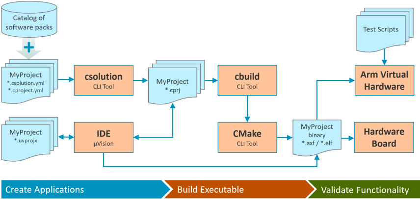
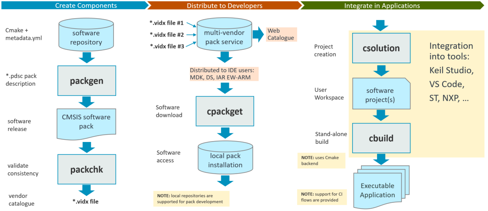

# Tools

These command-line tools provide the foundation for software development flows and are part of [**CMSIS-Toolbox**](https://github.com/Open-CMSIS-Pack/cmsis-toolbox).

**Package creation** and validation:

- [**packgen**](packgen/docs/packgen.md): create a software pack from a `CMake` based software repository
- [**packchk**](packchk/docs/packchk.md): semantic validation of a software pack description and the archive content

**Package management** including discovery of components, devices, boards and examples:

- [**cpackget**](cpackget/docs/cpackget.md): download, add and remove packs and local repositories to CMSIS_PACK_ROOT

**Project management** for constructing projects from local files and software components:

- [**csolution**](projmgr/docs/Manual/Overview.md): manage complex applications with `*.yaml` user input files and content from CMSIS-Packs; output `*.cprj` files for reproducible builds using **cbuild** in IDE and CI environments

**Build management** to compile and generate executable program images:

- [**cbuild**](buildmgr/docs/cbuild.md) (aka CMSIS-Build): convert a `*.cprj` file that describes a single target and single configuration of a project to a CMake input; start the build process.

## CMSIS-Toolbox - Download and Install

The **CMSIS-Toolbox** is currently under development but supports already a wide range of use cases.

- [**Download CMSIS-Toolbox**](https://github.com/Open-CMSIS-Pack/cmsis-toolbox/releases)
- [**Setup and Installation**](https://github.com/Open-CMSIS-Pack/cmsis-toolbox/blob/main/docs/Installation.md)
- [**Implementation Progress**](https://github.com/Open-CMSIS-Pack/cmsis-toolbox/blob/main/docs/progress.md)

## Development Cycle - Create Applications

The tools of the CMSIS-Toolbox provide a command-line interface for creating application projects that are based on software packs. The development flow is outlined in the diagram below.  An IDE that supports import and export of `*.cprj` project files is included for completeness.

Discover packs for an application by using a [*catalog of software packs*](https://www.keil.com/dd2/pack).These packs may be installed using [**cpackget**](cpackget/docs/cpackget.md) and by [**csolution**](projmgr/docs/Manual/Overview.md), for example to list devices or software components. Along with user code, these items are used to describe the application project in `*.csolution.yml` and `cproject.yml` format and convert it with [**csolution**](projmgr/docs/Manual/Overview.md) into `*.cprj` files.

These `*.cprj` files describe a reproducible build and are the input for [**cbuild**](buildmgr/docs/cbuild.md). Using different `target-types` at the `*.csolution.yml`-level allows to create applications that run on  hardware boards or simulation models (Arm Virtual Hardware).

## Development Cycle - Software Packs

The following diagram illustrates how the tools of the CMSIS-Toolbox improve the software component reuse by providing a development flow to create packs.

CMSIS software packs may be created from a CMake based repository with [**packgen**](packgen/docs/packgen.md) or directly described in the `*.PDSC` format. These packs should be verified for consistency with [**packchk**](packchk/docs/packchk.md) before publishing in a vendor index (`*.vidx`) file.

Once the pack is published it is available in a [*catalog of software packs*](https://www.keil.com/dd2/pack) and can be discovered by developers. With [**cpackget**](cpackget/docs/cpackget.md) these packs can be installed local and used to create the application program as described above.
