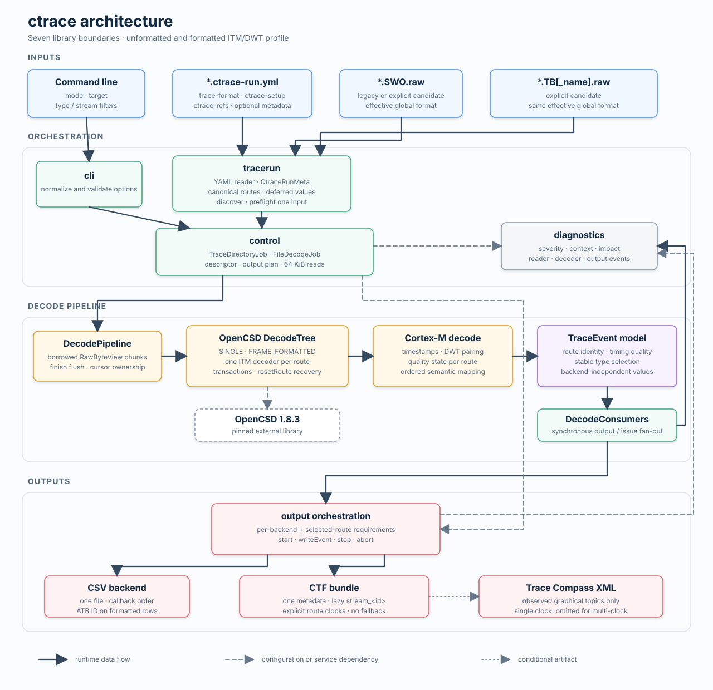

# ctrace Architecture

This document describes the internal structure of `ctrace`, the runtime data flow, and the intended extension points.
For command-line usage, build instructions, and release information, see the [project README](../README.md). The
[verified constraints](constraints.md) record preserved contracts; the compact [TODO list](todo.md) tracks remaining
work.

## Scope

`ctrace` combines a trace-run configuration with raw CoreSight trace data and converts supported trace channels into
backend-independent semantic events. Output backends consume these events to create CSV or CTF artifacts.

The first release profile supports SWO data containing ITM and DWT packets. Its stable output types are `itm`, `dwt`,
`exception`, `global_ts`, `overflow`, and `error`. DWT event-counter and PMU packets are retained internally but do
not have public output semantics yet; periodic PC samples remain disabled. Trace Bus input is discovered so that a
complete trace directory can be inspected, but `*.TB.raw` files are reported and skipped until a decoder is
implemented.

The architecture separates protocol decoding, semantic interpretation, and output generation. This keeps output
formats independent of OpenCSD and allows another raw trace channel to reuse the event model and output backends.

## Runtime flow

1. `CtraceMain` parses and validates the command line.
2. `TraceRunDiscovery` finds one or all `<solution-set>.ctrace-run.yml` files in the selected trace directory.
3. `YmlTraceRunConfigReader` reads fields used by `ctrace`; unrelated and unknown YAML fields are ignored.
4. `CtraceRunMeta` normalizes processor, timestamp, route, ITM, and DWT source metadata.
5. `TraceDirectoryJob` associates the configuration with matching raw trace channels.
6. `FileDecodeJob` creates the requested output plan and reads supported raw files in 64 KiB blocks.
7. `DecodePipeline` receives non-owning `RawByteView` values while preserving decoder state across every file-read
   boundary.
8. The OpenCSD adapter decodes ITM protocol elements and preserves decoder warnings, errors, and recovery boundaries.
9. The Cortex-M post-decoder converts protocol elements into semantic `TraceEvent` values.
10. `DecodeConsumers` forwards every event to diagnostics and the selected output backends.
11. Output lifecycle handling completes valid artifacts or removes incomplete artifacts after a fatal failure.

Without `--csv`, `--ctf`, or `--all`, the same pipeline runs in validation-only mode without creating output files.

## Module boundaries

### Entry point and orchestration

| Module | Responsibility |
|---|---|
| `src/CtraceMain.hpp` | Platform-independent entry point used by the executable trampoline |
| `src/cli` | Command-line parsing, value normalization, and validation |
| `src/control` | Solution-set orchestration, raw-file access, output setup, and per-file decode jobs |
| `src/diagnostics` | Structured diagnostics, severity tracking, and decoder issue reporting |

`control` is the composition layer. The raw-file reader is a private implementation detail of `FileDecodeJob`, not a
separate module or public abstraction. Control may depend on the other application modules, while lower-level modules
must not depend on control jobs or command-line details.

### Trace-run metadata

| Module | Responsibility |
|---|---|
| `src/tracerun` | File discovery, YAML parsing, schema subset validation, and normalized metadata |

The YAML reader intentionally consumes only data required by `ctrace`. A malformed consumed field is an error, while
an unknown field is ignored. This permits compatible trace-run format extensions without weakening validation of the
data used for decoding or output generation.

`CtraceRunMeta` is the boundary between the YAML representation and runtime processing. Decode and output modules use
normalized metadata instead of navigating YAML nodes.

### Decode and event model

| Module | Responsibility |
|---|---|
| `src/decode` | Raw-byte decoder interface, OpenCSD integration, packet recovery, timestamps, and Cortex-M semantics |
| `src/model` | Backend-independent event types, quality information, and event selection |

OpenCSD is isolated behind adapter classes in `src/decode`. OpenCSD-specific elements do not escape into the output
modules. The post-decoder maps them to `TraceEvent` variants such as software trace, DWT data, exceptions, timestamps,
overflow, and trace issues. `TraceSelection` owns the stable public type names and maps semantic events onto that
release-facing set.

Each event can retain its raw index, Trace Bus ID, timestamp, and quality state. This allows diagnostics and backends
to make independent decisions without reconstructing decoder state.

### Output

| Module | Responsibility |
|---|---|
| `src/output` | Backend requirements, output planning, and lifecycle management |
| `src/output/csv` | Stable CSV schema, row mapping, filtering, and file output |
| `src/output/ctf` | CTF metadata and stream encoding plus Trace Compass analysis XML |

Output requirements are evaluated per backend. For example, missing CTF-specific metadata may disable CTF while an
independent CSV output remains valid. `--all` therefore does not make the backends share failure state unnecessarily.

Outputs use an explicit `start`, `writeEvent`, `stop`, and `abort` lifecycle. A successful backend can finish even if
another backend fails. Fatal decode or finalization failures trigger cleanup of incomplete artifacts.

## Diagnostics and failure semantics

Diagnostics carry a severity, category, code, message, context, and impact. Severity describes the issue, while impact
determines whether the current job must fail. This distinction allows a trace-run generation error to remain visible
without necessarily preventing the decoding of otherwise valid trace input.

Decoder issue packets remain part of the event stream. They can therefore be written to CSV or CTF and reported to
stderr independently of payload filters. Repeated issues are not silently collapsed.

Processing continues with other solution sets where possible. The executable exits with a non-zero status if any
fatal diagnostic occurred.

## External dependencies

| Dependency | Use |
|---|---|
| `cxxopts` | Command-line parsing |
| `yaml-cpp` | Trace-run YAML parsing |
| `OpenCSD` 1.8.3 | ITM protocol decoding; pinned as a repository submodule |
| GoogleTest | Unit-test framework; not linked into the product executable |

Dependencies are provided by the devtools repository. `tools/ctrace` does not maintain private library copies.

## Extension points

### Add a raw trace channel

Implement a decoder that produces `TraceEvent` values, add it below `src/decode`, and select it in the control layer
for the corresponding channel. A Trace Bus implementation should replace the current warning and skip behavior while
reusing diagnostics, event selection, and output backends.

### Add an event type

Extend the model and its stable type names first. Then update the relevant decoder, selection behavior, and every
backend that can represent the event. Tests should cover semantic mapping separately from backend serialization.

### Add an output backend

Implement `TraceOutput`, define backend-specific preflight requirements, and add it to the output plan and lifecycle.
Do not introduce backend-specific state into the decode pipeline or event model.

## Test architecture

Unit tests under `test/unit/src` mirror the production modules. Shared file, event, and diagnostic helpers live under
`test/unit/support`. GoogleTest discovery registers every test case separately with CTest, so IDEs and CI can execute
individual cases.

Integration tests under `test/integration` execute the real `ctrace` binary and verify command-line behavior,
diagnostics, output cleanup, and fixture conversion. Test data and expected artifacts live under `test/data`; generated
files are written only below the CMake build directory.

The `CtraceUnitTests` target preserves one CI entry point while linking the ctrace modules explicitly. Integration
tests use the `ctrace-` CTest name prefix. The release workflow runs them on Windows AMD64, Linux AMD64, Linux Arm64
through QEMU, and a native macOS Arm64 runner. Windows Arm64 is cross-built on an x64 runner and its PE machine type
is verified without executing the binary.

## Build and release structure

The source tree has seven static library targets: `model`, `cli`, `trace-run`, `diagnostics`, `decode`, `output`, and
`control`. The `ctrace` executable adds only the platform trampoline and `CtraceMain`. Dependencies form a directed,
cycle-free graph with `control` as the composition root.

The tool-specific GitHub workflow is selected by a `tools/ctrace/<version>` release tag. It builds Windows AMD64 and
Arm64, Linux AMD64 and Arm64, and macOS Arm64 binaries. The release archive contains the Apache-2.0 project license,
third-party notices, the exact cxxopts, yaml-cpp, and OpenCSD license texts, and per-file SHA-256 checksums. A separate
checksum verifies the archive. The version compiled into the executable is derived from the same tag.

The checked-in SWO and TB captures are approved ctrace test assets and may be redistributed with devtools. Together
with the tool-specific build, test, packaging, versioning, and license integration, this forms the technical basis for
the first open-source release.

## Architectural constraints

- Runtime dependencies point from orchestration toward decode, model, and output modules.
- Output modules consume semantic events and never OpenCSD packet types.
- YAML nodes do not cross the `tracerun` boundary.
- Diagnostics are structured and are not inferred from formatted stderr text inside the application.
- Output backends own their artifacts and must support cleanup after partial failure.
- Published test fixtures must be approved for redistribution and must not contain private or unstable trace
  payloads.
