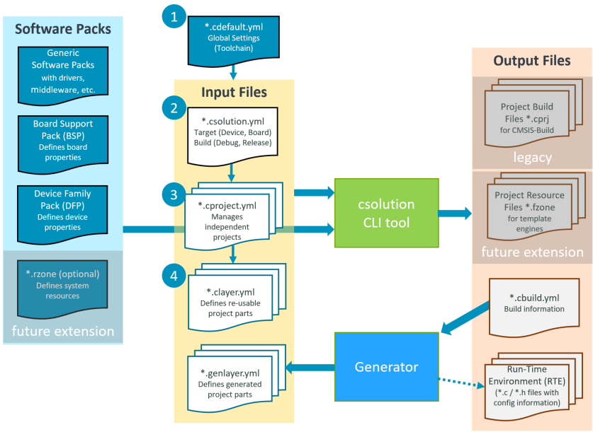

# Generator Workflow (Proposal)
<!-- markdownlint-disable MD013 -->

>**NOTE:** This document replaces [Generator Proposal](https://github.com/Open-CMSIS-Pack/devtools/blob/main/tools/projmgr/docs/Manual/YML-Input-Format.md#generator-proposal) in previous documentation.

The composition of a `csolution` based application should have the following steps:

- Create the `*.csolution.yml` container that refers the projects and selects `device:` or `board:`
  (optionally by using `target-types:`)
- Create `*.cproject.yml` files that are referred by the `*.csolution.yml` container.
- Add `components:` and/or `layers:` to the `*.cproject.yml` file
- For components that have configuration, run the generator in configuration mode
  - change pinout, clock, resources, etc.
  - reflect configuration in *.gpdsc file (and related settings files)

> **Note:** Components can have multiple instances.

## Workflow

The following explains the generator workflow of CSolution / CBuild for configuration of components:

1. User selects components in `*.cproject.yml` under `components:` and runs `csolution` tool with `convert` command.
    - `csolution` tool generates `*.cbuild.yml` file that provides project context and a list of user-selected components.
    - When a component requires generation (related `*.genlayer.yml` file is missing), user is notified to run the generator.
      This is also reflected in a `message: - error:` that is part of `*.cbuild.yml`.
  
2. Run the Generator (for component configuration, i.e. pin selection)
     - Generator reads `*.cbuild.yml` file
     - Generator may provide
         - Interactive mode with user interactions
         - Script mode where a settings are provided in an input file
     - Generator/User generates a `*.genlayer.yml` file; syntax is similar to a clayer.yml file.  This file informs the `csolution` tool about:
         - (a) the fact that a component is configured and has generated code,
         - (b) additional components that are the result of some user configuration.

3. User runs `csolution` tool with convert command again.  There might be consistency check between the `*.genlayer.yml` and user
   input files.  If no new component that requires generation is selected (all components are also included in `*.genlayer.yml`)
   the convert command completes, otherwise a user notification might be displayed.

>**NOTE:** This is a basic workflow that still requires an iteration for IDE integration.

### Example Content of \*.genlayer.yml (in this case STM32CubeMX.genlayer.yml)

```yml
generator:
  generated-by: STM32CubeMX <command-line>
  for-device: STM32F407IGHx    # only for consistency check
  for-board: NucleoF407        # only for consistency check

  packs:                       # packs that are used by the generator (consistency check, but may supply version information)
    - pack: Keil::STM32F4xx_DFP@2.16.1
    - pack: Keil::STM32F4xx_BSP@2.1.1

  components:               # components that have a genid and are specified in *.cproject.yml / *.clayer.yml must be in this list
                            # but additional components can be supplied by the generator
    - component: Device:STM32Cube HAL:Common
    - component: Board:LED
    - component: Device:HAL:UART

  groups:
    ...

  interfaces:
    ...

```

This diagram reflects the modified workflow:



The `*.genlayer.yml` files are added by indirectly by components that refer to a generator ID and are stored in a defined RTE
directory, i.e. `./RTE/Device`.  This directory may also store other artifacts used by the Generator.

As it is proposed to make each RTE Cclass section configurable, this would allow to store multiple configuration (i.e. depending
on the software layer used).

- Example for a .clayer with RTE directory settings is
  [here](
https://github.com/RobertRostohar/Demo_EW/blob/test_rte/AWS_MQTT_MutualAuth_Demo/Board/B-U585I-IOT02A/Board.clayer.yml).

- Complete project is [here](https://github.com/RobertRostohar/Demo_EW/tree/test_rte/AWS_MQTT_MutualAuth_Demo).

The proposal is therefore to add `RTE-paths:` to `*.project.yml` and `*.clayer.yml` that is also used to store generated information.  
This controls for each `Cclass` the location of the generated files.  This proposal was already discussed in the
[TR on 2022-08-23](https://linaro.atlassian.net/wiki/spaces/CMSIS/pages/28757721476/Open-CMSIS-Pack+Technical+Meeting+2022-08-23).

```yml
  RTE-paths:
  - Board_Support: <local-path>
  - Compiler: <local-path>   
  - CMSIS Driver: <local-path>
  - Device: <local-path>
```


Combined with the [proposal to store pre-configured layers in software packs](https://github.com/Open-CMSIS-Pack/Open-CMSIS-Pack-Spec/issues/134), this gives user starting points for own projects.

## Consolidated Changes to *.PDSC

### [\<generator\> element](https://open-cmsis-pack.github.io/Open-CMSIS-Pack-Spec/main/html/pdsc_generators_pg.html)

- Add \<exe-csolution\> element that specifies the new method for the csolution tool.  Could be similar to
  [\<exe\> element](https://open-cmsis-pack.github.io/Open-CMSIS-Pack-Spec/main/html/pdsc_generators_pg.html#element_gen_exe).
  The remaining methods would be kept for legacy.

- Add Variable: `$R` Specifies the RTE directory that stores generator artifacts. This is configurable using `RTE-paths:` at
  project level.

### [\<components\> element](https://open-cmsis-pack.github.io/Open-CMSIS-Pack-Spec/main/html/pdsc_components_pg.html)

- Add `genId` attribute to indicate that a component is managed by the `<generator>`.

- Add new file categories:
  - `genSource` source code templates for the generator
  - `genHeader` header file templates for the generator
  - `genParams` parameter templates for the generator
  - `genInfo` other information files for the generator

>**NOTE:** Attribute [`visiblity`](https://github.com/Open-CMSIS-Pack/Open-CMSIS-Pack-Spec/issues/112) is a separate pull request.

**Possible Example:**

```xml
 <generators>
    <!-- This generator is launched if any component referencing this generator by 'id' is selected and the specified <gpdsc> file does not exist -->
    <generator id="STCubeMX">
      <description>ST Microelectronics: STCubeMX Environment</description>
      <RTE-Cclass>Device</RTE-Cclass>
      <exe-csolution>
        <command host = "win">STCube --cbuild-in $G --out $R</command>
        <command host = "linux">STCube --cbuild-in $G --out $R</command>
      </exe-csolution>
      <workingDir>$R</workingDir> <!-- path is specified either absolute or relative to gpdsc file -->
    </generator>
  </generators>

  <taxonomy>
    <description Cclass="Device" generator="STCubeMX" doc="Documentation/DM00105879.pdf" >STM32F4xx Hardware Abstraction Layer (HAL) and Drivers</description>
    <description Cclass="Board" generator="ST2CubeMX" doc="Documentation/DM00105879.pdf" >STM32F412 Board Abstraction Layer (HAL) and Drivers</description>
  </taxonomy>


    <component Cclass="Device" Cgroup="STM32Cube HAL" Csub="Common"    Cversion="1.7.9" condition="STM32F4 HAL Common"  genid="STCubeMX" >
      <description>Common HAL driver</description>
      <RTE_Components_h>
        #define RTE_DEVICE_HAL_COMMON
      </RTE_Components_h>
      <files>
        <file category="include" name="Drivers/STM32F4xx_HAL_Driver/Inc/"/>
        <file category="header"  name="Drivers/STM32F4xx_HAL_Driver/Inc/stm32f4xx_hal.h"/>
        <file category="source"  name="Drivers/STM32F4xx_HAL_Driver/Src/stm32f4xx_hal.c"/>
        <file category="genParams" name="Drivers/STM32F4xx_HAL_Driver/Src/stm32f4xx_hal.json"/>
        <file category="genHeader" name="Drivers/STM32F4xx_HAL_Driver/Src/stm32f4xx_hal.h.template"/>
        <file category="genSource" name="Drivers/STM32F4xx_HAL_Driver/Src/stm32f4xx_hal.c.template"/>
      </files>
    </component>
    <component Cclass="Device" Cgroup="STM32Cube HAL" Csub="ADC"       Cversion="1.7.9" condition="STM32F4 HAL DMA"  genid="STCubeMX">
      <description>Analog-to-digital converter (ADC) HAL driver</description>
      <RTE_Components_h>
        #define RTE_DEVICE_HAL_ADC
      </RTE_Components_h>
      <files>
        <file category="source" name="Drivers/STM32F4xx_HAL_Driver/Src/stm32f4xx_hal_adc.c"/>
        <file category="source" name="Drivers/STM32F4xx_HAL_Driver/Src/stm32f4xx_hal_adc_ex.c"/>
        <file category="genParams" name="Drivers/STM32F4xx_HAL_Driver/Src/stm32f4xx_hal_adc.json"/>
        <file category="genHeader" name="Drivers/STM32F4xx_HAL_Driver/Src/stm32f4xx_hal_adc.h.template"/>
        <file category="genSource" name="Drivers/STM32F4xx_HAL_Driver/Src/stm32f4xx_hal_adc.c.template"/>
      </files>
    </component>
    :
    <bundle Cbundle="STM32F4-Discovery" Cclass="Board Support" Cversion="2.0.0">
      <description>STMicroelectronics STM32F4 Discovery Kit</description>
      <doc>http://www.st.com/st-web-ui/static/active/en/resource/technical/document/data_brief/DM00037955.pdf</doc>
      <component Cgroup="LED" Capiversion="1.0.0" condition="STM32F4 HAL GPIO" genid="STCube">
        <description>LED Interface for STMicroelectronics STM32F4-Discovery Kit</description>
        <files>
          <file category="source"  name="MDK/Boards/ST/STM32F4-Discovery/Common/LED_F4Discovery.c"/>
          <file category="genParams" name="MDK/Boards/ST/STM32F4-Discovery/Common/LED_F4Discovery.json"/>
          <file category="genHeader" name="MDK/Boards/ST/STM32F4-Discovery/Common/LED_F4Discovery.h.template"/>
          <file category="genSource" name="MDK/Boards/ST/STM32F4-Discovery/Common/LED_F4Discovery.c.template"/>
        </files>
      </component>
    </bundle>
```
