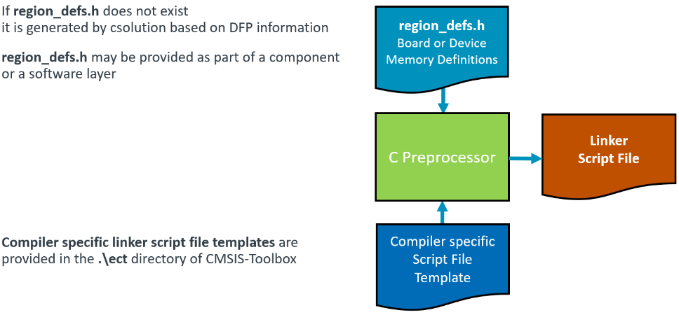

# Linker Script File Handling (Proposal)
<!-- markdownlint-disable MD013 -->

This is a proposal for resource handling that is based on information that is provided in Device Family Packs (DFP) and Board Support Packs (BSP).

The Linker Script contains a series of Linker directives that specify the available memory and how it should be used a project. The Linker directives reflect exactly the available memory resources and memory map for the project context.

Linker Script files are provided using the `file:` notation under [`groups:`](#groups) or as part of software components. The extensions `.sct`, `.scf` and `.ld` are automatically recognized as linker script files. The benefit is that linker script files can be part of software components.

If a project context does not specify any linker script it could be generated using information of the header file `region_defs.h`.

If no `region_defs.h` is available, it could be generated using the information from the `<memory>` element of:
 - [`<device>` element in the DFP](https://open-cmsis-pack.github.io/Open-CMSIS-Pack-Spec/main/html/pdsc_boards_pg.html#element_board_memory)
 - [`<board>` element in the BSP](https://open-cmsis-pack.github.io/Open-CMSIS-Pack-Spec/main/html/pdsc_family_pg.html#element_memory)

The process is shown in the picture below.

