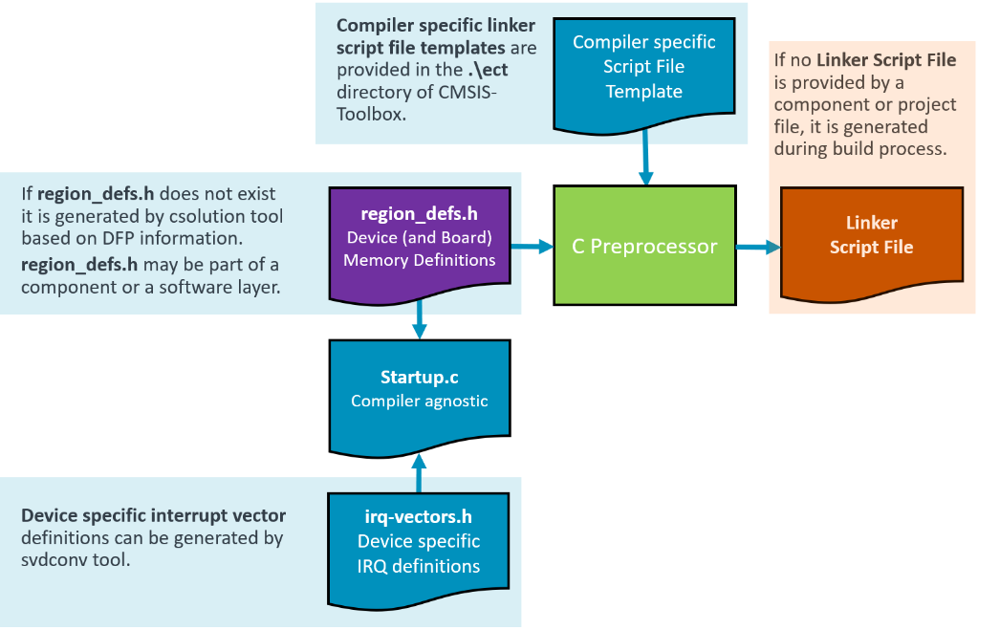

# Linker Script File Handling (Proposal)

<!-- markdownlint-disable MD009 -->
<!-- markdownlint-disable MD013 -->
<!-- markdownlint-disable MD036 -->

This is a proposal for resource handling that is based on information that is provided in Device Family Packs (DFP) and Board Support Packs (BSP).

**Table of Contents**

- [Linker Script File Handling (Proposal)](#linker-script-file-handling-proposal)
  - [Introduction](#introduction)
  - [Automatic Linker Script generation](#automatic-linker-script-generation)
    - [File locations](#file-locations)
  - [User Modifications to Memory Regions](#user-modifications-to-memory-regions)
  - [File Overview](#file-overview)
  - [Questions](#questions)
  - [YAML Input File extension](#yaml-input-file-extension)
    - [`linker:` control script generation](#linker-control-script-generation)
  - [`region_defs.h` template file](#region_defsh-template-file)

## Introduction

The Linker Script contains a series of Linker directives that specify the available memory and how it should be used by a project. The Linker directives reflect exactly the available memory resources and memory map for the project context.

Linker Script files are provided using the `file:` notation under [`groups:`](YML-Input-Format.md#groups) or as part of software components. The extensions `.sct`, `.scf` and `.ld` are automatically recognized as linker script files. The benefit is that linker script files can be part of software components.

## Automatic Linker Script generation

If a project context does not specify any linker script it could be generated using information of the header file `region_defs.h`.

If no `region_defs.h` is **not** available, it is generated based on information of the software packs using the:

- [`<device>` - `<memory>` element in the DFP](https://open-cmsis-pack.github.io/Open-CMSIS-Pack-Spec/main/html/pdsc_boards_pg.html#element_board_memory)
- [`<board>` - `<memory>` element in the BSP](https://open-cmsis-pack.github.io/Open-CMSIS-Pack-Spec/main/html/pdsc_family_pg.html#element_memory)

### File locations

The file `region_defs.h` and the Linker Script file should be generated in the directory `\RTE\Device\<device-name>`.  

It should be evaluated if `board:` specific `region_defs.h` files could have a name specific to the board and located in the same directory or if it is required to store it in a directory `\RTE\Board\<board-name>` (see Questions below).

## User Modifications to Memory Regions

The file `region_defs.h` should be user modifiable as it might be required to adjust the memory regions or give additional attributes (such as `noinit`).  Therefore this file should have [Configuration Wizard Annotations](https://open-cmsis-pack.github.io/Open-CMSIS-Pack-Spec/main/html/configWizard.html). It might be consider to generate this file using a file template provided in the `.\etc` directory.

## File Overview

The picture below gives an overview and explains the relationship between the different files. It includes also a compiler agnostic `Startup.c` file/

## Questions

- Is it possible to specify the name of the `region-defs.h` file for the C Preprocessor step?  In this way the filename `region-defs.h` could be flexible. Consider that a system with a `board:` may require a different `region-defs.h` files.  Same may apply for different project contexts that require fine tuning of memory regions.
- Is it required to include `region-defs.h` in `Startup.c` (i.e. to define the heap)? If not, that would simplify `Startup.c`.
- This proposal should work well for single-processor devices.  For multi-processor devices or devices with TrustZone an interface to a CMSIS-Zone tool might be required. Should we add already provisions?
- Is there Linker Script support for all toolchains with: (a) multiple regions, (b) startup attribute, (c) noinit attribute?  (see `region_defs.h` template file below).

## YAML Input File extension

### `linker:` control script generation

>**Proposal for Implementation:** Linker Control in `*.cproject.yml` or `*.clayer.yml` input files.

When no `linker:` node is specified in `*.cproject.yml` or `*.clayer.yml` input files, the Linker Script file should be provided using the `file:` notation under [`groups:`](YML-Input-Format.md#groups) or as part of software components. The extensions `.sct`, `.scf` and `.ld` are recognized as Linker Script files.

> ToDo: The extension *.sct is considered unsafe under Windows operating systems, add a check in `packchk` tool.

The `linker:` list node controls the linker operation.

`linker:`                                             |              |  Content
:-----------------------------------------------------|:-------------|:--------------------------------
`- regions:`                                          |  Optional    | Path and file name of `region_defs.h`, used to generate a Linker Script
&nbsp;&nbsp; [`for-compiler:`](YML-Input-Format.md#for-compiler)         |   Optional   | Include Linker Script for the specified toolchain.
&nbsp;&nbsp; [`for-context:`](YML-Input-Format.md#for-context)           |   Optional   | Include Linker Script for a list of *build* and *target* types.
&nbsp;&nbsp; [`not-for-context:`](YML-Input-Format.md#not-for-context)   |   Optional   | Exclude Linker Script for a list of *build* and *target* types.
`- script:`                                           |   Optional   | Explicit file name of the Linker Script, overrules files provided with `file:` or components.
&nbsp;&nbsp; [`for-compiler:`](YML-Input-Format.md#for-compiler)         |   Optional   | Include Linker Script for the specified toolchain.
&nbsp;&nbsp; [`for-context:`](YML-Input-Format.md#for-context)           |   Optional   | Include Linker Script for a list of *build* and *target* types.
&nbsp;&nbsp; [`not-for-context:`](YML-Input-Format.md#not-for-context)   |   Optional   | Exclude Linker Script for a list of *build* and *target* types.
`- script-template:`                                  |   Optional   | Path and file name of a Linker Script template. If not used, the `.\etc` directory is searched.
&nbsp;&nbsp; [`for-compiler:`](YML-Input-Format.md#for-compiler)         |   Optional   | Include Linker Script for the specified toolchain.
&nbsp;&nbsp; [`for-context:`](YML-Input-Format.md#for-context)           |   Optional   | Include Linker Script for a list of *build* and *target* types.
&nbsp;&nbsp; [`not-for-context:`](YML-Input-Format.md#not-for-context)   |   Optional   | Exclude Linker Script for a list of *build* and *target* types.

>**Note:**
>
> Specifying both a `- script:` file and a `- regions:` file results in a error at `csolution` tool.

## `region_defs.h` template file

A `region_defs.h` template file should be pre-annotated using [Configuration Wizard Annotations](https://open-cmsis-pack.github.io/Open-CMSIS-Pack-Spec/main/html/configWizard.html) and could include:

- memory regions defined by [MemoryID](https://open-cmsis-pack.github.io/Open-CMSIS-Pack-Spec/main/html/pdsc_family_pg.html#MemoryIDTypeEnum) in DFP or BSP
  - memory names (when available) in comment annotations
- a way to specify the `startup` attribute.
- a way to set the `uninit` attribute.
