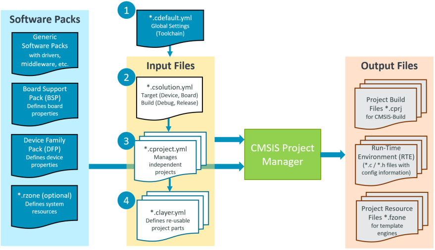
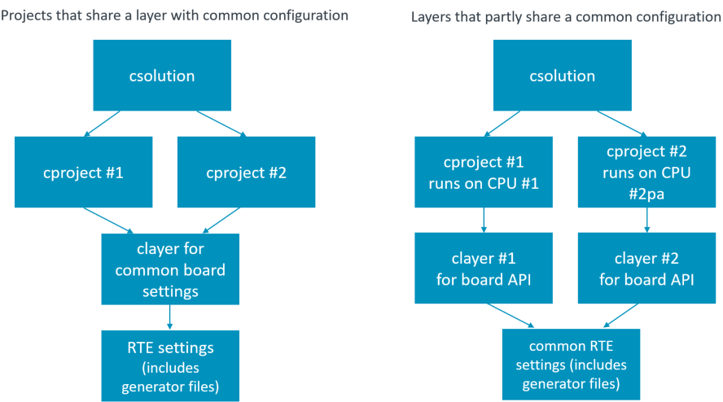
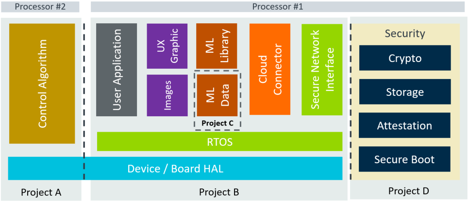

# csolution: CMSIS Project Manager - Users Manual (Draft)

<!-- markdownlint-disable MD013 -->
<!-- markdownlint-disable MD036 -->

Manual Chapters                                         | Content
:-------------------------------------------------------|:-------------------------
[Usage](#usage)                                         | Overall Concept, tool setup, and invocation commands.
[Project Examples](#project-examples)                   | Various example projects to get started.
[Project Structure](#project-structure)                 | Overall structure of projects.
[YML Input Format](YML-Input-Format.md)                 | Format of the various YAML input files (`*.csolution.yml`, `*.cproject.yml`, `*.clayer.yml`, `cdefault.yml`).
[Linker Script Management](Linker-Script-Management.md) | Specify the available memory and control the linker operation.
[Build Operation](Build-Operation.md)                   | Build process overview and toolchain interface for adding additional compilers.
[YML CBuild Format](YML-CBuild-Format.md)               | Format of the YAML CBuild output file.
[Reference Application Framework](RefApp-Framework.md)  | Enables example projects that scale across many boards and production hardware.

> **Note:**
>
>This documentation uses the filename extension `*.yml`, but the extension `*.yaml` is also supported.

**Table of Contents**

- [csolution: CMSIS Project Manager - Users Manual (Draft)](#csolution-cmsis-project-manager---users-manual-draft)
  - [Revision History](#revision-history)
  - [Overview of Operation](#overview-of-operation)
    - [Theory of Operation](#theory-of-operation)
  - [Usage](#usage)
    - [Requirements](#requirements)
    - [Invocation](#invocation)
    - [Command Examples](#command-examples)
      - [List Environment](#list-environment)
      - [List Installed Packs](#list-installed-packs)
      - [Install Missing Packs](#install-missing-packs)
      - [List Devices or Boards](#list-devices-or-boards)
      - [List Unresolved Dependencies](#list-unresolved-dependencies)
      - [Create Build Information](#create-build-information)
      - [Select a Toolchain](#select-a-toolchain)
      - [List Compatible Layers](#list-compatible-layers)
      - [Use Generators (i.e. CubeMX)](#use-generators-ie-cubemx)
  - [Project Examples](#project-examples)
    - [GitHub repositories](#github-repositories)
    - [Minimal Project Setup](#minimal-project-setup)
    - [Project Templates](#project-templates)
    - [Compiler Agnostic Project](#compiler-agnostic-project)
    - [Software Layers](#software-layers)
      - [Configuration Settings](#configuration-settings)
      - [Software Layers in Packs](#software-layers-in-packs)
    - [Project Setup for Multiple Targets and Builds](#project-setup-for-multiple-targets-and-builds)
    - [Project Setup for Related Projects](#project-setup-for-related-projects)
  - [Project Structure](#project-structure)
    - [Working Areas](#working-areas)
    - [Project Area](#project-area)
    - [RTE Directory Structure](#rte-directory-structure)
    - [Output Directory Structure](#output-directory-structure)
    - [Software Components](#software-components)
    - [PLM of Configuration Files](#plm-of-configuration-files)
    - [RTE\_Components.h](#rte_componentsh)

## Revision History

Version            | Description
:------------------|:-------------------------
Draft              | Work in progress

## Overview of Operation

The **csolution - CMSIS Project Manager** processes **user input files** (in YAML format) and **software packs**
(in Open-CMSIS-Pack format) to create self-contained CMSIS-Build input files that allow to generate independent projects
which may be a part of a more complex application.

The **csolution - CMSIS Project Manager** supports the user with the following features:

- Access to the content of software packs in Open-CMSIS-Pack format to:
  - Setup the tool chain based on a *Device* or *Board* that is defined in the CMSIS-Packs.
  - Add software components that are provided in the various software packs to the application.
- Organize applications (with a `*.csolution.yml` file) into projects that are independently managed
  (using `*.cproject.yml` files).
- Organize software layers (with a `*.clayer.yml` file) that enable code reuse across similar applications.
- Manage multiple hardware targets to allow application deployment to different hardware
  (test board, production hardware, etc.).
- Manage multiple build types to support software verification (debug build, test build, release build, ect.)
- Support multiple compiler toolchains (GCC, Arm Compiler 6, IAR, etc.) for project deployment.

### Theory of Operation

The diagram below outlines the operation of the `csolution convert` command. It processes one or more [`context`](YML-Input-Format.md#context) configurations of the application project (called solution). Refer to ["Project Examples"](#project-examples) for more information.



Input Files              | Description
:------------------------|:---------------------------------
[Generic Software Packs](https://open-cmsis-pack.github.io/Open-CMSIS-Pack-Spec/main/html/cp_PackTutorial.html#cp_SWComponents) | Provide re-usable software components that are typically configurable  towards a user application.
[DFP Software Packs](https://open-cmsis-pack.github.io/Open-CMSIS-Pack-Spec/main/html/cp_PackTutorial.html#createPack_DFP)     | Device related information (including memory sizes) for the tool configuration.
[BSP Software Packs](https://open-cmsis-pack.github.io/Open-CMSIS-Pack-Spec/main/html/cp_PackTutorial.html#createPackBoard)    | Board specific configuration (i.e. additional memory resources).
[cdefault.yml](YML-Input-Format.md#default)           | When enabled with [`cdefault:`](YML-Input-Format.md#solution), setup of toolchain specific controls and pre-defined toolchains.
[*.csolution.yml](YML-Input-Format.md#solution)         | Complete scope of the application with build order of sub-projects. Defines [target](YML-Input-Format.md#target-types) and [build](YML-Input-Format.md#build-types) types.
[*.cproject.yml](YML-Input-Format.md#project)           | Content of an independent build (linker run) - directly relates to a `*.cprj` file.
[*.clayer.yml](YML-Input-Format.md#layer)               | Set of source files along with pre-configured components for reuse in different applications.

Output Files             | Description
:------------------------|:---------------------------------
[*.cbuild-idx.yml](YML-CBuild-Format.md#file-structure-of-cbuild-idxyml)  | Index file of all `*.cbuild.yml` build descriptions; contains also overall information for the application.
[*.cbuild.yml](YML-CBuild-Format.md#file-structure-of-cbuild-yml)      | Build description of a single [`*.cproject.yml`](YML-Input-Format.md#project-file-structure) input file (replaces *.CPRJ in CMSIS-Toolbox 2.1 - schedule for Q3'23)
[Project Build Files *.cprj](https://arm-software.github.io/CMSIS_5/Build/html/cprjFormat_pg.html) | Project build information for a Open-CMSIS-Pack based tool environment.
[Run-Time Environment (RTE)](#rte-directory-structure)  | Contains the user configured files of a project along with RTE_Components.h inventory file.
[Linker Script Files](Linker-Script-Management.md#automatic-linker-script-generation) | Header file that describes the memory resources.

To build an application project, the `csolution convert` command executes the following steps:

1. Read Input Files:
   - Read *.YML input files and check files against schema (disable schema check with option: `--no-check-schema`)
   - Parse *.YML input nodes.
   - Load software packs for selected contexts (control packs with option: `--load [latest|all|required]`).

2. Process each project context (select a specific context with option: `--context`):
   - Apply [`pack:`](YML-Input-Format.md#pack), [`device:`](YML-Input-Format.md#device) and [`board:`](YML-Input-Format.md#board) to filter the content of software packs.
   - From [`groups:`](YML-Input-Format.md#groups) add the list of user source files.
   - From [`components:`](YML-Input-Format.md#components) add the list of component source files.
   - From [*.GPDSC files](#use-generators-ie-cubemx) add the list of generated source files.

3. Generate output files:
   - Update [configuration files](#plm-of-configuration-files) in RTE directory (disable with option: `--no-update-rte`).
   - Print results of software component dependency validation.
   - Create `cbuild-idx.yml`, `cbuild.yml` and `*.CPRJ` files.

## Usage

### Requirements

The CMSIS-Pack repository must be present in the development environment.

- There are several ways to initialize and configure the pack repository, for example using the
  `cpackget` tool available from <https://github.com/Open-CMSIS-Pack/cpackget>
- Before running the **csolution - CMSIS Project Manager** the location of the pack repository shall be set via the environment variable
  `CMSIS_PACK_ROOT` otherwise its default location (todo what is the default?) will be taken.

### Invocation

```text
csolution: Project Manager 2.0.0 (C) 2023 Arm Ltd. and Contributors

Usage:
  csolution <command> [<name>.csolution.yml] [options]

Commands:
  convert                  Convert user input *.yml files to *.cprj files
  list boards              Print list of available board names
  list contexts            Print list of contexts in a <name>.csolution.yml
  list components          Print list of available components
  list dependencies        Print list of unresolved project dependencies
  list devices             Print list of available device names
  list environment         Print list of environment configurations
  list generators          Print list of code generators of a given context
  list layers              Print list of available, referenced and compatible layers
  list packs               Print list of used packs from the pack repository
  list toolchains          Print list of supported toolchains
  run                      Run code generator
  update-rte               Create/update configuration files and validate solution

Options:
  -c, --context arg [...]  Input context names [<project-name>][.<build-type>][+<target-type>]
  -d, --debug              Enable debug messages
  -e, --export arg         Set suffix for exporting <context><suffix>.cprj retaining only specified versions
  -f, --filter arg         Filter words
  -g, --generator arg      Code generator identifier
  -l, --load arg           Set policy for packs loading [latest | all | required]
  -L, --clayer-path arg    Set search path for external clayers
  -m, --missing            List only required packs that are missing in the pack repository
  -n, --no-check-schema    Skip schema check
  -N, --no-update-rte      Skip creation of RTE directory and files
  -o, --output arg         Output directory
  -t, --toolchain arg      Selection of the toolchain used in the project optionally with version
  -v, --verbose            Enable verbose messages
  -V, --version            Print version

Use 'csolution <command> -h' for more information about a command.
```

### Command Examples

#### List Environment

Print the current directory settings which allows to verify the correctness of the tool installation.

```text
csolution list environment
```

#### List Installed Packs

Print list of installed packs. The list can be filtered by words provided with the option `--filter`:

```text
csolution list packs [--filter "<filter words>"]
```

Print list of packs that are required by the `<example.csolution.yml>`.

```text
csolution list packs example.csolution.yml
```

#### Install Missing Packs

Print list of missing packs to the file `packs.txt` that are required by the `<example.csolution.yml>` but not available
in the pack repository. This missing packs might be installed using the
[`cpackget`](../../../cpackget/docs/cpackget.md) tool.

```text
csolution list packs -s <example.csolution.yml> -m >packs.txt
cpackget update-index               // optional to ensure that pack index is up-to-date
cpackget add -f packs.txt
```

#### List Devices or Boards

Print list of available device or board names. The list can be filtered by words provided with the option `--filter`:

```text
csolution list devices
csolution list boards --filter NXP
```

#### List Unresolved Dependencies

Print list of unresolved project dependencies. Device, board, and software components are specified as part of the
`*.csolution.yml` and `*.cproject.yml` files. The list may be filtered by words provided with the option `--filter`:

```text
csolution list dependencies mysolution.csolution.yml [-f "<filter words>"]
```

#### Create Build Information

Convert `example.csolution.yml` into build information files.

```text
csolution convert -s example.csolution.yml
```

Convert specific contexts of a `*.csolution.yml` file into build information files.

```text
csolution convert SimpleTZ.csolution.yml -c CM33_s.Debug -c CM33_ns.Release+AVH
```

#### Select a Toolchain

List and select a specific toolchain (in this case AC6 for Arm Compiler version 6) for the compilation of a project.

```text
csolution list toolchains --verbose
csolution convert -s example.csolution.yml -t AC6
```

#### List Compatible Layers

List compatible layers for `./fxls8962_normal_spi.csolution.yml` and the context `*+frdmk22f_agmp03`. This contains also setup information.

```text
csolution list layers ./fxls8962_normal_spi.csolution.yml -c *+frdmk22f_agmp03
```

Refer to [Working with Layers](RefApp-Framework.md#working-with-layers) for more information.

#### Use Generators (i.e. CubeMX)

List external code generators that are used to create software components in `*.gpdsc` format. It outputs the generator
ID that is required for the `run` command.

```text
csolution list generators mysolution.csolution.yml
```

Run a generator (in this case STCubeMX) for a specific project context.

```text
csolution run -g STCubeMX mysolution.csolution.yml -c Blinky.Debug+STM32L4
```

## Project Examples

### GitHub repositories

The following repositories provide several working examples:

Repository            | Description
:---------------------|:-------------------------------------
[csolution-examples](https://github.com/Open-CMSIS-Pack/csolution-examples) | Contains a simple Hello World example and links to other working examples.  
[vscode-get-started](https://github.com/Open-CMSIS-Pack/vscode-get-started) | Contains the setup for a VS Code development environment including an example project.

The section below explains the the overall concepts consider by the **csolution - CMSIS Project Manager** based on examples.

### Minimal Project Setup

A minimal application requires two files:

- `Sample.csolution.yml` that defines the a [target type](YML-Input-Format.md#target-types) with [device](YML-Input-Format.md#device) and selects the [compiler](YML-Input-Format.md#compiler).
- `Sample.cproject.yml` that defines the files and software components that belong to the device.

### Project Templates

The following `*.csolution.yml` templates may be used to create own embedded applications.

Template    | Description
:-----------|:------------------------------
[Simple](https://github.com/Open-CMSIS-Pack/csolution-examples/tree/main/Templates/Simple)        | A csolution.yml template with a single cproject.yml.
[Multicore](https://github.com/Open-CMSIS-Pack/csolution-examples/tree/main/Templates/Multicore)  | A csolution.yml template with multiuple cproject.yml each targeting one processor of a multicore device.
[TrustZone](https://github.com/Open-CMSIS-Pack/csolution-examples/tree/main/Templates/TrustZone)  | A csolution.yml template with a non-secure cproject.yml and an optional secure cproject.yml.
[UnitTest](https://github.com/Open-CMSIS-Pack/csolution-examples/tree/main/Templates/UnitTest)    | A csolution.yml template that shares one HAL clayer.yml with multiple cproject.yml files for unit testing.

To use these templates, copy the content of the folder to your own application folder. Then adapt the names accordingly and add missing information.

Refer to [Overall Workflow](https://github.com/Open-CMSIS-Pack/csolution-examples/tree/main/Templates#overall-workflow) for more details.

**Simple Project: `Sample.csolution.yml`**

```yml
solution:
  created-for: CMSIS-Toolbox@2.0.0
  cdefault:
  compiler: AC6                               # explicit selection of compiler
  
  packs:
    - pack: NXP::K32L3A60_DFP@16.0.0          # specify DFP
    - pack: NXP::FRDM-K32L3A6_BSP@16.0.0 

  target-types:
    - type: FRDM-K32L3A6
      board: FRDM-K32L3A6

  build-types:                                # defines toolchain options for 'debug' and 'release'
    - type: Debug
      debug: on
      optimize: none

    - type: Release
      debug: off
      optimize: balanced

  projects:
    - project: ./Sample.cproject.yml
```

**Simple Project: `Sample.cproject.yml`**

```yml
project:
  packs:
    - pack: ARM::CMSIS                        # specify additional packs

  groups:
    - group: App
      files:
        - file: ./main.c

  components:
    - component: ARM::CMSIS:CORE
    - component: Device:Startup
```

### Compiler Agnostic Project

With generic [**Translation Control**](YML-Input-Format.md#translation-control) settings it is possible to create projects that work across the range of supported compilers (AC6, GCC, IAR).  The compiler selection and potential compiler specific settings can be stored in the file `cdefault.yml`. By replacing the `cdefault.yml` file it is possible to re-target application projects.  [**Translation Control**](YML-Input-Format.md#translation-control) settings are mapped to specify compiler by the build tools.

**Default settings for multiple compiler toolchains**

```yml
default:
  compiler: GCC          # selects the default compiler for an installation

  misc:
    - for-compiler: GCC
      C:
        - -std=gnu11
      Link:
        - --specs=nano.specs
        - --specs=rdimon.specs

    - for-compiler: AC6
      C-CPP:
        - -Wno-macro-redefined
        - -Wno-pragma-pack
        - -Wno-parentheses-equality
      C:
        - -std=gnu11
      ASM:
        - -masm=auto
      Link:
        - --entry=Reset_Handler
        - --info summarysizes

    - for-compiler: IAR
      C-CPP:
        - --dlib_config DLib_Config_Full.h
      Link:
        - --semihosting
```

**Simple Compiler Agnostic Project: `Sample.csolution.yml`**

```yml
solution:
  cdefault:                      # use default setup of toolchain specific controls
  compiler: AC6                  # explicit compiler selection (optional)

  packs:
    - pack: ARM::CMSIS
    - pack: Keil::LPC1700_DFP

  target-types:                  # multiple device or boards
    - type: MyHardware
      device: NXP::LPC1768

    - type: MyBoard
      board: MCB1700

  build-types:
    - type: debug                # options for 'debug'
      optimize: none
      debug: on

    - type: release              # options for 'release'
      optimize: balanced
      debug: off
      
  projects:
    - project: ./Sample.cproject.yml
```

**Simple Compiler Agnostic Project: `Sample.cproject.yml`**

```yml
project:
  groups:
    - group: App
      files:
        - file: ./main.c

  components:
    - component: ARM::CMSIS:CORE
    - component: Device:Startup
```

### Software Layers

Software layers collect source files and software components along with configuration files for re-use in different projects as shown in the picture below.



An application could be composed of various layers, for example to compose an IoT cloud application:

- **Demo.cproject.yml**: Implements the IoT Reference example.
- **Socket.clayer.yml**: A software layer that provides the Socket interface for internet connectivity.
- **Board.clayer.yml**: A software layer that provides the hardware interfaces to the device hardware.

**Example:**

The project [AWS_MQTT_MutualAuth_SW_Framework](https://github.com/Open-CMSIS-Pack/AWS_MQTT_MutualAuth_SW_Framework) provides an example for software layers.

#### Configuration Settings

A software layer is a set of source files and pre-configured software components that can be shared across multiple projects. For sharing the configuration settings of software components across multiple projects,
the configuration files of a [`layer`](YML-Input-Format.md#layer) are stored within the directory structure of the software layer. This separate [RTE Directory Structure](#rte-directory-structure) allows that projects
can share a `layer` with common configuration settings.

#### Software Layers in Packs

A collection of software layers can be stored in software packs using the element [`<csolution>`](todo-link). Using the `list layers` command it is possible to identify compatible software by iterating the [`layers:` - `type:`](YML-Input-Format.md#layers---type)
 [`connections`](YML-Input-Format.md#connections).
filter conditions to it. In combination with interfaces specifications, an interactive IDE should be able to display suitable layers that could be added to an application.

### Project Setup for Multiple Targets and Builds

Complex examples require frequently slightly different targets and/or modifications during build, i.e. for testing. The
picture below shows a setup during software development that supports:

- Unit/Integration Testing on simulation models (called Virtual Hardware) where Virtual Drivers implement the interface
  to simulated I/O.
- Unit/Integration Testing the same software setup on a physical board where Hardware Drivers implement the interface to
  physical I/O.
- System Testing where the software is combined with more software components that compose the final application.


As the software may share a large set of common files, provisions are required to manage such projects. The common way
in other IDE's is to add:

- **target-types** that select a target system. In the example this would be:
  - `Virtual`: for Simulation Models.
  - `Board`: for a physical evaluation board.
  - `Production-HW`: for system integration test and the final product delivery.
- **build-types** add the flexibility to configure each target build towards a specific testing. It might be:
  - `Debug`: for a full debug build of the software for interactive debug.
  - `Test`: for a specific timing test using a test interface with code maximal optimization.
  - `Release`: for the final code deployment to the systems.

It is required to generate reproducible builds that can deployed on independent CI/CD test systems. To achieve that, the **csolution - CMSIS Project Manager** generates *.cprj output files with the following naming conventions:

`<project-name>[.<build-type>][+target-type].cprj` this would generate for example: `Multi.Debug+Production-HW.cprj`

This output file convention is identical with the [context: name conventions](YML-Input-Format.md#context-name-conventions) and enables that each `target-type:` and/or `build-type:` can be identified and independently generated which provides the support for test automation. It is however not required to build every possible combination, this should be under user control.

**Flexible Builds for multi-target projects**

Currently multi-target projects require the setup of a `*.csolution.yml` file to define `target-types` and
`build-types`. Note, that this is currently under review, but this documents the current status.

**File: MultiTarget.csolution.yml**

```yml
solution:
  cdefault:                        # use default setup of toolchain specific controls
  compiler: AC6

    :                              # pack definition not shown

  target-types:
    - type: Board
      board: NUCLEO-L552ZE-Q

    - type: Production-HW
      device: STM32L552XY          # specifies device

    - type: Virtual
      board: VHT-Corstone-300      # Virtual Hardware platform (appears as board)
      
  build-types:
    - type: Debug
      optimize: none
      debug: on

    - type: Test
      optimize: size
      debug: on

    - type: Release
      optimize: size
      debug: off

projects:
  - project: ./MyProject.cproject.yml
```

**File: MyProject.csolution.yml**

```yml
project:
  groups:
    - group: My group1
      files:
        - file: file1a.c
        - file: file1b.c
        - file: file1c.c

    - group: My group2
      files:
        - file: file2a.c

    - group: Test-Interface
      for-context: .Test
      files:
        - file: fileTa.c

  layers:
    - layer: NUCLEO-L552ZE-Q/Board.clayer.yml   # tbd find a better way: i.e. $Board$.clayer.yml
      for-context: +Board

    - layer: Production.clayer.yml              # added for target type: Production-HW
      for-context: +Production-HW

    - layer: Corstone-300/Board.clayer.yml      # added for target type: AVH-Corstone-300
      for-context: +AVH-Corstone-300

  components:
    - component: Device:Startup
    - component: CMSIS:RTOS2:FreeRTOS
    - component: ARM::CMSIS:DSP&Source          # not added for build type: Test
      not-for-context: .Test                           
```

### Project Setup for Related Projects

A solution is the software view of the complete system. It combines projects that can be generated independently and
therefore manages related projects. It may be also deployed to different targets during development as described in the
previous section under [Project Setup for Multiple Targets and Builds](#project-setup-for-multiple-targets-and-builds).

The picture below shows a system that is composed of:

- Project A: that implements a time-critical control algorithm running on a independent processor #2.
- Project B: which is a diagram of a cloud connected IoT application with Machine Learning (ML) functionality.
- Project C: that is the data model of the Machine Learning algorithm and separate to allow independent updates.
- Project D: that implements the device security (for example with TF-M that runs with TrustZone in secure mode).

In addition such systems may have a boot-loader that can be also viewed as another independent project.



To manage the complexity of such related a projects, the `*.csolution.yml` file is introduced. At this level the
`target-types:` and `build-types:` may be managed, so that a common set is available across the system. However it should
be also possible to add project specific `build-types` at project level. (tdb: `target-types` might be only possible at
solution level).

- `target-types:` describe a different hardware target system and have therefore different API files for peripherals or a
  different hardware configuration.

- `build-types:` describe a build variant of the same hardware target. All `build-types` share the same API files for
  peripherals and the same hardware configuration, but may compile a different variant (i.e. with test I/O enabled) of
  an application.

**Related Projects: `iot-product.csolution.yml`**

```yml
solution:
   :                            # setup not shown

  target-types:
    - type: Board
      board: NUCLEO-L552ZE-Q

    - type: Production-HW
      device: STM32U5X          # specifies device
      
  build-types:
    - type: Debug
      optimize: none
      debug: on

    - type: Test
      optimize: size
      debug: on
    
  projects:
    - project: ./security/TFM.cproject.yml
      for-context: .Release
    - project: ./application/MQTT_AWS.cproject.yml
    - project: ./bootloader/Bootloader.cproject.yml
      not-for-context: +Virtual
```

## Project Structure

This section describes how the files of a `csolution` based project should be organized to allow the scenarios described above. This section gives also guidelines for a directory structure.

Refer to [Directory Control](./YML-Input-Format.md#directory-control) for information about configuring this directories.

### Working Areas

The table below explains the different working area sections of an application project.

Working Area                                                      | Access | Description
:-----------------------------------------------------------------|:------:|:------------------
[Project Area](#project-area)                                     | RW     | Contains user source code files managed by the user along with the  project files (see next item).
[Project files](./YML-Input-Format.md#project-file-structure)     | RW     | Created by a user or an IDE front-end to describe the application project.
Component source code                                             | RO     | Content of software packs; specified by environment variable [`CMSIS_PACK_ROOT`](https://github.com/Open-CMSIS-Pack/cmsis-toolbox/blob/main/docs/installation.md#environment-variables) or [`pack: path`](./YML-Input-Format.md#pack) in project files.
[Component Configuration​](#rte-directory-structure)               | RW     | User editable config files of software components that are copied to the RTE directory.
Generator artifacts​                                               | RO     | Managed by domain specific configuration tools such as STM32CubeMX or MCUXpresso.
[Build artifacts](./YML-Input-Format.md#directory-control)        | RW     | Created during the build process for example by a compiler.

### Project Area

There are no strict rules on how to organize the project area that stores the user source code. However the following guidelines are given:

- Each [solution](#project-examples) should have a distinct base directory. This directory contains the file `*.csolution.yml` which refers to the independent projects defined with `*.cproject.yml` files.

- Each project should have a distinct base directory. This directory contains the file `*.cproject.yml` that defines the content of the project. The source code of the project might be grouped in sub-directories that are typically stored in this base directory. The [component configuration​](#rte-directory-structure) of the software components is typically stored in a sub-directory with the name `./RTE`. A `*.cproject.yml` may refer one or more [software layers](#software-layers) with `*.clayer.yml` files.

- Each software layer should have a distinct base directory with a similar structure as a project. This base directory contains the file `*.clayer.yml` that defines the content of the software layer. It also contains the user source code (optionally organized in sub-directories and the [component configuration​](#rte-directory-structure) of software components that belong to this layer, typically stored in a sub-directory with the name `./RTE`.

### RTE Directory Structure

The table below summarizes the overall directory structure and further details the `./RTE` directory. The `./RTE` directory contains the configuration information for software components and is managed by the **csolution - CMSIS Project Manager**. It contains:

- Configuration files of the software components. These files have `attr="config"` in the PDSC-file of the software packs.  Refer to [PLM of Configuration Files](#plm-of-configuration-files) for more information.
- The file [`RTE_components.h`](#rte_componentsh) and pre-include files that are generated based on the PDSC-file information of the software packs.

> **Note:**
>
> The `./RTE` directory structure is maintained by tools. You should not modify the structure of this directory.  However the complete directory should be committed to a repository of a version control system.

Directory Structure                 | Content
:-----------------------------------|:---------------
`<csolution>`                       | Base directory that contains one or more `*.csolution.yml` files.
`<project>`                         | Each project has its own directory, this base directory contains the `*.cproject.yml` file.
`<project>/RTE/<Cclass>`            | Configurable files for each component `Cclass` have a common directory.
`<project>/RTE/<Cclass>/<device>`   | Configurable files for components that have a condition to a `device` are in a separate directory.
`<project>/RTE/<context-dir>`       | Directory for `RTE_components.h` and pre-include files that are generated by the **csolution - CMSIS Project Manager**.
`<layer>`                           | Each layer has its own base directory; this directory contains the `*.clayer.yml` file.
`<layer>/RTE/<Cclass>`              | Configurable files for each component `Cclass` have a common directory.
`<layer>/RTE/<Cclass>/<device>`     | Configurable files for components that have a condition to a `device` are in a separate directory.

- The `<context-dir>` has the following format: `_<build-type>_<target-type>`.

> **Note:**
>
> CBuild does no longer generate the `<context-dir>` by default. It is therefore required to align the naming of `<context-dir>` with other tools (MDK, CMSIS-Pack-Eclipse, etc.) that support the CMSIS-Pack system.

### Output Directory Structure

By default the following output and working directories are used. The content of these output directories is generated by the `cbuild` step.

Output / Working Directory                    | Content
:---------------------------------------------|:---------------
`./out/<project>/<target>/<build>`            | Contains the final binary and symbol files of a project context.
`./tmp/<project>/<target>/<build>`            | Contains interim files (`*.o`, `*.lst`) of a project context.

### Software Components

Software components are re-usable library or source files that require no modification in the user application.
Optionally, configurable source and header files are provided that allow to set parameters for the software component.

- Configurable source and header files are copied to the project using the directory structure explained above.
- Libraries, source, and header files that are not configurable (and need no modification) are stored in the directory
  of the software component (typically part of CMSIS_Pack_ROOT) and get included directly from this location into the
  project.
- An Include Path to the header files of the software component is added to the C/C++ Compiler control string.

> **Note:**
>
> The option `--no-update-rte` disables generation of files in the `./RTE` directory and therefore the management of configuration files and the `RTE_Components.h` file.

### PLM of Configuration Files

Configurable source and header files have a version information that is required during Project Lifetime Management
(PLM) of a project. The version number is important when the underlying software pack changes and provides a newer
configuration file version.

Depending on the PLM status of the application, the `csolution` performs for configuration files the following
operation:

1. **Add** a software component for the first time: the related config file is copied twice into the related `RTE`
   project directory. The first copy can be modified by the user with the parameters for the user application. The
   second copy is an unmodified  backup file with the format `<configfile>.<ext>.base@version`.

    **Example:** A configuration file `ConfigFile.h` at version `1.2.0` is copied:

    ```c
    ./RTE/component_class/ConfigFile.h                  // user editable configuration file
    ./RTE/component_class/ConfigFile.h.base@1.2.0       // current unmodified configuration file with version
                                                        // information; used as a base for version comparison
    ```

    The `csolution` outputs a user notification to indicate that files are added:

    ```text
    ./RTE/component_class/ConfigFile.h -  info: component 'name' added configuration file version '1.2.0'
    ```

    >**NOTE:**
    >
    > The unmodified files with `@version` information should be committed to the repository of the version control system as this files are used to upgrade configuration information using merge utilities.

2. **Upgrade** (or downgrade) a software component: if the version of the unmodified backup file is identical, no
   operation is performed. If the version differs, the new configuration file is copied with the format
   `<configfile>.<ext>.update@version`.

    **Example:** after configuration file `ConfigFile.h` to version `1.3.0` the directory contains these files:

    ```c
    ./RTE/component_class/ConfigFile.h                  // user editable configuration file (based on current version)
    ./RTE/component_class/ConfigFile.h.update@1.3.0     // new configuration file; used to start a 3-way merge
    ./RTE/component_class/ConfigFile.h.base@1.2.0       // current unmodified configuration file with version 
                                                        // information; used as a base for version comparison
    ```

    The `csolution` outputs a user notification to indicate that configuration files have changed:

    ```text
    ./RTE/component_class/ConfigFile.h - warning: component 'name' upgrade for configuration file version '1.3.0'
                                                  added, but file inactive
    ```

3. **User action to complete upgrade**: The user has now several options (outside of `csolution`) to merge the
   configuration file information. A potential way could be to use a 3-way merge utility. After merging the
   configuration file, the hidden backup should be deleted and the unmodified new version should become the hidden
   backup. The previous configuration file may be stored as backup as shown below.

    ```c
    ./RTE/component_class/ConfigFile.h                  // new configuration file with merge configuration
    ./RTE/component_class/ConfigFile.h.bak              // previous configuration file stored as backup
    ./RTE/component_class/ConfigFile.h.base@1.3.0       // current unmodified configuration file with version 
                                                        // information; used as a base for version comparison
    ```

> **Note: Multiple Instances of Configuration files**
>
>The system is also capable of handling multiple instances of configuration files as explained in the CMSIS-Pack specification under
>[Component Instances](https://open-cmsis-pack.github.io/Open-CMSIS-Pack-Spec/main/html/pdsc_components_pg.html#Component_Instances).
>In this case the instance %placeholder% is expanded as shown below:
>
>  ```c
>  ./RTE/component_class/ConfigFile_0.h
>  ./RTE/component_class/ConfigFile_0.h.base@1.2.0
>  ./RTE/component_class/ConfigFile_1.h
>  ./RTE/component_class/ConfigFile_1.h.base@1.2.0
>  ```

### RTE_Components.h

The file `./RTE/RTE_Components.h` is automatically created by the CMSIS Project Manager (during CONVERT). For each
selected software component it contains `#define` statements required by the component. These statements are defined in
the `*.PDSC` file for that component. The following example shows a sample content of a RTE_Components.h file:

```c
/* Auto generated Run-Time-Environment Component Configuration File *** Do not modify ! *** */

#ifndef RTE_COMPONENTS_H
#define RTE_COMPONENTS_H

/* Define the Device Header File: */
#define CMSIS_device_header "stm32f10x.h"

#define RTE_Network_Interface_ETH_0     /* Network Interface ETH 0 */
#define RTE_Network_Socket_BSD          /* Network Socket BSD */
#define RTE_Network_Socket_TCP          /* Network Socket TCP */
#define RTE_Network_Socket_UDP          /* Network Socket UDP */

#endif /* RTE_COMPONENTS_H */
```

The typical usage of the `RTE_Components.h` file is in header files to control the inclusion of files that are related
to other components of the same software pack.

```c
#include "RTE_Components.h"
#include  CMSIS_device_header

#ifdef  RTE_Network_Interface_ETH_0  // if component Network Interface ETH 0 is included
#include "Net_Config_ETH_0.h"        // add the related configuration file for this component
#endif
```
