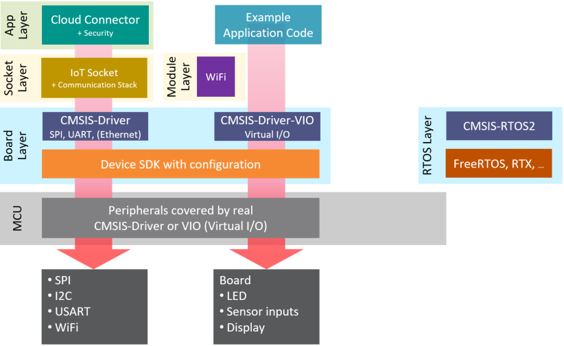

# CMSIS Project Manager (Users Manual - Draft)

The **CSolution Project Manager** processes **User Input Files** (in YML format) and **Software Packs** (in Open-CMSIS-Pack format) to create self-contained CMSIS-Build input files that allow to generate  independent projects which may be a part of a more complex application.

The **CSolution Project Manager** supports the user with the following features:

- Access to the content of software packs in Open-CMSIS-Pack format to:
  - Setup the tool chain based on a *Device* or *Board* that is defined in the CMSIS-Packs.
  - Add software components that are provided in the various software packs to the application.
- Organize applications (with a `*.csolution.yml` file) into projects that are independently managed (using `*.cproject.yml` files).
- Manage the resources (memory, peripherals, and user defined) across the entire application to:
  - Partition the resources of the system and create related system and linker configuration.
  - Support in the configuration of software stacks (such as RTOS threads).
  - Hint the user for inclusion of software layers that are pre-configured for typical use cases.
- Organize software layers (with a `*.clayer.yml` file) that enable code reuse across similar applications.
- Manage multiple hardware targets to allow application deployment to different hardware (test board, production hardware, etc.).
- Manage multiple build types to support software verification (debug build, test build, release build, ect.)
- Support multiple compiler toolchains (GCC, LLVM, Arm Compiler 6, IAR, etc.) for project deployment.

**Note:**

- The **CSolution Project Manager** is currently under development and part of the **[Open-CMSIS-Pack](https://www.open-cmsis-pack.org/index.html)** open source project.

Manual Chapters                          | Content
:----------------------------------------|:-------------------------
[Usage](#usage)                          | Overall Concept, tool setup, and invocation commands
[Project Examples](#project-examples)    | Various example projects to get started
[Project Structure](#project-structure)  | Directory structure of the projects
[YML Input Format](YML-Format.md)        | Format of the various YML input files.

**Table of Contents**

- [CMSIS Project Manager (Users Manual - Draft)](#cmsis-project-manager-users-manual---draft)
  - [Revision History](#revision-history)
- [Usage](#usage)
  - [Overview of Operation](#overview-of-operation)
  - [Requirements](#requirements)
  - [Invocation](#invocation)
    - [Commands](#commands)
- [Project Examples](#project-examples)
  - [Minimal Project Setup](#minimal-project-setup)
  - [Software Layers](#software-layers)
  - [Project Setup for Multiple Targets and Builds](#project-setup-for-multiple-targets-and-builds)
  - [Project Setup for Related Projects](#project-setup-for-related-projects)
- [Project Structure](#project-structure)
  - [Directory Structure](#directory-structure)
  - [Support for unnamed *.yml files](#support-for-unnamed-yml-files)
  - [Software Components](#software-components)
    - [PLM of configuration files](#plm-of-configuration-files)
  - [RTE_Components.h](#rte_componentsh)
- [YML Input Format](#yml-input-format)
- [Proposals](#proposals)
  - [Output versions to *.cprj](#output-versions-to-cprj)
  - [CMSIS-Zone Integration](#cmsis-zone-integration)
  - [Layer Interface Defintions](#layer-interface-defintions)
  - [CMSIS-Pack extensions](#cmsis-pack-extensions)
    - [Board condition](#board-condition)
    - [Layers in packs](#layers-in-packs)
- [Schema](#schema)

## Revision History

Version            | Description
:------------------|:-------------------------
Draft              | Work in progress

# Usage

The  **CMSIS Project Manager** is a command line utility that is available for different operating systems.  

## Overview of Operation


This picture above outlines the operation. The **CMSIS Project Manager** uses the following files.

Input Files              | Used for....
:------------------------|:---------------------------------
[Generic Software Packs](https://open-cmsis-pack.github.io/Open-CMSIS-Pack-Spec/main/html/cp_PackTutorial.html#cp_SWComponents) | ... provide re-usable software components that are typically configurable  towards a user application.
[DFP Software Packs](https://open-cmsis-pack.github.io/Open-CMSIS-Pack-Spec/main/html/cp_PackTutorial.html#createPack_DFP)     | ... device related information on the tool configuration. May refer an *.rzone file.
[BSP Software Packs](https://open-cmsis-pack.github.io/Open-CMSIS-Pack-Spec/main/html/cp_PackTutorial.html#createPackBoard)    | ... board specific configuration (i.e. memory). May refer to an *.rzone file that defines board components.
[*.rzone files](https://arm-software.github.io/CMSIS_5/Zone/html/xml_rzone_pg.html)                 | ... definition of memory and peripheral resources. If it does not exist, content is created from DFP.
*.csettings.yml          | ... \[step 1\] setup of an environment (could be an IDE) to pre-define a toolchain or built-types (Debug, Release).
*.csolution.yml          | ... \[step 2\] complete scope of the application and the build order of sub-projects.
*.cproject.yml           | ... \[step 3\] content of an independent build (linker run) - directly relates to a *.cprj file.
*.clayer.yml             | ... \[step 4\] set of source files along with pre-configured components for reuse in different applications.

**Note**: The values \[*step n*\] indicate the order of processing of the user input files.

Output Files             | Used for....
:------------------------|:---------------------------------
[Project Build Files](https://arm-software.github.io/CMSIS_5/Build/html/cprjFormat_pg.html) | ... project build information for a Open-CMSIS-Pack based tool environment.
Run-Time Environment (RTE)  | ... contains the user configured files of a project along with RTE_Components.h inventory file.
[Project Resource Files *.fzone](https://arm-software.github.io/CMSIS_5/Zone/html/GenDataModel.html)     | ... resource and partition data structure for template based code generators.

## Requirements

The CMSIS Pack repository must be present in the development environment.

- There are several ways to initialize and configure the pack repository, for example using the 
`cpackget` tool available from https://github.com/Open-CMSIS-Pack/cpackget
- Before running `csolution` the location of the pack repository shall be set via the environment variable
`CMSIS_PACK_ROOT` otherwise its default location (todo what is the default?) will be taken.

## Invocation

```text
CMSIS Project Manager 0.0.0+g23b6f99 (C) 2022 ARM 
Usage:
  csolution <command> [<args>] [OPTIONS...]

Commands:
  list packs            Print list of installed packs
       devices          Print list of available device names
       components       Print list of available components
       dependencies     Print list of unresolved project dependencies
       contexts         Print list of contexts in a csolution.yml
       generators       Print list of code generators of a given context
  convert               Convert cproject.yml or csolution.yml in cprj files
  run                   Run code generator
  help                  Print usage

Options:
  -s, --solution arg    Input csolution.yml file
  -p, --project arg     Input cproject.yml file
  -c, --context arg     Input context name <cproject>[.<build-type>][+<target-type>]
  -f, --filter arg      Filter words
  -g, --generator arg   Code generator identifier
  -n, --no-check-schema Skip schema check
  -o, --output arg      Output directory
  -h, --help            Print usage
```

### Commands

Print list of installed packs. The list can be filtered by words provided with the option `--filter`:

```text
csolution list packs [--filter "<filter words>"]
```

Print list of available device names. The list can be filtered by words provided with the option `--filter`:

```text
csolution list devices [--filter "<filter words>"]
```

Print list of available components. The list can be filtered by a selected device in the `cproject.yml` file with the option `--input` and/or by words provided with the option `--filter`:

```text
csolution list components [-p <example.cproject.yml> -f "<filter words>"]
```
todo: this does not work anymore

Print list of unresolved project dependencies. Device, board, and software components are specified as part of the `*.csolution.yml` and `*.cproject.yml` files. The list may be filtered by words provided with the option `--filter`:

```text
csolution list dependencies -s mysolution.csolution.yml [-f "<filter words>"]
```

Convert `example.cproject.yml` into *.cprj file(s):

```text
csolution convert -p example.cproject.yml
```

List external code generators that are used to create software components in *.gpdsc format.  It outputs the generator ID that is required for the `run` command.

```text
csolution list generators -s mysolution.csolution.yml
```

Run a generator (in this case STCubeMX) for a specific project context.

```text
csolution run -g STCubeMX -s mysolution.csolution.yml -c Blinky.Debug+STM32L4
```

# Project Examples

## Minimal Project Setup

Simple applications require just one self-contained file.

**Simple Project: `Sample.cproject.yml`**

```yml
project:
  compiler: AC6                    # Use Arm Compiler 6 for this project
  device: LPC55S69JEV98:cm33_core0 # Device name (exact name as defined in the DFP) optional with Pname for core selection
  
  optimize: size                   # Code optimization: emphasis code size
  debug: on                        # Enable debug symbols

  groups:                          # Define file groups of the project
    - group: My files           
      files:                       # Add source files
        - file: main.c

    - group: HAL
      files:
        - file: ./hal/driver1.c

  components:                      # Add software components
    - component: Device:Startup
```

## Software Layers

Software layers collect source files and software components along with configuration files for re-use in different projects.
The following diagram shows the various layers that are used to compose the IoT Cloud examples.



The following example is a `Blinky` application that uses a `App`, `Board`, and `RTOS` layer to compose the application for a NUCELO-G474RE board.  Note, that the `device:` definition is is the `Board` layer.

**Example Project: `Blinky.cproject.yml`**

```yml
project:
  compiler: AC6

  layers:
    - layer: .\Layer\App\Blinky.clayer.yml
    - layer: .\Layer\RTOS\RTX.clayer.yml
    - layer: .\Layer\Board\Nucleo-G474RE.clayer.yml
```

**App Layer: `.\Layer\App\Blinky.clayer.yml`**

```yml
layer:
# type: RTOS
  name: RTX
  description: Keil RTX5 open-source real-time operating system with CMSIS-RTOS v2 API

  interfaces:
    - provides:
        - RTOS2:

  components:
    - component: CMSIS:RTOS2:Keil RTX5&Source
```

**RTOS Layer: `.\Layer\RTOS\RTX.clayer.yml`**

```yml
layer:
# type: RTOS
  name: RTX
  description: Keil RTX5 open-source real-time operating system with CMSIS-RTOS v2 API

  interfaces:
    - provides:
        - RTOS2:

  components:
    - component: CMSIS:RTOS2:Keil RTX5&Source
```

**Board Layer: `.\Layer+NUCELO-G474RE\Board\Nucleo-G474RE.clayer.yml`**

```yml
layer:
  name: NUCLEO-G474RE
# type: Board
  description: Board setup with interfaces
  device: STM32G474CBTx

  interfaces:
    - consumes:
        - RTOS2:
    - provides:
        - C_VIO:
        - A_IO9_I:
        - A_IO10_O:
        - C_VIO:
        - STDOUT:
        - STDIN:
        - STDERR:
        - Heap: 65536
  
  components:
    - component: CMSIS:CORE
    - component: CMSIS Driver:USART:Custom
    - component: CMSIS Driver:VIO:Board&NUCLEO-G474RE
    - component: Compiler&ARM Compiler:Event Recorder&DAP
    - component: Compiler&ARM Compiler:I/O:STDERR&User
    - component: Compiler&ARM Compiler:I/O:STDIN&User
    - component: Compiler&ARM Compiler:I/O:STDOUT&User
    - component: Board Support&NUCLEO-G474RE:Drivers:Basic I/O
    - component: Device&STM32CubeMX:STM32Cube Framework:STM32CubeMX
    - component: Device&STM32CubeMX:STM32Cube HAL
    - component: Device&STM32CubeMX:Startup
  
  groups:
    - group: Board IO
      files:
        - file: ./Board_IO/arduino.c
        - file: ./Board_IO/arduino.h
        - file: ./Board_IO/retarget_stdio.c
    - group: STM32CubeMX
      files:
        - file: ./RTE/Device/STM32G474RETx/STCubeGenerated/STCubeGenerated.ioc
```

## Project Setup for Multiple Targets and Builds

Complex examples require frequently slightly different targets and/or modifications during build, i.e. for testing. The picture below shows a setup during software development that supports:

- Unit/Integration Testing on simulation models (called Virtual Hardware) where Virtual Drivers implement the interface to simulated I/O.
- Unit/Integration Testing the same software setup on a physical board where Hardware Drivers implement the interface to physical I/O.
- System Testing where the software is combined with more software components that compose the final application.


As the software may share a large set of common files, provisions are required to manage such projects.  The common way in other IDE's is to add:

- **target-types** that select a target system. In the example this would be:
  - `Virtual`: for Simulation Models.
  - `Board`: for a physical evaluation board.
  - `Production-HW`: for system integration test and the final product delivery.
- **build-types** add the flexibility to configure each target build towards a specific testing.  It might be:
  - `Debug`: for a full debug build of the software for interactive debug.
  - `Test`: for a specific timing test using a test interface with code maximal optimization.
  - `Release`: for the final code deployment to the systems.

It is required to generate reproducible builds that can deployed on independent CI/CD test systems. To achieve that, the CMSIS Project Manager generates *.cprj output files with the following naming conventions:

`<projectname>[.<build-type>][+target-type].cprj` this would generate for example: `Multi.Debug+Production-HW.cprj`

This enables that each target and/or build type can be identified and independently generated which provides the support for test automation. It is however not required to build every possible combination, this should be under user control.

**Flexible Builds for multi-target projects.

Currently multi-target projects require the setup of a `*.csolution.yml` file to define `target-types` and `build-types`. Note, that this is currently under review, but this documents the current status.

**File: MultiTarget.csolution.yml**

```yml
solution:
  compiler: AC6

  target-types:
    - type: Board
      board: NUCLEO-L552ZE-Q

    - type: Production-HW
      device: STM32L552XY         # specifies device

    - type: Virtual
      board: VHT-Corstone-300     # Virtual Hardware platform (appears as board)
      
  build-types:
    - type: Debug
      optimize: debug
      debug: on

    - type: Test
      optimize: max
      debug: on

    - type: Release
      optimize: max
      debug: off

projects:
  - project: .\MyProject.cproject.yml
```

**File: MyProject.csolution.yml**

```yml
project:
  groups:
    - group: My group1
      files:
        - file: file1a.c
        - file: file1b.c
        - file: file1c.c

    - group: My group2
      files:
        - file: file2a.c

    - group: Test-Interface
      for-type: .Test
      files:
        - file: fileTa.c

  layers:
    - layer: NUCLEO-L552ZE-Q/Board.clayer.yml   # tbd find a better way: i.e. $Board$.clayer.yml
      for-type: +Board

    - layer: Production.clayer.yml              # added for target type: Production-HW
      for-type: +Production-HW

    - layer: Corstone-300/Board.clayer.yml      # added for target type: VHT-Corstone-300
      for-type: +VHT-Corstone-300

  components:
    - component: Device:Startup
    - component: CMSIS:RTOS2:FreeRTOS
    - component: ARM::CMSIS:DSP&Source          # not added for build type: Test
      not-for-type: .Test                           
```

## Project Setup for Related Projects

A solution is the software view of the complete system. It combines projects that can be generated independently and therefore manages related projects. It may be also deployed to different targets during development as described in the previous section under [Project Setup for Multiple Targets and Builds](#project-setup-for-multiple-targets-and-builds).

The picture below shows a system that is composed of:

- Project A: that implements a time-critical control algorithm running on a independent processor #2.
- Project B: which is a diagram of a cloud connected IoT application with Machine Learning (ML) functionality.
- Project C: that is the data model of the Machine Learning algorithm and separate to allow independent updates.
- Project D: that implements the device security (for example with TF-M that runs with TrustZone in secure mode).

In addition such systems may have a boot-loader that can be also viewed as another independent project.


To manage the complexity of such related a projects, the `*.csolution.yml` file is introduced. At this level the `target-types` and `build-types` may be managed, so that a common set is available across the system. However it should be also possible to add project specific `build-types` at project level.  (tdb: `target-types` might be only possible at solution level).

- `target-types` describe a different hardware target system and have therefore different API files for peripherals or a different hardware configuration.

- `build-types` describe a build variant of the same hardware target. All `build-types` share the same API files for peripherals and the same hardware configuration, but may compile a different variant (i.e. with test I/O enabled) of an application.

**Related Projects `iot-product.csolution.yml`**

```yml
solution:
  target-types:
    - type: Board
      board: NUCLEO-L552ZE-Q

    - type: Production-HW
      device: STM32U5X          # specifies device
      
  build-types:
    - type: Debug
      optimize: debug
      debug: on

    - type: Test
      optimize: max
      debug: on
    
  projects:
    - project: /security/TFM.cproject.yml
      type: .Release
    - project: /application/MQTT_AWS.cproject.yml
    - project: /bootloader/Bootloader.cproject.yml
      not-for-type: +Virtual
```

# Project Structure

## Directory Structure

ToDo: Impact analysis to legacy products that include CMSIS-Pack management.

This section describes how the files of `*.csolution.yml` should be organized to allow the scenarios described above:

Source Directory                    | Content
:-----------------------------------|:---------------
`.`                                 | Contains one or more `*.csolution.yml` files that describes an overall application.
`./<project>`                       | Each project has its own directory
`./<project>/RTE+<target>`          | Configurable files that are specific to a target have a specific directory.
`./<project>/RTE`                   | Configurable files that are common to all targets may have a common directory.
`./<project>/Layer+<target>/<name>` | `*.clayer.yml` and related source files of a layers that are specific to a target have a specific directory.
`./<project>/Layer/<name>`          | `*.clayer.yml` and related source files of a layers that are common to all targets may have a common directory.

**Notes:**

- `./<project>/RTE+<target>` contains the *.cprj file that is generated by `CSolution`
- Directory names `RTE` and `Layer` should become configurable.  ToDo: analyze impact.

The `./RTE` directory structure is maintained by tools and has the following structure. You should not modify the structure of this directory.

`RTE[+<target>]` Directory        | Content
:---------------------------------|:---------------
`.../.<build-type>`               | Contains the file `RTE_Components.h` that is specific to a `build-type`.
`.../<component class>`           | Configurable files for each component class are stored in sub-folders. The name of this sub-folder is derived from the component class name.
`.../<component class>/<Dname>`   | Configurable files of the component class that are device specific. It is generated when a component has a condition with a `Dname` attribute. (strictly speaking no longer needed, backward compatiblity to MDK?)
`.../Device/<Dname>`              | Configurable files of the component class Device. This should have always a condition with a `Dname` attribute.

Output Directory                              | Content
:---------------------------------------------|:---------------
`./<project>/Output+<target>`                 | Contains the final binary and symbol files of a project. Each `build-type` shares the same output directory.
`./<project>/.Interim+<target>/.<build-type>` | Contains interim files (`*.o`, `*.lst`) fore each `build-type`

**Note:**
- The content of the `Output` directory is generated by the `CBuild` step.

## Support for unnamed *.yml files

It is possible to use named and unnamed `*.csolution.yml` and `*.cproject.yml` files. If an explicit name is omitted, the name of the directory is used. However it is possible to overwrite the directory name with an explicit filename.

**Example:**
```c
./blinky/cproject.yml                     // project name: "blinky"
./blinky/blinky-test.cproject.yml         // project name: "blinky-test"
```

A solution template skeleton may be provided as shown below. The benefit is that renaming of the directory names changes also the project and solution names.

```c
./                                        // root directory of a workspace
./cdefaults.yml                           // contains the "cdefaults.yml" file
./MySolution                              // the current directory used for invoking "CSolution"
./MySolution/csolution.yml                // unnamed "csolution.yml" file is the default input file
./MySolution/blinky                       // project directory for project "blinky"
./MySolution/blinky/cproject.yml          // unnamed "cproject.yml" that obtains the project name from directory name
```

## Software Components

Software components are re-usable library or source files that require no modification in the user application. Optionally, configurable source and header files are provided that allow to set parameters for the software component. 

- Configurable source and header files are copied to the project using the directory structure explained above.
- Libraries, source, and header files that are not configurable (and need no modification) are stored in the directory of the Software Component (typically part of CMSIS_Pack_ROOT) and get included directly from this location into the project.
- An Include Path to the header files of the Software Component is added to the C/C++ Compiler control string.

### PLM of configuration files

Configurable source and header files have a version information that is required during Project Lifetime Management (PLM) of a project. The version number is important when the underlying software pack changes and provides a newer configuration file version.

Depending on the PLM status of the application, the `csolution` performs for configuration files the following operation:

1. **Add** a software component for the first time: the related config file is copied twice into the related `RTE` project directory.  The first copy can be modified by the user with the parameters for the user application. The second copy is an unmodified hidden backup file that is appended with the version information.

    **Example:** A configuration file `ConfigFile.h` at version `1.2.0` is copied:

    ```c
    ./RTE/component_class/ConfigFile.h           // user editable configuration file
    ./RTE/component_class/.ConfigFile.h@1.2.0    // hidden backup used for version comparison
    ```
    
    The `csolution` outputs a user notification to indicate that files are added:

    ```text
    ./RTE/component_class/ConfigFile.h -  info: component 'name' added configuration file version '1.2.0'
    ```

2. **Upgrade** (or downgrade) a software component: if the version of the hidden backup is identical, no operation is performed. If the version differs, the new configuration file is copied with appended version information.

    **Example:** after configuration file `ConfigFile.h` to version `1.3.0` the directory contains these files:

    ```c
    ./RTE/component_class/ConfigFile.h           // user editable configuration file
    ./RTE/component_class/ConfigFile.h@1.3.0     // user editable configuration file
    ./RTE/component_class/.ConfigFile.h@1.2.0    // hidden backup used for version comparison
    ```

    The `csolution` outputs a user notification to indicate that configuration files have changed:

    ```text
    ./RTE/component_class/ConfigFile.h - warning: component 'name' upgrade for configuration file version '1.3.0' added, but file inactive
    ```

3. **User action to complete upgrade**: The user has now several options (outside of `csolution`) to merge the configuration file information.  A potential way could be to use a 3-way merge utility. After merging the configuration file, the hidden backup should be deleted and the unmodified new version should become the hidden backup.  The previous configuration file may be stored as backup as shown below.

    ```c
    ./RTE/component_class/ConfigFile.h           // new configuration file with merge configuration
    ./RTE/component_class/ConfigFile.h.bak       // previous configuration file stored as backup
    ./RTE/component_class/.ConfigFile.h@1.3.0    // hidden backup of unmodified config file, used for version comparison
    ```

- **Note: Multiple Instances of Configuration files**

   The system is also capable of handling multiple instances of configuration files as explained in the CMSIS-Pack specification under [Component Instances](https://open-cmsis-pack.github.io/Open-CMSIS-Pack-Spec/main/html/pdsc_components_pg.html#Component_Instances). In this case the instance %placeholder% is expanded as shown below:

   ```c
   ./RTE/component_class/ConfigFile_0.h
   ./RTE/component_class/.ConfigFile_0.h@1.2.0
   ./RTE/component_class/ConfigFile_1.h
   ./RTE/component_class/.ConfigFile_1.h@1.2.0
   ```

## RTE_Components.h

The file `./RTE/RTE_Components.h` is automatically created by the CMSIS Project Manager (during CONVERT). For each selected Software Component it contains `#define` statements required by the component. These statements are defined in the \*.PDSC file for that component. The following example shows a sample content of a RTE_Components.h file:

```c
/* Auto generated Run-Time-Environment Component Configuration File *** Do not modify ! *** */

#ifndef RTE_COMPONENTS_H
#define RTE_COMPONENTS_H

/* Define the Device Header File: */
#define CMSIS_device_header "stm32f10x.h"

#define RTE_Network_Interface_ETH_0     /* Network Interface ETH 0 */
#define RTE_Network_Socket_BSD          /* Network Socket BSD */
#define RTE_Network_Socket_TCP          /* Network Socket TCP */
#define RTE_Network_Socket_UDP          /* Network Socket UDP */

#endif /* RTE_COMPONENTS_H */
```

The typical usage of the `RTE_Components.h` file is in header files to control the inclusion of files that are related to other components of the same Software Pack.
```c
#include "RTE_Components.h"
#include  CMSIS_device_header

#ifdef  RTE_Network_Interface_ETH_0  // if component Network Interface ETH 0 is included
#include "Net_Config_ETH_0.h"        // add the related configuration file for this component
#endif
```

# YML Input Format

Is described in [here](YML-Format.md).

# Proposals

## Output versions to *.cprj

The ProjMgr should always generate *.cprj files that contain version information about the used software packs.

## CMSIS-Zone Integration

Suggest to split this into two sections:

 - `resources:` to define the execution phases, memory regions and region splits, and peripherals.  This section would be in the `csolution.yml` file. 

 - `requirements:` to define project requirements - effectively the partitioning of a system. It should be possible to assign to the application all remaining resources.

Add to the project the possibility to specify .  The issue might be that the project files become overwhelming, alternative is to keep partitioning in separate files.

```yml
resources:
  phases:    # define the life-time of a resource definition
    - phase: Boot
    - phase: OTA
    - phase: Run

  memories:              # specifies the required memory
    - split: SRAM_NS
      into:
      - region: DATA_NS
        size: 128k
        permission: n
      - region: DATA_BOOT
        phase: Boot      # region life-time (should allow to specify multiple phases)
        size: 128k
    
  peripherals:           # specifies the requried peripherals
    - peripheral: I2C0
      permission: rw, s
```

## Layer Interface Defintions

A software layer could specify the interfaces that it provides.  The interface specification indicates also the configuration of the layer.  Issue might be that a standardization across the industry is required.

```yml
interfaces:
  consumes:
    - RTOS2:     # requires CMSIS-RTOS2 features
  provides:
    - C_VIO:     # provides CMSIS-VIO interface for LEDs
    - A_IO9_I:   # provides Audrino connector pin I09 configured as input
    - A_IO10_O:  # provides Audrino connector pin I10 configured as output
    - STDOUT:    # redirects STDIO
    - STDIN:
    - STDERR:
    - Heap: 65536 # provides 64K heap
```

## CMSIS-Pack extensions

### Board condition

It should be possible to use conditions to filter against a selected board name.

### Layers in packs

A layer is a set of pre-configured software components. It should be possible to store a layer in a pack and apply filter conditions to it.  In combination with interfaces specifications, an interactive IDE should be able to display suitable layers that could be added to an application.


# Schema

This is a ToDo list for the schema files

- add `packs:` for `target-types:` and `build-types:` (but no `filter:` cannot be specified there).