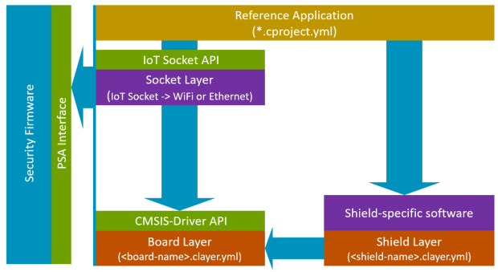
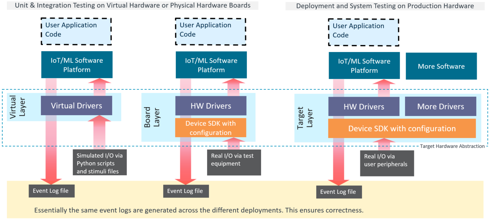
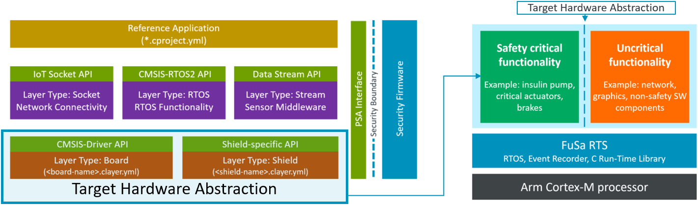
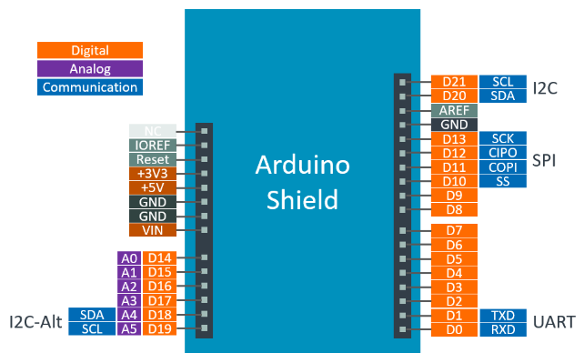

# Reference Application Framework

(Proposal)

<!-- markdownlint-disable MD009 -->
<!-- markdownlint-disable MD013 -->
<!-- markdownlint-disable MD036 -->

**Table of Contents**

- [Reference Application Framework](#reference-application-framework)
  - [Overview](#overview)
    - [Software Layers](#software-layers)
    - [Interface Definitions](#interface-definitions)
    - [Target Hardware Abstraction](#target-hardware-abstraction)
    - [Connections](#connections)
    - [Arduino Shield](#arduino-shield)
  - [Software Layer Types](#software-layer-types)
    - [Board](#board)
    - [Shield](#shield)
    - [RTOS](#rtos)
    - [Socket](#socket)
    - [Stream](#stream)
  - [Working with Layers](#working-with-layers)
    - [Install missing software packs](#install-missing-software-packs)
    - [Compile application](#compile-application)
    - [Add new targets](#add-new-targets)
    - [Known problems](#known-problems)
    - [Finalize Workflow](#finalize-workflow)

## Overview

The following section describes the structure of a standardized **Reference Application Framework** that allows to demonstrate a range of application examples:
  
- Cloud connectivity using SDKs from Cloud Service Providers.
- Sensor reference examples.
- Machine Learning applications that use sensors and audio inputs.
- Middleware examples such as TCP/IP stack and file system.

These reference examples can target various evaluation boards. It is also possible to target production hardware and use the examples as starting point for embedded IoT and ML applications. This is enabled by:

- Software layers with defined and standardized interfaces that contain re-usable parts of applications.
- Description of standardized connections (provided and consumed interfaces) between these software layers. 
- Consistent bootstrap and startup sequence that initializes the system resources and starts the application software. 
- Board software layer that provides connections for many different applications.



> **Note:** 
> 
> The various software layer types are optional; the usage depends on the reference application. The layer type board is an exception, as it is the base software layer that implements the system startup.

### Software Layers

The following table lists the various software layers types that are used to compose reference applications.

Software Layer Type    | Description of the operations
:----------------------|:----------------------------------
Socket                 | Provides an IoT_Socket for network connectivity.
RTOS                   | Provides a CMSIS-RTOS2 compliant RTOS; various RTOS implementations may provide extra functionality.
Stream                 | Provides middleware for sensor, audio, and video data streaming to DSP and ML algorithms.
Board                  | System startup: board/device hardware initialization; transfers control to application. Exposes various drivers and interfaces.
Shield                 | Provides software definitions and support for additional hardware provided on shields that extend a physical hardware board. 

Each of the software layers is described in the section [Software Layer Types](#software-layer-types)

### Interface Definitions

The interfaces between the software layers are defined in header files.  As such is it possible to reuse the various software blocks with other build systems that are not CMSIS aware.

The header files `CMSIS_board_header`, `iot_socket.h`, `cmsis_os2.h`, and `todo: cmsis_stream.h` are typically used by the reference application to access the software layers.

Header File              | Description
:------------------------|:----------------------------------
`CMSIS_board_header`     | `#define` of the board header file; gives access to drivers defined in the board connections.
`CMSIS_shield_header`    | `#define` of the shield header file; gives access to drivers defined in the shield connections.
`CMSIS_target_header`    | `#define` of the target header file; combines drivers defined in Board and Shield layers.
[`iot_socket.h`](https://github.com/MDK-Packs/IoT_Socket/blob/develop/include/iot_socket.h)           | Defines the interface to the [IoT Socket](https://github.com/MDK-Packs/IoT_Socket).
[`cmsis_os2.h`](https://github.com/ARM-software/CMSIS_5/blob/develop/CMSIS/RTOS2/Include/cmsis_os2.h) | Defines the interface to the [RTOS](https://arm-software.github.io/CMSIS_5/RTOS2/html/group__CMSIS__RTOS.html).
`cmsis_stream.h`                                                                                      | ToDo: Defines the interface for data streaming.

### Target Hardware Abstraction 

**Proposed Software Structure (work-in-progress)**

The Board and Shield layer combined are the Target Hardware Abstraction (defined in `CMSIS_target_header`) for the IoT/ML Software Platform (composed of Reference Application, Socket, RTOS and Stream layer). Using the CMSIS-Toolbox, the `target-type:` selection allows to change both  the Board and Shield layer along with the `CMSIS_target_header` definition. This retargets the IoT/ML Software Platform to run on a different hardware target as shown in the picture below. This is a typical use case for validation and prototyping during software development.



Some applications require Process Isolation to separate safety critical functionality from uncritical functionality. The parts of the IoT/ML Software Platform are typical qualified uncritical functionality. In such a design the Target it is required to  rquGoing forward, 




### Connections

The [connections](YML-Input-Format.md#connections) are only used to identify compatible software layers. There are no strict rules for the **`connect` Name** it is therefore possible to extend it with additional name spacing, i.e. prefix with *ST_* to denote ST specific interfaces.

There are also no strict rules how the different software layers consume or provide the `connect` names.  However guidelines will be developed once reference applications mature.

Currently the following **`connect` names** are used.

`connect` name         | Value                  | Description
:----------------------|:-----------------------|:-------------------- 
.                      |.                       | **Arduino Shield Interface**
ARDUINO_UNO_UART       | CMSIS-Driver instance  | CMSIS-Driver UART connecting to UART on Arduino pins D0..D1
ARDUINO_UNO_SPI        | CMSIS-Driver instance  | CMSIS-Driver SPI connecting to SPI on Arduino pins D10..D13
ARDUINO_UNO_I2C        | CMSIS-Driver instance  | CMSIS-Driver I2C connecting to I2C on Arduino pins D20..D21
ARDUINO_UNO_I2C-Alt    | CMSIS-Driver instance  | CMSIS-Driver I2C connecting to I2C on Arduino pins D18..D19
ARDUINO_UNO_D0 .. D21  | -                      | CMSIS-Driver GPIO connecting to Arduino pins D0..D21
.                      |.                       | **CMSIS Driver and RTOS Interfaces**
CMSIS_\<driver-name\>  | CMSIS-Driver instance  | [CMSIS-Driver](https://arm-software.github.io/CMSIS_5/Driver/html/modules.html) name, i.e. CMSIS_I2C, CMSIS_ETH_MAC.
CMSIS-RTOS2            |.                       | CMSIS-RTOS2 compliant RTOS
.                      |                        | **Network Connectivity**
IoT_Socket             |.                       | IP Socket (BSD like) Network layer
.                      |.                       | **I/O Retargeting**
STDERR                 |.                       | Standard Error output
STDIN                  |.                       | Standard Input
STDOUT                 |.                       | Standard Output
.                      |.                       | **Memory allocation**
Heap                   | Heap Size              | Memory heap configuration in startup
.                      |.                       | **Data Streaming Interfaces**
Stream_Audio           |.                       | Audio Data Stream (todo)
Stream_SDS             |.                       | Synchronous Data Stream (Sensors) (todo)
.                      |                        | **PSA Security Interfaces**
PSA_\<interface-name\> |.                       | Interfaces for Crypto, Storage, Firmware Update

### Arduino Shield

The software layers [Board](#board) and [Shield](#shield) are currently based on Arduino UNO connectors. To combine different boards and shields a consistent pin naming is required. The standardized mapping is shown in the diagram below.



## Software Layer Types

### Board

Provides system startup, board/device hardware initialization, and transfers control to the application. It also exposes various drivers and interfaces.

**Features:**

- System startup
- Heap and Stack configuration
- Device/Board hardware initialization
-	Shield setup [optional]
- Application startup for applications with and without RTOS
- [Event Recorder](https://arm-software.github.io/CMSIS-View/main/evr.html) initialization [optional] 
- [Fault Storage](https://arm-software.github.io/CMSIS-View/main/evr.html) [optional]
- RTOS initialization and startup [optional]
- Drivers for peripherals or Arduino interfaces [optional]
- STDIO re-targeting to debug interfaces [optional]
- PSA interfaces [optional]

**Files:**

- CMSIS startup and system file for device initialization.
- `main.c` source module that implements the function `main`.
- Optional drivers and interfaces (CMSIS-Drivers, GPIO, STDIO).
- Files that relate to the device and/or board configuration (i.e. generated by MCUXpresso or STM32CubeMX)
- Linker script definition

The `main.c` source module of the Board software layer uses the following entry points to the application code:

- `app_initialize` initializes the software stack and is executed in Handler mode.
- `app_main` transfers execution to the application. For RTOS-based applications this is a RTOS thread.

**RTOS Usage**

The board layer supports application with or without RTOS. The function  `extern void app_main (void *argument)` defines the entry point of the application.

- Application using RTOS:

  Before RTOS is started the function `app_initialize` is called where the user can create application threads. A default implementation (defined `weak`) is part of the board layer:

  ``` c
  __WEAK int32_t app_initialize (void) {
    osThreadNew(app_main, NULL, NULL);
  }
  ```

  By default, `app_main` is the thread that starts executing with default settings (priority, stack).

- Application not using RTOS:
  
  `app_main` is the entry of the application and executes as a single thread.

### Shield

Support for additional hardware via plugin shields (i.e. Arduino Uno).  Arduino shields [*consume connections*](YML-Input-Format.md#example-sensor-shield) with the prefix `ARDUINO_UNO_`.  Potentially other shields could be covered.

Shields may feature various hardware modules such as WiFi chips or MEMS sensors.  Frequently the Shield software layer only defines a header file that redirects the Arduino specific `connect:` to a chip specific `connect:` that is then used by application software.

The Shield software layer is configured from the Board software layer which calls the following function:

``` c
extern int32_t shield_setup (void);
```

**Example:**

Connections (consumed):

- ARDUINO_UNO_* (provided by board layer)
- STDIN/OUT (if used by the driver)
- RTOS2 (if used by the driver)

Connections (provided):

- CMSIS_WiFi (WiFi Shield)
- \<Sensor\>
- \<Sensor\>_\<Feature\>

Note regarding sensors:

\<Sensor\> is typically a sensor name (for example NXP sensors: FXLS8974, FXAS21002, …
Sensor can use different buses (I2C, SPI) and have optional interrupt lines. It makes sense to define sensor connections with specifying features to cover various layer combinations. Examples of connections:
FXLS8974 sensor:

- Connected via I2C:
  - FXLS8974_I2C: connected via I2C
  - FXLS8974_INT: interrupt line (optional)
- Connected via SPI:
  - FXLS8974_SPI: connected via SPI
  - FXLS8974_CS: SPI CS (can be any Arduino Dx pin to cover multiple devices on the same SPI bus)
  - FXLS8974_INT: interrupt line (optional)

### RTOS

The RTOS software layer provides a CMSIS-RTOS2 compliant RTOS. Various implementations can be used; currently RTX and FreeRTOS is provided as software layer. Some RTOS functionality might be used by peripheral drivers, the PSA interface or the application itself. When present, the RTOS is initialized and started in the [Board](#board) software layer.

> **Note:**
> 
> The *CMSIS-RTOS2 connect name* may be also provided by the application software. For example, the AWS IoT stack implements FreeRTOS and also exposes CMSIS-RTOS2 API as the underlying driver interfaces may require it.

### Socket

Provides an [IoT Socket](https://github.com/MDK-Packs/IoT_Socket) compliant socket. Various implementation can be used. 

Currently layers are available for: 

- WiFi using CMSIS-Driver with built-in TCP/IP stack.
- TCP/IP middleware over Ethernet (using Ethernet CMSIS-Driver).
- VSocket over Arm Virtual Hardware (AVH).

The IoT Socket is initialized and started from the application by calling the following function:

``` c
extern int32_t socket_startup (void);
```

### Stream

Provides middleware for data streaming in a format that is consumed by DSP or ML algorithms.  Proposals for these interfaces will be provided.

The data streaming interfaces relate to:

- [SDS-Framework](https://github.com/Arm-software/SDS-Framework) for recording, analyzing, and playback of data streams. 
- [CMSIS-DSP compute graph](https://github.com/ARM-software/CMSIS-DSP) that allows to optimize data flows between DSP and ML algorithms.

## Working with Layers

The following section explains how to operate with layers. It uses the projects:

- [AWS_MQTT_MutualAuth_SW_Framework](https://github.com/Open-CMSIS-Pack/AWS_MQTT_MutualAuth_SW_Framework/tree/develop) - currently the branch `develop`. When cloning this project ensure that you also get the git sub-module `framework`. 
- [RefApp-Framework](https://github.com/Open-CMSIS-Pack/RefApp-Framework) contains the software layers that are used by various projects. It is represented by the git sub-module `framework` in the example above.

[AWS_MQTT_MutualAuth_SW_Framework](https://github.com/Open-CMSIS-Pack/AWS_MQTT_MutualAuth_SW_Framework/tree/develop) is a AWS Cloud connector project that is defined in `Demo.csolution.yml`.  The directory `framework` contains various [software layers](#software-layers) that are compatible with this application.

### Install missing software packs

Before

```text
csolution list packs -s Demo.csolution.yml -m >packs.txt
cpackget update-index               // optional to ensure that pack index is up-to-date
cpackget add -f packs.txt
```

### Compile application

To generate the application variants enter:

``` txt
csolution convert -s Demo.csolution.yml
```

Despite the fact that currently warnings are generated, it creates the following projects:

``` txt
./AWS_MQTT_MutualAuth_SW_Framework/Demo.Debug+AVH_MPS3_Corstone-300.cprj - info csolution: file generated successfully
./AWS_MQTT_MutualAuth_SW_Framework/Demo.Debug+AVH_MPS3_Corstone-310.cprj - info csolution: file generated successfully
./AWS_MQTT_MutualAuth_SW_Framework/Demo.Debug+B-U585I-IOT02A.cprj - info csolution: file generated successfully
./AWS_MQTT_MutualAuth_SW_Framework/Demo.Debug+IMXRT1050-EVKB.cprj - info csolution: file generated successfully
./AWS_MQTT_MutualAuth_SW_Framework/Demo.Debug+IMXRT1050-EVKB_DA16200.cprj - info csolution: file generated successfully
./AWS_MQTT_MutualAuth_SW_Framework/Demo.Debug+IMXRT1050-EVKB_WizFi360.cprj - info csolution: file generated successfully
./AWS_MQTT_MutualAuth_SW_Framework/Demo.Release+AVH_MPS3_Corstone-300.cprj - info csolution: file generated successfully
./AWS_MQTT_MutualAuth_SW_Framework/Demo.Release+AVH_MPS3_Corstone-310.cprj - info csolution: file generated successfully
./AWS_MQTT_MutualAuth_SW_Framework/Demo.Release+B-U585I-IOT02A.cprj - info csolution: file generated successfully
./AWS_MQTT_MutualAuth_SW_Framework/Demo.Release+IMXRT1050-EVKB.cprj - info csolution: file generated successfully
./AWS_MQTT_MutualAuth_SW_Framework/Demo.Release+IMXRT1050-EVKB_DA16200.cprj - info csolution: file generated successfully
./AWS_MQTT_MutualAuth_SW_Framework/Demo.Release+IMXRT1050-EVKB_WizFi360.cprj - info csolution: file generated successfully
```

Each of these projects can be translated using:

```txt
cbuild "Demo.Debug+AVH_MPS3_Corstone-300.cprj"
```

### Add new targets

To add a new target, add in `Demo.csolution.yml` under `target-types:` a new type as shown below:

```txt
    - type: test
      device: NXP::MIMXRT1052DVL6B
```

Compatible layers can be listed using the command:

```txt
csolution list layers -s Demo.csolution.yml -c Demo.Release+test verbose -L ./framework -l all

./AWS_MQTT_MutualAuth_SW_Framework/framework/layer/Board/B-U585I-IOT02A/IoT/Board.clayer.yml (layer type: Board)
./AWS_MQTT_MutualAuth_SW_Framework/framework/layer/Shield/WiFi/Inventek_ISMART43362-E/Shield.clayer.yml (layer type: Shield)
./AWS_MQTT_MutualAuth_SW_Framework/framework/layer/Shield/WiFi/Sparkfun_DA16200/Shield.clayer.yml (layer type: Shield)
./AWS_MQTT_MutualAuth_SW_Framework/framework/layer/Shield/WiFi/Sparkfun_ESP8266/Shield.clayer.yml (layer type: Shield)
./AWS_MQTT_MutualAuth_SW_Framework/framework/layer/Shield/WiFi/WizNet_WizFi360-EVB/Shield.clayer.yml (layer type: Shield)
./AWS_MQTT_MutualAuth_SW_Framework/framework/layer/Socket/WiFi/Socket.clayer.yml (layer type: Socket)
```

Each of the different layers is working with the new added target.

### Known problems

- Not every target requires a `Shield`, but `csolution` complains about a missing $Shield-Layer$.  csolution should not search for additional layers when all `consumed connections` are `provided` the the layers already.
- The board `B-U585I-IOT02A` as onboard WiFi and would not work with a `Shield`.  The tool does not raise a conflict when the same `connection:` is `provided` multiple times, 
  nor does check that a Shiel layer is not required.

### Finalize Workflow

- The current workflow needs review and improvements in the usability.
- Layers should be provided in packs, the workflow with packs has not been validated yet.
