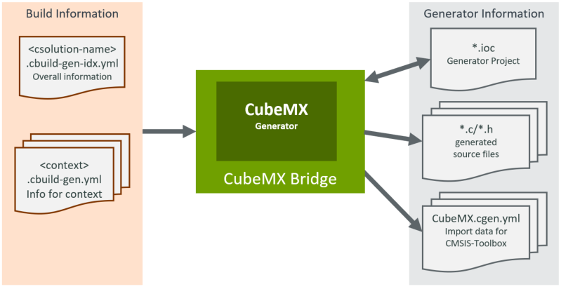

# Generator Workflow (Proposal) - Revised 1. Sept 2023
<!-- markdownlint-disable MD013 -->

- [Generator Workflow (Proposal) - Revised 1. Sept 2023](#generator-workflow-proposal---revised-1-sept-2023)
  - [User Steps](#user-steps)
  - [Generator Interface](#generator-interface)
  - [Project Scenarios](#project-scenarios)
    - [Single-Core](#single-core)
    - [Multi-Core or TrustZone](#multi-core-or-trustzone)
  - [Global Generator Registry](#global-generator-registry)
  - [Impact to PDSC files and Packs](#impact-to-pdsc-files-and-packs)
  - [Other](#other)

>**NOTE:**
>
> This document is a refined [Generator Proposal](https://github.com/Open-CMSIS-Pack/devtools/blob/main/tools/projmgr/docs/Manual/Generator%20\(Proposal\).md). It focuses on existing generators such as STM32CubeMX.

## User Steps

The user steps for creating a `csolution` based application with a Generator are:

- Create the `*.csolution.yml` container that refers the projects and selects `device:` or `board:`  (by using `target-types:`)
- Create `*.cproject.yml` files that are referred by the `*.csolution.yml` container.
- Add `components:` and/or `layers:` to the `*.cproject.yml` file
- For components that have a **GenID**, run the related generator.

Typically generators are used to:

- Configure device and/or board settings, for example clock configuration or pinout.
- Add and configure software drivers, for example for UART, SPI, or I/O ports.
- Configure parameters of an algorithm, for example DSP filter design or motor control parameters.

## Generator Interface

The diagram below shows how the Generator is integrated into the CMSIS-Build tools. The data flow is exemplified on STM32CubeMX (or just CubeMX). The information about the project is delivered in `*.cbuild-idx.yml` and `<context>.cbuild.yml` files. Using this information provides CubeMX with the project context, such as selected board or device, and CPU mode such as TrustZone disabled/enabled.



CubeMX generates:

- `*.ioc` CubeMX project file with current project settings
- `*.c/.h` source files, i.e. for interfacing with drivers
- `<context>.cgen.yml` which provides the data for project import into the csolution build process.

> **Note:**  As CubeMX itself does not have the required interfaces to the csolution project format, there is a utility `CubeMX Bridge` that converts the `*.cbuild*.yml` files into command-line options for CubeMX. It also generates the `<context>.cgen.yml` based on the generator information.

## Project Scenarios

The following in an analysis of the different project scenarios, again exemplified with STM32CubeMX.
Note that the directory structure can be controlled already using the key [`generators:`](https://github.com/Open-CMSIS-Pack/cmsis-toolbox/blob/main/docs/YML-Input-Format.md#generators). Hence the following is just a proposal for changing default locations.

### Single-Core

All generator files belong to only one `cproject.yml` or `clayer.yml` file.  A potential default directory structure is:

- When all components with **GenID** are in `cproject.yml`.
  - Base Directory: `$ProjectDir()$/generated.$GenID$`
  - `cgen.yml` file: `$ProjectDir()$/RTE/Device/$Dname$`
- When all components with **GenID** are in `clayer.yml`:
  - Base Directory: `$LayerDir()$/generated.$GenID$`
  - `cgen.yml` file: `$LayerDir()$/RTE/Device/$Dname$`

### Multi-Core or TrustZone

Generator files belong to `csolution.yml` or to a `clayer-idx.yml` file.

- When all components with **GenID** are in `cproject.yml` files:
  - Base Directory: `$SolutionDir()$/generated.$GenID$`
  - multiple `cgen.yml` files: `$ProjectDir()$/RTE/Device/$Dname$`
- When all components with **GenID** are in `clayer.yml`:
  - Base Directory: `$LayerIdxDir()$/generated.$GenID$`
  - multiple `cgen.yml` files: `$LayerDir()$/RTE/Device/$Dname$`

> **Notes:**
>
> - New Access Sequences are introduced: $GenID$, $LayerDir()$, $LayerIdxDir()$.
> - For using layers with Multi-Core and TrustZone projects
> - When components with **GenID** are intermixed (some in `*.clayer.yml`, some in `*.cproject.yml`) an error is displayed with the request to use explicit [`generators:`](https://github.com/Open-CMSIS-Pack/cmsis-toolbox/blob/main/docs/YML-Input-Format.md#generators) settings.

```txt
error: <context> requires explicit generator base directory, use key generator: 
```

## Global Generator Registry

As there is typically only one Generator of type **GenID** installed, a global registry could be introduced.

- In CMSIS-Toolbox `./etc` directory either a global file `generators.yml` or a file `$GenID$.generator.yml could be introduced that registers the generators.
- In CMSIS-Toolbox `./bin` directory the 'Bridge programs' for CubeMX and potentially MCUxpresso could be added.

**Potential format of generators.yml:**

```yml
generators:
  - generator: CubeMX    # potentially with version added by `@` notation
    download-url: https://www.st.com/en/development-tools/stm32cubemx.html
    exe: ../bin/CubeMX2cgen
    build-info: abs      # default setting is relative
    args:
      - arg: <access-sequence> 
      - arg: <access-sequence> 
      - arg: <access-sequence>
    dirs:
      - generator-type: single    # for single-core project
        work-dir: $GenBaseDir()$/generated.STCube/$Dname$
        gen-dir: ./RTE/Device/$Dname$
      - generator-type: multi     # for multi-core or TrustZone enabled projects
        work-dir: $GenBaseDir()$/generated.STCube/$Dname$
        gen-dir: ./RTE/Device/$Dname$
  - generator: MCUxpresso
     :
  - generator: Renesas...
```

With `build-info: abs`, it is required for generate absolute paths for the build invocation files.  In this case `<context>.cbuild-gen.yml` files are written by csolution prior to calling the generator and passed as file reference to generator via `$G` command line argument. This file follows the `cbuild.yml` schema but contains absolute paths.

## Impact to PDSC files and Packs

The following changes might be implemented in the PDSC files:

- Element [`<generators>`](https://open-cmsis-pack.github.io/Open-CMSIS-Pack-Spec/main/html/pdsc_generators_pg.html) is optional as there is a [global registration of generators](#global-generator-registry).
- Element [`<component>`](https://open-cmsis-pack.github.io/Open-CMSIS-Pack-Spec/main/html/pdsc_components_pg.html#element_component)
  - Attribute `generator` checks if a `cgen.yml` or `*.gpdsc` file is present.
  - Add new attribute `generator-type` with option `single` (default) and `multi` to define the [project scenarios](Project Scenarios). As a `<component>` can have conditions, it is possible to use a `single` structure when for example TrustZone is disabled.
  - Allow that a `<component>` with a `<generator>` can be empty (has no source files).

**Example component for CubeMX:**

```xml
  <component Cclass="Device" Cgroup="STM32CubeMX" generator="CubeMX">
    <description>Run STM32CubeMX for device configuration</description>
  </component>
```

The proposed changes allow to use:

- Standard STM32CubeMX device and board firmware packs. There is special work in the Packs required and reformatting of the STM32CubeMX firmware is not longer required.
- It is possible to start from a `device` or `board` which utilizes the feature set of CubeMX.

## Other

- `cgen.yml` format needs formal definition. Starting proposal is to use `*.clayer.yml`. Extensions are possible as discussed in [637](https://github.com/Open-CMSIS-Pack/devtools/issues/637). However suggestion is to implement only the currently used feature set.
- It might be required to make the location of `cgen.yml` configurable to support situations where the same device is used in multiple `target-types:` with different configurations.
- Here are [Example Projects](https://github.com/DavidLesnjak/cgen_mockup) that use this proposal.
