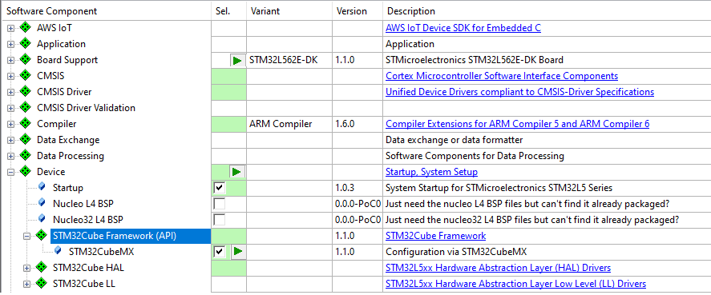

# YML Input Format

The following chapter explains the YML format that is used to describe the YML input files for the **CSolution** Project Manager.

**Table of Contents**
- [YML Input Format](#yml-input-format)
- [Name Conventions](#name-conventions)
  - [Pack Name Conventions](#pack-name-conventions)
  - [Component Name Conventions](#component-name-conventions)
  - [Device Name Conventions](#device-name-conventions)
  - [Board Name Conventions](#board-name-conventions)
- [Access Sequences](#access-sequences)
- [Overall File Structure](#overall-file-structure)
  - [`default:`](#default)
  - [`solution:`](#solution)
  - [`project:`](#project)
  - [`layer:`](#layer)
- [Toolchain Options](#toolchain-options)
  - [`compiler:`](#compiler)
  - [`output-type:`](#output-type)
  - [`linker:`](#linker)
- [Translation Control](#translation-control)
  - [`optimize:`](#optimize)
  - [`debug:`](#debug)
  - [`warnings:`](#warnings)
  - [`defines:`](#defines)
  - [`undefines:`](#undefines)
  - [`add-paths:`](#add-paths)
  - [`del-paths:`](#del-paths)
  - [`misc:`](#misc)
- [Pack Selection](#pack-selection)
  - [`packs:`](#packs)
  - [`pack:`](#pack)
- [Target Selection](#target-selection)
  - [`board:`](#board)
  - [`device:`](#device)
- [Processor Attributes](#processor-attributes)
  - [`processor:`](#processor)
- [Target and Build Types](#target-and-build-types)
  - [`target-types:`](#target-types)
  - [`build-types:`](#build-types)
- [Build/Target-Type control](#buildtarget-type-control)
  - [`for-type:`](#for-type)
  - [`not-for-type:`](#not-for-type)
    - [*type list*](#type-list)
    - [*list nodes*](#list-nodes)
- [Related Projects](#related-projects)
  - [`projects:`](#projects)
- [Source File Management](#source-file-management)
  - [`groups:`](#groups)
  - [`files:`](#files)
  - [`layers:`](#layers)
  - [`components:`](#components)
  - [`instances:`](#instances)
- [Pre/Post build steps](#prepost-build-steps)
  - [`execute:`](#execute)
- [Layer todo](#layer-todo)
- [Generator (Proposal)](#generator-proposal)
  - [Workflow assumptions](#workflow-assumptions)
  - [Steps for component selection and configuration](#steps-for-component-selection-and-configuration)
  - [Enhance Usability](#enhance-usability)
  - [Workflow](#workflow)
  - [Changes to the *.GPDSC file](#changes-to-the-gpdsc-file)
  - [Changes to the *.PDSC file](#changes-to-the-pdsc-file)
- [Resource Management](#resource-management)
  - [`resources:`](#resources)
    - [`- import:`](#--import)
    - [`- split:`](#--split)
    - [`- combine`](#--combine)
  - [`phases:`](#phases)
  - [`project-zones:`](#project-zones)
    - [`- memory:`](#--memory)
    - [`- peripheral:`](#--peripheral)
  - [`requires:`](#requires)
    - [`- memory:`](#--memory-1)
    - [`- peripheral:`](#--peripheral-1)

# Name Conventions

## Pack Name Conventions

The CMSIS Project Manager uses the following syntax to specify the `pack:` names in the `*.yml` files.

```text
vendor [:: pack-name [@[~ | >=] version] ]
```

Element      | Description
:------------|:---------------------
`vendor`     | is the vendor name of the software pack (optional).
`pack-name`  | is the name of the software pack, for the key `filter:` wildcards (*, ?) can be used.
`version`    | is the version number of the software pack, with `@1.2.3` that must exactly match, `@~1.2`/`@~1` that matches with sematic versioning, or `@>=1.2.3` that allows any version higher or equal.

**Examples:**

```yml
- pack:   ARM::CMSIS@5.5.0                             # 'CMSIS' Pack (with version 5.5.0)
- pack:   Keil::MDK-Middleware@>=7.13.0                # 'MDK-Middleware' Software Pack from vendor Keil (with version 7.13.0 or higher)
- filter: AWS                                          # All Software Packs from vendor 'AWS'
- filter: Keil::STM*                                   # All Software Packs that start with 'STM' from vendor 'Keil'
```

## Component Name Conventions

The CMSIS Project Manager uses the following syntax to specify the `component:` names in the `*.yml` files.

```text
[Cvendor::] Cclass [&Cbundle] :Cgroup [:Csub] [&Cvariant] [@[~ | >=]Cversion]
```

Element    | Description
:----------|:---------------------
`Cvendor`  | is the name of the component vendor defined in `<components>` element of the software pack (optional).
`Cclass`   | is the component class name  defined in `<components>` element of the software pack (required)
`Cbundle`  | is the bundle name of component class defined in `<bundle>` element of the software pack (optional).
`Cgroup`   | is the component group name  defined in `<components>` element of the software pack (required).
`Csub`     | is the component sub-group name  defined in `<components>` element of the software pack (optional).
`Cvariant` | is the component sub-group name  defined in `<components>` element of the software pack (optional).
`Cversion` | is the version number of the component, with `@1.2.3` that must exactly match, `@~1.2`/`@~1` that matches with sematic versioning, or `@>=1.2.3` that allows any version higher or equal.

> Notes:
> - The unique separator `::` allows to omit `Cvendor`
> - When `Cvariant` is omitted, the default `Cvariant` is selected.

**Examples:**

```yml
- component: ARM::CMSIS:CORE                           # CMSIS Core component from vendor ARM (any version)
- component: ARM::CMSIS:CORE@5.5.0                     # CMSIS Core component from vendor ARM (with version 5.5.0)
- component: ARM::CMSIS:CORE@>=5.5.0                   # CMSIS Core component from vendor ARM (with version 5.5.0 or higher)

- component: Device:Startup                            # Device Startup component from any vendor

- component: CMSIS:RTOS2:Keil RTX5                     # CMSIS RTOS2 Keil RTX5 component with default variant (any version)
- component: ARM::CMSIS:RTOS2:Keil RTX5&Source@5.5.3   # CMSIS RTOS2 Keil RTX5 component with variant 'Source' and version 5.5.3

- component: Keil::USB&MDK-Pro:CORE&Release@6.15.1     # From bundle MDK-Pro, USB CORE component with variant 'Release' and version 6.15.1
```

## Device Name Conventions

The device specifies multiple attributes about the target that ranges from the processor architecture to Flash algorithms used for device programming. The following syntax is used to specify a `device:` value in the `*.yml` files.

```text
[Dvendor:: [device_name] ] [:Pname]
```

Element       | Description
:-------------|:---------------------
`Dvendor`     | is the name (without enum field) of the device vendor defined in `<devices><family>` element of the software pack (optional).
`device_name` | is the device name (Dname attribute) or when used the variant name (Dvariant attribute) as defined in the \<devices\> element.
`Pname`       | is the processor identifier (Pname attribute) as defined in the `<devices>` element.

**Notes:**

- All elements of a device name are optional which allows to supply additional information, such as the `:Pname` at different stages of the project. However the `device_name` itself is a mandatory element and must be specified in context of the various project files.
- `Dvendor::` must be used in combination with the `device_name`.  

**Examples:**

```yml
device: NXP::LPC1768                                # The LPC1788 device from NXP
device: LPC1788                                     # The LPC1788 device (vendor is evaluated from DFP)
device: LPC55S69JEV98                               # Device name (exact name as defined in the DFP)
device: LPC55S69JEV98:cm33_core0                    # Device name (exact name as defined in the DFP) with Pname specified
device: :cm33_core0                                 # Pname added to a previously defined device name (or a device derived from a board)
```

## Board Name Conventions

Evaluation Boards define indirectly a device via the related BSP.   The following syntax is used to specify a `board:` value in the `*.yml` files.

```text
[vendor::] board_name
```

Element      | Description
:------------|:---------------------
`vendor`     | is the name of the board vendor defined in `<boards><board>` element of the board support pack (BSP) (optional).
`board_name` | is the board name (name attribute) of the as defined in the \<board\> element of the BSP.

**Note:**

- When a `board:` is specified, the `device:` specification can be omitted, however it is possible to overwrite the device setting in the BSP with an explicit `device:` setting.

**Examples:**

```yml
board: Keil::MCB54110                             # The Keil MCB54110 board (with device NXP::LPC54114J256BD64) 
board: LPCXpresso55S28                            # The LPCXpresso55S28 board
```

# Access Sequences

The following **Access Sequences** allow to use arguments from the CMSIS Project Manager as arguments of the various `*.yml` files in the key values for `defines:`, `add-paths:`, `misc:`, `files:`, and `execute:`. The **Access Sequences** can refer in a different project and provide therefore a method to describe project dependencies.

Access Sequence                                | Description
:----------------------------------------------|:--------------------------------------
`$Bname$`                                      | Board name of the selected board.
`$Dname$`                                      | Device name of the selected device.
`$Output(project[.build-type][+target-type])$` | Path to the output file of a related project that is defined in the `*.csolution.yml` file.
`$OutDir(project[.build-type][+target-type])$` | Path to the output directory of a related project that is defined in the `*.csolution.yml` file.
`$Source(project[.build-type][+target-type])$` | Path to the source directory of a related project that is defined in the `*.csolution.yml` file.

The `.build-type` and `+target-type` can be explicitly specified.  When ommited the `.build-type` and/or `+target-type` of the current processed context is used.

**Note:** The Access Sequences below are not completed yet, as they require a change to CMSIS-Build.

Access Sequence                                | Description
:----------------------------------------------|:--------------------------------------
`$Bpack$`                                      | Path to the pack that defines the selected board (BSP).
`$Dpack$`                                      | Path to the pack that defines the selected device (DFP).
`$PackRoot$`                                   | Path to the CMSIS Pack Root directory.
`$Pack(vendor.name)$`                          | Path to specific pack [with latest version ToDo: revise wording]. Example: `$Pack(NXP.K32L3A60_DFP)$`.

**Example:**

For the example below we assume the following `build-type`, `target-type`, and `projects` definitions.

```yml
solution:
  target-types:
    - type: Board
      board: NUCLEO-L552ZE-Q    # specifies board

    - type: Production-HW
      device: STM32U5X          # specifies device
      
  build-types:
    - type: Debug
      optimize: debug
      debug: on

    - type: Release
      optimize: max
    
  projects:
    - project: ./bootloader/Bootloader.cproject.yml           # relative path
    - project: /MyDevelopmentTree/security/TFM.cproject.yml   # absolute path
    - project: ./application/MQTT_AWS.cproject.yml            # relative path
```

The `project: /application/MQTT_AWS.cproject.yml` can now use **Access Sequences** to reference files or directories in other projects that belong to a solution. For example, these references are possible in the file `MQTT_AWS.cproject.yml`.

The example below uses the `build-type` and `target-type` of the current processed context. In practice this means that the same `build-type` and `target-type` is used as for the `MQTT_AWS.cproject.yml` project.

```yml
    files:
    - file: `$Output(TFM)$`.o                             # use the symbol output file of the TFM Project
```

The example below uses from the TFM project always `build-type: Debug` and the `target-type: Production-HW`.

```yml
    files:
    - file: `$Output(TFM.Release+Production-HW)$`.o       # use the symbol output file of the TFM Project
```

The example below uses the `build-type: Debug`. The `target-type` of the current processed context is used.

```yml
  - execute: Generate Image
    os: Windows                           # on Windows run from
    run: $DPack$/bin/gen_image.exe        # DFP the get_image tool
    arg: -input $Output(TFM.Debug).axf -output $Output(TFM.Debug)
```

The example below creates a `define` that uses the device name.

```yml
groups:
  - group:  "Main File Group"
    defines:
      - $Dname$                           # Generate a #define 'device-name' for this file group
```

# Overall File Structure

The table below explains the top-level elements in each of the different `*.yml` input files.

Keyword                          | Description
:--------------------------------|:------------------------------------
[`default:`](#default)           | Start of `*.cdefault.yml` file that provides global settings
[`solution:`](#solution)         | Start of `*.csolution.yml` file that [collects related projects](Overview.md#solution-collection-of-related-projects) along with build order.
[`project:`](#project)           | Start of `*.cproject.yml` file that that defines a project that can be indepentantly generated.
[`layer:`](#layer)               | Start of `*.clayer.yml` file that contains pre-configured software components along with source files.

## `default:`

The `default:` node is the start of a `*.cdefaults.yml` file and contain the following.

`default:`                                            | Content
:-----------------------------------------------------|:------------------------------------
&nbsp;&nbsp; [`packs:`](#packs)                       | Defines local packs and/or scope of packs that are used
&nbsp;&nbsp; [`compiler:`](#compiler)                 | Default toolchain selection
&nbsp;&nbsp; [`build-types:`](#build-types)           | Default list of build-types (i.e. Release, Debug)

**Example:**

```yml
default:
  compiler: AC6                   # use Arm Compiler 6 as default

  packs:
    - filter: ARM                 # use all packs from Arm
    - filter: AWS                 # use all packs from AWS
    - filter: NXP::*LPC*          # use all packs from NXP that contain LPC

    - pack: ARM::CMSIS            # use local path for the CMSIS pack
      path: .\dev\CMSIS
    - pack: Keil::MDK-Middleware  # use MDK-Middleware pack from Keil
      
  build-types:                
    - type: Debug
      optimize: debug
      debug: on

    - type: Release
      optimize: max
```


## `solution:`

The `solution:` node is the start of a `*.csolution.yml` file that collects related projects as described in the section ["Project setup for related projects"](Overview.md#project-setup-for-related-projects).

`solution:`                                           | Content
:-----------------------------------------------------|:------------------------------------
&nbsp;&nbsp; [`packs:`](#packs)                       | Defines local packs and/or scope of packs that are used
&nbsp;&nbsp; [`compiler:`](#compiler)                 | Overall toolchain selection for the solution
&nbsp;&nbsp; [`target-types:`](#target-types)         | List of target-types that define the target system (device or board)
&nbsp;&nbsp; [`build-types:`](#build-types)           | List of build-types (i.e. Release, Debug, Test)
&nbsp;&nbsp; [`projects:`](#projects)                 | List of projects that belong to the solution

**Example:**

```yml
solution:
  compiler: GCC                 # overwrite compiler definition in 'cdefaults.yml'

  packs: 
    - filter: ST                # add ST packs to existing filter in 'cdefaults.yml'

  build-types:                  # additional build types
    - type: Test
      optimize: debug
      debug: on      
      packs:                    # with explicit pack specification
        - pack: ST::TestSW
          path: .\MyDev\TestSW    

  target-types:
    - type: Board
      board: NUCLEO-L552ZE-Q

    - type: Production-HW
      device: STM32U5X          # specifies device
      
  projects:
    - project: ./blinky/Bootloader.cproject.yml
    - project: /security/TFM.cproject.yml
    - project: /application/MQTT_AWS.cproject.yml
```

## `project:`

The `project:` node is the start of a `*.cproject.yml` file and contain the following.

`project:`                                            | Content
:-----------------------------------------------------|:------------------------------------
&nbsp;&nbsp; [`description:`](#description)           | Project description (optional)
&nbsp;&nbsp; [`compiler:`](#compiler)                 | Toolchain selection (optional)
&nbsp;&nbsp; [`output-type:`](#output-type)           | Generate executable (default) or library
&nbsp;&nbsp; [`optimize:`](#optimize)                 | Optimize level for code generation (optional)
&nbsp;&nbsp; [`linker:`](#linker)                     | Instructions for the linker
&nbsp;&nbsp; [`debug:`](#debug)                       | Generation of debug information (optional)
&nbsp;&nbsp; [`defines:`](#defines)                   | Preprocessor (#define) symbols for code generation (optional)
&nbsp;&nbsp; [`undefines:`](#undefines)               | Remove preprocessor (#define) symbols (optional)
&nbsp;&nbsp; [`add-paths:`](#add-paths)               | Additional include file paths (optional)
&nbsp;&nbsp; [`del-paths:`](#del-paths)               | Remove specific include file paths (optional)
&nbsp;&nbsp; [`misc:`](#misc)                         | Literal tool-specific controls
&nbsp;&nbsp; [`board:`](#board)                       | Board specification (optional)
&nbsp;&nbsp; [`device:`](#device)                     | Device specification (optional)
&nbsp;&nbsp; [`processor:`](#processor)               | Processor specific settings (optional)
&nbsp;&nbsp; [`groups:`](#groups)                     | List of source file groups along with source files
&nbsp;&nbsp; [`components:`](#components)             | List of software components used
&nbsp;&nbsp; [`layers:`](#layers)                     | List of software layers that belong to the project

**Example:**

```yml
project:
  description:           # project description (optional)
  compiler:              # toolchain specification (optional) 
  output-type: lib | exe # generate executable (default) or library
  linker:                # instructions for the link step

  optimize:              # optimize level for code generation (optional)
  debug:                 # generation of debug information (optional)
  defines:               # define symbol settings for code generation (optional).
  undefines:             # remove define symbol settings for code generation (optional).
  add-paths:             # additional include file paths (optional).
  del-paths:             # remove specific include file paths (optional). 
  misc:                  # Literal tool-specific controls

  board:                 # board specification (optional)
  device:                # device specification (optional)         
  processor:             # processor specific settings (optional)

  groups:                # List of source file groups along with source files
  components:            # List of software components used
  layers:                # List of software layers that belong to the project
```

## `layer:`

The following top-level *key values* are supported in a `*.clayer.yml` file.

```yml
layer:                   # Start of a layer
  description:           # layer description (optional)
  interfaces:            # List of consumed and provided interfaces
  groups:                # List of source file groups along with source files
  components:            # List of software components used
```

# Toolchain Options

The following code translation  options may be used at various places such as:
  - [`solution:`](#solution) level to specify options for a collection of related projects
  - [`project:`](#projects) level to specify options for a project

## `compiler:`

Selects the compiler toolchain used for code generation.

Value                                                 | Supported Compiler
:-----------------------------------------------------|:------------------------------------
`AC6`                                                 | Arm Compiler version 6
`GCC`                                                 | GCC Compiler
`IAR`                                                 | IAR Compiler

**Example:**

```yml
compiler: AC6              # Select Arm Compiler version 6
```

## `output-type:`

Selects the output type for code generation.

Value                                                 | Generated Output
:-----------------------------------------------------|:------------------------------------
`exe`                                                 | Executable in ELF format
`lib`                                                 | Library or archive

**Example:**

```yml
output-type: lib            # Generate a library
```

## `linker:`

The `linker:` node controls the linker operation.

`linker:`                                             | Content
:-----------------------------------------------------|:------------------------------------
&nbsp;&nbsp; `script:`                                | Explicit file name of the linker script

**Example:**

```yml
linker:                      # Control linker operation
  - script: .\MyProject.sct  # Explicit scatter file
    for-type: .Debug  
```

# Translation Control

The following translation control options may be used at various places such as:
  - [`solution:`](#solution) level to specify options for a collection of related projects
  - [`project:`](#projects) level to specify options for a project
  - [`groups:`](#groups) level to specify options for a specify source file group
  - [`files:`](#files) level to specify options for a specify source file

**Notes:**

- `defines:`, `add-paths:`, `del-paths:`  and `misc:` are additive. All other keywords overwrite previous settings.

## `optimize:`

Generic optimize levels for code generation; mapped to the compiler toolchain by CMSIS-Build.

Value                                                 | Code Generation
:-----------------------------------------------------|:------------------------------------
`balanced`                                            | Balanced optimization (default)
`size`                                                | Optimized for code size
`speed`                                               | Optimized for execution speed
`debug`                                               | Optimized for debug illusion (generates typical slower and larger code)
`max`                                                 | Maximum optimization (may use link-time optimizations)

**Example:**

```yml
groups:
  - group:  "Main File Group"
    optimize: debug         # optimize this file group for debug illusion
    files: 
      - file: file1a.c
      - file: file1b.c
```

## `debug:`

Control the generation of debug information; mapped to the compiler toolchain by CMSIS-Build.

Value                                                 | Code Generation
:-----------------------------------------------------|:------------------------------------
`on`                                                  | Generate debug information (default)
`off`                                                 | Generate no debug information

**Example:**

```yml
 build-types:
    - type: Release
      optimize: size        
      debug: off            # generate no debug information for the release build
```

## `warnings:`

Control warnings (could be: no, all, Misra, AC5-like), mapped to the toolchain by CMSIS-Build.

## `defines:`

Contains a list of symbol #define statements that are passed via the command line to the development tools.

`defines:`                                            | Content
:-----------------------------------------------------|:------------------------------------
&nbsp;&nbsp; `- <symbol-name>:`                       | #define symbol passed via command line
&nbsp;&nbsp; `- <symbol-name>: <value>`               | #define symbol with value passed via command line

**Example:**

```yml
defines:                   # Start a list of define statements
  - TestValue: 12          # add symbol 'TestValue' with value 12
  - TestMode:              # add symbol 'TestMode'
```

## `undefines:`

Remove symbol #define statements from the command line of the development tools.

**YML structure:**

```yml
groups:
  - group:  "Main File Group"
    undefines:
      - TestValue           # remove define symbol `TestValue` for this file group
    files: 
      - file: file1a.c
        undefines:
         - TestMode         # remove define symbol `TestMode` for this file
      - file: file1b.c
```

## `add-paths:`

Add include paths to the command line of the development tools.

**YML structure:**
```yml
add-paths:                 # Start a list path names that should be added to the include file search
  - path:                  # add path name
  - path:
```

## `del-paths:`

Remove include paths (that are defined at the cproject level) from the command line of the development tools.

**YML structure:**
```yml
del-paths:                 # Start a list of path names that should be removed from the include file search
  - path:                  # remove path name
  - *                      # remove all paths
```

## `misc:`

Add miscellaneous literal tool-specific controls that are directly passed to the individual tools depending on the file type.

**YML structure:**
```yml
misc:                      # Start a list of literal control strings that are directly passed to the tools.
  - compiler:              # select the toolchain that the literal control string applies too (AC6, IAR, GCC).
    C: string              # applies to *.c files only.
    CPP: string            # applies to *.cpp files only.
    C*: string             # applies to *.c and *.cpp files.
    ASM: string            # applies to assembler source files
    Link: string           # applies to the linker
    Lib: string            # applies to the library manager or archiver
```

# Pack Selection

The `packs:` node can be specified in the `*.csolution.yml` and `*.cdefault.yml` file allows you to:
  
  - Reduce the scope of software packs that are available for projects.
  - Add specific software packs optional with a version specification.
  - Provide a path to a local installation of a software pack that is for example project specific or under development.

The  [Pack Name Conventions](#pack-name-conventions) are used to specify the name of the software packs.
The `pack:` definition can be specific to [target and build types](#target-and-build-types) and may provide a local path to a development repository of a software pack.

## `packs:`

The `packs:` node is the start of a pack selection.

`packs:`                                              | Content
:-----------------------------------------------------|:------------------------------------
&nbsp;&nbsp; `-filter:`                               | Lists a selection for software packs (additive) with wildcards
&nbsp;&nbsp; [`-pack:`](#pack)                        | Explicit pack specification (additive), overrules `filter:` settings

**Note:**
  - `filter:` is not allowed when `packs:` are specified as part of [`target-types:`](#target-types) or [`build-types:`](#build-types).


## `pack:`

The `pack:` list allows to add specific software packs, optional with a version specification. The version number can have also the format `@~1.2`/`@~1` that matches with sematic versioning.

`pack:`                                               | Content
:-----------------------------------------------------|:------------------------------------
&nbsp;&nbsp; `path:`                                  | Explicit path name that stores the software pack
&nbsp;&nbsp; [`for-type:`](#for-type)                 | Include pack for a list of *build* and *target* types.
&nbsp;&nbsp; [`not-for-type:`](#not-for-type)         | Exclude pack for a list of *build* and *target* types.

**Example:**

```yml
packs:                                  # start section that specifics software packs
  - filter: AWS                         # use packs from AWS
  - filter: NXP::*K32L*                 # use packs from NXP that relate to K32L series (would match K32L3A60_DFP + FRDM-K32L3A6_BSP)
  - filter: ARM                         # use packs from Arm

  - pack: Keil::Arm_Compiler            # add always Keil::Arm_Compiler pack (bypasses filter)
  - pack: Keil::MDK-Middleware@7.13.0   # add Keil::MDK-Middleware pack at version 7.13.0
  - pack: ARM::CMSIS-FreeRTOS@~10.4     # add CMSIS-FreeRTOS with version 10.4.x

  - pack: NXP::K32L3A60_DFP             # add pack for NXP device 
    path: ./local/NXP/K32L3A60_DFP      # with path to the pack (local copy, repo, etc.)

  - pack: AWS::coreHTTP                 # add pack
    path: ./development/AWS/coreHTTP    # with path to development source directory
    for-type: +DevTest                  # pack is only used for target-type "DevTest"
```

# Target Selection

## `board:`

Specifies a [unique board name](#board-name-conventions), optionally with vendor that must be defined in software packs. This information is used to define the `device:` along with basic toolchain settings.

## `device:`

Specifies a [unique device name](#device-name-conventions), optionally with vendor that must be defined in software packs. This information is used to define the `device:` along with basic toolchain settings.

A `device:` is derived from the `board:` setting, but an explicit `device:` setting overrules the `board:` device.

If `device:` specifies a multi-core device, and no explicit `core` is specified, the default `core` of the device is used.

# Processor Attributes

## `processor:`
The `processor:` keyword defines attributes such as TrustZone and FPU register usage.

```yml
  processor:               # processor specific settings
    trustzone: secure      # TrustZone mode: secure | non-secure | off
    fpu: on | off          # control usage of FPU registers (S-Register for Helium/FPU) (default: on for devices with FPU registers)
    endian: little | big   # select endianess (only available when devices are configurable)
```

**Note:**
- Default for `trustzone:` 
   - `off` for devices that support this option.
   - `non-secure` for devices that have TrustZone enabled.

# Target and Build Types

The section [Project setup for multiple targets and test builds](Overview.md#project-setup-for-multiple-targets-and-builds) describes the concept of  `target-types` and `build-types`.  These *types* can be defined in the following files in the following order:

- `default.csettings.yml`  where it defines global *types*, such as *Debug* and *Release* build.
- `*.csolution.yml` where it specifies the build and target *types* of the complete system.

The *`target-type`* and *`build-type`* definitions are additive, but an attempt to redefine an already existing type results in an error.

The settings of the *`target-type`* are processed first; then the settings of the *`build-type`* that potentially overwrite the *`target-type`* settings.

## `target-types:`

The `target-types:` node may include [toolchain options](#toolchain-options), [target selection](#target-selection), [processor attributes](#processor-attributes), and explicit selection of [software packs](`pack:`).

`target-types:`                                       | Content
:-----------------------------------------------------|:------------------------------------
`- type:`                                             | Name of the target-type (required)
&nbsp;&nbsp;&nbsp; [`compiler:`](#compiler)           | Toolchain selection (optional)
&nbsp;&nbsp;&nbsp; [`output-type:`](#output-type)     | Generate executable (default) or library
&nbsp;&nbsp;&nbsp; [`optimize:`](#optimize)           | Optimize level for code generation (optional)
&nbsp;&nbsp;&nbsp; [`debug:`](#debug)                 | Generation of debug information (optional)
&nbsp;&nbsp;&nbsp; [`defines:`](#defines)             | Preprocessor (#define) symbols for code generation (optional)
&nbsp;&nbsp;&nbsp; [`undefines:`](#undefines)         | Remove preprocessor (#define) symbols (optional)
&nbsp;&nbsp;&nbsp; [`add-paths:`](#add-paths)         | Additional include file paths (optional)
&nbsp;&nbsp;&nbsp; [`del-paths:`](#del-paths)         | Remove specific include file paths (optional)
&nbsp;&nbsp;&nbsp; [`misc:`](#misc)                   | Literal tool-specific controls (optional)
&nbsp;&nbsp;&nbsp; [`board:`](#board)                 | Board specification (optional)
&nbsp;&nbsp;&nbsp; [`device:`](#device)               | Device specification (optional)
&nbsp;&nbsp;&nbsp; [`processor:`](#processor)         | Processor specific settings (optional)
&nbsp;&nbsp;&nbsp; [`packs:`](#packs)                 | Explicit selection of software packs (optional)

## `build-types:`

The `build-types:` node may include [toolchain options](#toolchain-options) and explicit selection of [software packs](`pack:`).

`target-types:`                                       | Content
:-----------------------------------------------------|:------------------------------------
`- type:`                                             | Name of the target-type (required)
&nbsp;&nbsp;&nbsp; [`compiler:`](#compiler)           | Toolchain selection (optional)
&nbsp;&nbsp;&nbsp; [`output-type:`](#output-type)     | Generate executable (default) or library
&nbsp;&nbsp;&nbsp; [`optimize:`](#optimize)           | Optimize level for code generation (optional)
&nbsp;&nbsp;&nbsp; [`debug:`](#debug)                 | Generation of debug information (optional)
&nbsp;&nbsp;&nbsp; [`defines:`](#defines)             | Preprocessor (#define) symbols for code generation (optional)
&nbsp;&nbsp;&nbsp; [`undefines:`](#undefines)         | Remove preprocessor (#define) symbols (optional)
&nbsp;&nbsp;&nbsp; [`add-paths:`](#add-paths)         | Additional include file paths (optional)
&nbsp;&nbsp;&nbsp; [`del-paths:`](#del-paths)         | Remove specific include file paths (optional)
&nbsp;&nbsp;&nbsp; [`misc:`](#misc)                   | Literal tool-specific controls (optional)
&nbsp;&nbsp;&nbsp; [`packs:`](#packs)                 | Explicit selection of software packs (optional)

**Example:**

```yml
target-types:
  - type: Board
    board: NUCLEO-L552ZE-Q       # board specifies indirectly also the device

  - type: Production-HW
    device: STM32L552RC          # specifies device
      
build-types:
  - type: Debug
    optimize: debug
    debug: on

  - type: Test
    optimize: max
    debug: on
    packs:
      - pack: ARM::CMSIS
        path: .\local-packs\cmsis
```

The `board:`, `device:`, and `processor:` settings are used to configure the code translation for the toolchain.  These settings are processed in the following order:

1. `board:` relates to a BSP software pack that defines board parameters, including the [mounted device](https://arm-software.github.io/CMSIS_5/Pack/html/pdsc_boards_pg.html#element_board_mountedDevice).  If `board:` is not specified, a `device:` most be specified.
2. `device:` defines the target device.  If `board:` is specified, the `device:` setting can be used to overwrite the device or specify the processor core used.
3. `processor:` overwrites default settings for code generation, such as endianess, TrustZone mode, or disable Floating Point code generation.

**Examples:**

```yml
target-types:
  - type: Production-HW
    board: NUCLEO-L552ZE-Q    # hardware is similar to a board (to use related software layers)
    device: STM32L552RC       # but uses a slightly different device
    processor: 
      trustzone: off          # TrustZone disabled for this project
```

```yml
target-types:
  - type: Production-HW
    board: FRDM-K32L3A6       # NXP board with K32L3A6 device
    device: :cm0plus          # use the Cortex-M0+ processor
```

# Build/Target-Type control

Depending on a *`target-type`* or *`build-type`* selection it is possible to include or exclude *items* in the build process.

## `for-type:`
A [*type list*](#type-list) that adds a [*list-node*](#list-nodes) for a specific target or build *type* or a list of *types*.

## `not-for-type:`

A [*type list*](#type-list) that removes an [*list-node*](#list-nodes) for a specific target or build *type* or a list of *types*.

### *type list*

It is possible to specify only a `<build-type>`, only a `<target-type>` or a combination of `<build-type>` and `<target-type>`. It is also possible to provide a list of *build* and *target* types. The *type list syntax* for `for-type:` or `not-for-type:` is:

`[.<build-type>][+<target-type>] [, [.<build-type>]+[<target-type>]] [, ...]`

**Examples:**

```yml
for-type:      .Test                            # add item for build-type: Test (any target-type)
not-for-type:  +Virtual                         # remove item for target-type: Virtual (any build-type)
not-for-type:  .Release+Virtual                 # remove item for build-type: Release with target-type: Virtual
for-type:      .Debug, .Release+Production-HW   # add for build-type: Debug and build-type: Release / target-type: Production-HW
```

### *list nodes*

The keyword `for-type:` or `not-for-type:` can be applied to the following list nodes:

List Node                                  | Description
:------------------------------------------|:------------------------------------
[`- project:`](#projects)     | At `projects:` level it is possible to control inclusion of project.
[`- group:`](#groups)         | At `groups:` level it is possible to control inclusion of a file group.
[`- file:`](#files)           | At `files:` level it is possible to control inclusion of a file.
[`- layer:`](#layers)         | At `projects:` level it is possible to control inclusion of a software layer.
[`- component:`](#components) | At `components:` level it is possible to control inclusion of a software component.

# Related Projects

The section [Project setup for related projects](Overview.md#project-setup-for-related-projects) describes the collection of related projects.  The file `*.csolution.yml` describes the relationship of this projects.  This file may also define [Target and Build Types](#target-and-build-types) before the section `solution:`.

## `projects:`

The YML structure of the section `projects:` is:

```yml
projects:                  # Start a list of projects.
  - project:               # path to the project file (required).
    for-type:              # include project for a list of *build* and *target* types (optional).
    not-for-type:          # exclude project for a list of *build* and *target* types (optional).
    compiler:              # specify a specific compiler
    optimize:              # optimize level for code generation (optional)
    debug:                 # generation of debug information (optional)
    defines:               # define symbol settings for code generation (optional).
    undefines:             # remove define symbol settings for code generation (optional).
    add-paths:             # additional include file paths (optional).
    del-paths:             # remove specific include file paths (optional). 
    misc:                  # Literal tool-specific controls
```


# Source File Management 

Keyword          | Allowed for following files..                  | Description
:----------------|:-----------------------------------------------|:------------------------------------
`groups:`        | `*.cproject.yml`, `*.clayer.yml`               | Start of a list that adds [source groups and files](#source-file-management) to a project or layer.
`layers:`        | `*.cproject.yml`                               | Start of a list that adds software layers to a project.
`components:`    | `*.cproject.yml`, `*.clayer.yml`               | Start of a list that adds software components to a project or layer.

## `groups:`

**YML structure:**

```yml
groups:                # Start a list of groups
  - group:             # name of the group
    for-type:          # include group for a list of *build* and *target* types.
    not-for-type:      # exclude group for a list of *build* and *target* types.
    optimize:          # optimize level for code generation (optional)
    debug:             # generation of debug information (optional)
    defines:           # define symbol settings for code generation (optional).
    undefines:         # remove define symbol settings for code generation (optional).
    add-paths:         # additional include file paths (optional).
    del-paths:         # remove specific include file paths (optional). 
    misc:              # Literal tool-specific controls
    groups:            # Start a nested list of groups
      - group:         # name of the group
         :
    files:             # Start a nested list of files
      - file:          # file name along with path
        for-type:      # include group for a list of *build* and *target* types.
        not-for-type:  # exclude group for a list of *build* and *target* types.
        optimize:      # optimize level for code generation (optional)
        debug:         # generation of debug information (optional)
        defines:       # define symbol settings for code generation (optional).
        undefines:     # remove define symbol settings for code generation (optional).
        add-paths:     # additional include file paths (optional).
        del-paths:     # remove specific include file paths (optional). 
        misc:          # Literal tool-specific controls.
```

## `files:`

**Example:**

Add source files to a project or a software layer.  Used in `*.cproject.yml` and `*.clayer.yml` files.

```yml
groups:
  - group:  "Main File Group"
    not-for-type: .Release+Virtual, .Test-DSP+Virtual, +Board
    files: 
      - file: file1a.c
      - file: file1b.c
        defines:
          - a: 1
        undefines:
          - b
        optimize: size

  - group: "Other File Group"
    files:
      - file: file2a.c
        for-type: +Virtual
        defines: 
          - test: 2
      - file: file2a.c
        not-for-type: +Virtual
      - file: file2b.c

  - group: "Nested Group"
    groups:
      - group: Subgroup1
        files:
          - file: file-sub1-1.c
          - file: file-sub1-2.c
      - group: Subgroup2
        files:
          - file: file-sub2-1.c
          - file: file-sub2-2.c
```

## `layers:` 

Add a software layer to a project.  Used in `*.cproject.yml` files.

**YML structure:**

```yml
layers:                # Start a list of layers
  - layer:             # path to the `*.clayer.yml` file that defines the layer (required).
    for-type:          # include layer for a list of *build* and *target* types (optional).
    not-for-type:      # exclude layer for a list of *build* and *target* types (optional).
    optimize:          # optimize level for code generation (optional).
    debug:             # generation of debug information (optional).
    defines:           # define symbol settings for code generation (optional).
    undefines:         # remove define symbol settings for code generation (optional).
    add-paths:         # additional include file paths (optional).
    del-paths:         # remove specific include file paths (optional). 
    misc:              # Literal tool-specific controls.
```

## `components:`

Add software components to a project or a software layer.  Used in `*.cproject.yml` and `*.clayer.yml` files.

**YML structure:**

```yml
components:            # Start a list of layers
  - component:         # name of the software component.
    for-type:          # include layer for a list of *build* and *target* types (optional).
    not-for-type:      # exclude layer for a list of *build* and *target* types (optional).
    optimize:          # optimize level for code generation (optional).
    debug:             # generation of debug information (optional).
    defines:           # define symbol settings for code generation (optional).
    undefines:         # remove define symbol settings for code generation (optional).
    add-paths:         # additional include file paths (optional).
    del-paths:         # remove specific include file paths (optional). 
    misc:              # Literal tool-specific controls.
    instances:         # Configure component instances          
```

> NOTE: The name format for a software component is described under [Name Conventions - 
Component Names](#Component_Names)

## `instances:`

This is a proposal for component instances.

Modern microcontrollers often have multiple instances of the same peripheral interface (for example UART, SPI, USB, etc.). To be able to have separate configuration files for each of these instances, Software Components can have multiple instances as well. To cope with multiple configurations, the `instances:` list allows to assign peripherals to a usage and provide configuration parameters.

**YML structure:**

```yml
instances:             # Start a list of instances
  - name: value        # Assign a name to a instance, value is the instance number
    <parameters:>      # An unchecked list of key/value pairs to supply parameters for the instance
```

**Example:**

```yml
components:
  - component: CMSIS-Driver:UART
    instances:
      - WiFi: 0            # UART0 connection to WiFi chipset
        setup: wifi-config.json
        baudrate: 19200 
      - Debug: 2           # UART2 Debug I/O
        baudrate: 57600
```

*Extend tool behavior:*

- Existing definitions in the *.PDSC for [Component Instances](https://open-cmsis-pack.github.io/Open-CMSIS-Pack-Spec/main/html/pdsc_components_pg.html#Component_Instances) remain unchanged:

   - The instance *value* must be within the range of the attribute `maxInstances`. Hence there is currently no change in the *.PDSC format required.

   - The instance *values* can be non-contiguous, for example it is possible to specify instance value 1 and 4 for a component.  This requires a tool modification.

If the user selects multiple instances of the same component, all files with  attribute `config` in the `*.PDSC` file will be copied multiple times to the project. The name of the component (for example config_mylib.h) will get a postfix `_value`.  The instance `name:` specifies this `value`:

Instance 0: config_uart_0.h
Instance 2: config_uart_2.h

The availability of instances in a project can be made public in the `RTE_Components.h` file. The existing way to extend the `%Instance%` with the instance `value` is extended with `%Instance_Name%` to access the instance `name:`.

**Example: \*.PDSC file content:**
```c
<RTE_Components_h>
  <!-- the following content goes into file 'RTE_Components.h' -->
  #define HAL_UART%Instance%   %Instance_Name%
</RTE_Components_h>
```
**Expanded RTE_Components.h file:**

```c
  #define HAL_UART0    WiFi
  #define HAL_UART2    Debug
```

When component files are copied to the project workspace the tools also replaces text `%Instance%` and `%Instance_Name%` with instance `value` and `name:` for component files that have the `attr=config` or `attr=template` 

# Pre/Post build steps

Tbd: potentially map to CMake add_custom_command.

## `execute:`

```yml
- execute: description      # execute an external command with description
  os: Linux                 # executed on which operating systems (if omitted it is OS independent)
  run:                      # tool name that should be executed, optionally with path to the tool
  args:                     # tool arguments
  stop:                     # stop on exit code
```

Potential usage before/after build

```yml
solution:
  :
  :
  projects:
    - execute: Generate Keys for TF-M
      os: Linux
      run: KeyGen.exe
    - project: /security/TFM.cproject.yml
    - project: /application/MQTT_AWS.cproject.yml
    - execute: Copy output files
      run: cp *.out .\output
```

Potential usage during build steps
```yml
project:
  :
  :
  groups:
    - group:  "Main File Group"
      files: 
        - execute: Generate file1a.c
          run: xyz.exe
          ....
        - file: file1a.c
```

# Layer todo

Start of a layer definition in a `*.clayer.yml` file.


**Example:**


```yml
project:
  compiler: AC6

  layers:
    - layer: ..\layer\App\Blinky.clayer.yml
    - layer: ..\layer\Board+NUCELO-G474RE\Nucelo-G474RE.clayer.yml      # 'NUCLEO-G474RE' is target-type
    - layer: ..\layer\RTOS\RTX.clayer.yml
```    


```yml
layer: App
# name: Blinky
#  description: Simple example

# interfaces:
#   consumes:
#     - C_VIO:
#     - RTOS2:

  groups:
    - group: App
      files:
        - file: "./Blinky.c"
    - group: Documentation
      files:
        - file: name="./README.md"
```

```yml
layer:
  type: RTOS
  description: Keil RTX5 open-source real-time operating system with CMSIS-RTOS v2 API
  
interface:
  provides:
    - RTOS2:
    
components:
  component: CMSIS:RTOS2:Keil RTX5&Source
```

```yml
layer: Board
  name: NUCLEO-G474RE
  description: Board setup with interfaces 
  
interfaces:
  consumes:
    - RTOS2:
  provides:
    - C_VIO:
    - A_IO9_I:
    - A_IO10_O:
    - C_VIO:
    - STDOUT:
    - STDIN:
    - STDERR:
    - Heap: 65536

target-types:
  - type: NUCLEO-G474RE
    board:NUCLEO-G474RE

components:
  component: CMSIS:CORE
  component: CMSIS Driver:USART:Custom
  component: CMSIS Driver:VIO:Board&NUCLEO-G474RE
  component: Compiler&ARM Compiler:Event Recorder&DAP
  component: Compiler&ARM Compiler:I/O:STDERR&User
  component: Compiler&ARM Compiler:I/O:STDIN&User
  component: Compiler&ARM Compiler:I/O:STDOUT&User
  component: Board Support&NUCLEO-G474RE:Drivers:Basic I/O
  component: Device&STM32CubeMX:STM32Cube Framework:STM32CubeMX
  component: Device&STM32CubeMX:STM32Cube HAL
  component: Device&STM32CubeMX:Startup

groups:
  - group: Board IO
    files:
      - file: ./Board_IO/arduino.c
      - file: ./Board_IO/arduino.h
      - file: ./Board_IO/retarget_stdio.c
  - group: STM32CubeMX
    files:
      - file: ./RTE/Device/STM32G474RETx/STCubeGenerated/STCubeGenerated.ioc
```


Todo: work on this

The YML structure of the section `layer:` is:
```yml
layer:
  description:
  ....
```  

# Generator (Proposal)

## Workflow assumptions

The composition of a solution of a solution should have the following steps:

- Create `*.cproject.yml` files and the `*.csolution.yml` container that refers the projects.
- Select `device:` or `board:` (optionally by using `target-types:`)
- Add `components:` or `layers:` to the `*.cproject.yml` file
- For components that have configuration, run the generator in configuration mode
   - change pinout, clock, resources, etc.
   - reflect configuration in *.gpdsc file (and related settings files)

> Note: Components can have multiple [instances](#instances).

## Steps for component selection and configuration

The following explains the generator workflow of CSolution / CBuild for configuration of components:

1. User selects components in `*.cproject.yml` under `components:`
    - When these components require generation, user is notified to run a generator.
    - "CSolution Run GenID” is invoked for a list of components.
    - CSolution generates `*.cgen.json` file that provides project context and a list of user-selected components.
  
2. Running the Generator (for Component Configuration, i.e. pin selection)
     - Generator reads `*.cgen.json` file
     - User performs the configuration is done.
         - Interactive mode (where a settings file is generated)
         - Remote mode (where a settings file is an input) **IS THIS REALLY REQUIRED**
     - Generator creates a `*.gpdsc` file that informs the CSolution tool about
         - (a) the fact that a component is configured and has generated code, 
         - (b) additional components that are the result of some user configuration.

   Discussions: 
     - is a component list or a dependency list
     - Generator might be VS Code plugin or web based

3. User creates CBuild output with CSolution Convert command
      - Both `*.cproject.yml` and `*.gpdsc` are read by Csolution and create the complete list of selected components.
      - If `*.gpdsc` does not contain component information about a component that has `genId` and selected in `*.cproject.yml` the generator configuration is incomplete. This can happen when a component is added at a later step.
      - Likewise the Generator can detect with the `<component User="1">` attribute that a component is longer required. In this case the user is notified to run a generator.

## Enhance Usability

Add Run Generator buttons to Cclass descriptions.



## Workflow

1. For `*.cproject.yml` files that contain selected `<components>` with a `generator` or `genid` attribute the `csolution` manager checks if a file with the name `./<project>/RTE+<target>/<genid>.cgen.json` exists.
    - When this file is missing, it is required to use the command `csolution run genid` to start the generator.
    - When this file exists, the `csolution` manager checks if the list of components with `genid` has changed. If this is the case it is required to use the command `csolution run genid` to reconfigure generated components.

2. The command `csolution run genid` creates the file `./<project>/RTE+<target>/<genid>.cgen.json` and starts the generator.  The generator creates a *.GDPSC file along with other source files that are required [as specified](https://open-cmsis-pack.github.io/Open-CMSIS-Pack-Spec/main/html/pdsc_generators_pg.html#element_generators).

**Example Content of \*.cgen.json (in this case STM32CubeMX.cgen.json)**

The `*.cgen.json` file is passed to generator as argument.

**NOTE:** Shown is still a YML file, but the equivalent data would be formatted in *.JSON format

```yml
cgenerator:
  device: STM32F407IGHx
  board: NucleoF407
  solution: C:/tmp/MySolution/MySolution.csolution.yml 
  project: C:/tmp//MySolution/Blinky/Blinky.cproject.yml 
  context: .Debug+Nucelo    # build-type and target-type of the current generated context
  destination: C:/tmp/MySolution/Blinky/RTE+Nucelo/

  packs:                     # packs that are used for the project
    - pack: Keil::STM32F4xx_DFP@2.16.1
      path: C:/CMSIS-PACKS/Keil/STM32F4xx_DFP/2.16.1/
    - pack: Keil::STM32F4xx_BSP@2.1.1
      path: C:/CMSIS-PACKS/Keil/STM32F4xx_BSP/2.1.1/

  components:               # components that have a genid and are specified in *.cproject.yml
    - component: Device:STM32Cube HAL:Common
    - component: Board:LED
    - component: Device:HAL:UART
      instances:
        - WiFi: 0
          setup: wifi-config.json
          baudrate: 19200 
        - Debug: 2
          baudrate: 57600
```

## Changes to the *.GPDSC file

To indicate that a component was generated due to a user selection in `*.cproject.yml`, the `component` element is extended with `User` attribute.  When set to `1` it indicates that a component is included due to the selection in `*.cproject.yml`.

When a user removes this component in the `*.cproject.yml`, the CSolution could detect that a Run command should be executed.

## Changes to the *.PDSC file

- Add `<key>` to `<generator>` element.  The `key` is used to invoke the generator and pass the `<genid>.cgen.json` file.
  - on Windows to a registry key to invoke the generator tool
  - on Linux and MacOS to an environment variable that specifies how to invoke the generator tool
  - todo: Web based tools?

- Add `genId` to `component` element. Indicates that a component is managed by the `<generator>`.
   
- Add `inherent` to `component` element. Indicates that a component is managed by the `<generator>`

     Components with inherent attribute are not selectable by the user (and could be managed by the `<generator>`). Components with `inherent` attribute have the following behavior:
     - Are selected when a condition requires this component.
     - Are de-selected when a no condition requires this component.
    - IDE's may choose to hide such components in the RTE selection (default might be to show it).

- Add new file category:
  - `genParms` template parameters
  - `genInput` source templates for the generator and other related input files for the generator

**Example:**
```xml
 <generators>
    <!-- This generator is launched if any component referencing this generator by 'id' is selected and the specified <gpdsc> file does not exist -->
    <generator id="STM32CubeMX">
      <description>ST Microelectronics: STCubeMX Environment</description>
      <key>STCubeMX_CGENFILE</key>          <!-- for windows registry key that opens a *.cgenerator.yml file -->
                                            <!-- for Linux / MacOS the key is an environment variable that can start the tool -->
      <web>url</web>                        <!-- for web based tools the url is used and appended by &Cgen=file -->
      <workingDir>$PRTE/Device</workingDir> <!-- path is specified either absolute or relative to gpdsc file -->
      <gpdsc name ="myGen.gpdsc"/>  <!-- PDSC or GPDSC file. If not specified it is the project directory configured by the environment -->
      <files>   <!-- does this make sense? -->
        <file category="genHelper" name="Drivers/STM32F4xx_HAL_Driver/Src/common-file-for-gen.xyz"/>
      </files>
    </generator>
  </generators>

  <taxonomy>
    <description Cclass="Device" generator="STM32CubeMX" doc="Documentation/DM00105879.pdf" >STM32F4xx Hardware Abstraction Layer (HAL) and Drivers</description>
    <description Cclass="Board" generator="STM32CubeMX" doc="Documentation/DM00105879.pdf" >STM32F412 Board Abstraction Layer (HAL) and Drivers</description>
  </taxonomy>


    <component Cclass="Device" Cgroup="STM32Cube HAL" Csub="Common"    Cversion="1.7.9" condition="STM32F4 HAL Common"  genid="STM32CubeMX" >
      <description>Common HAL driver</description>
      <RTE_Components_h>
        #define RTE_DEVICE_HAL_COMMON
      </RTE_Components_h>
      <files>
        <file category="include" name="Drivers/STM32F4xx_HAL_Driver/Inc/"/>
        <file category="header"  name="Drivers/STM32F4xx_HAL_Driver/Inc/stm32f4xx_hal.h"/>
        <file category="source"  name="Drivers/STM32F4xx_HAL_Driver/Src/stm32f4xx_hal.c"/>
        <file category="genParams" name="Drivers/STM32F4xx_HAL_Driver/Src/stm32f4xx_hal.json"/>
        <file category="genHeader" name="Drivers/STM32F4xx_HAL_Driver/Src/stm32f4xx_hal.h.template"/>
        <file category="genSource" name="Drivers/STM32F4xx_HAL_Driver/Src/stm32f4xx_hal.c.template"/>
      </files>
    </component>
    <component Cclass="Device" Cgroup="STM32Cube HAL" Csub="ADC"       Cversion="1.7.9" condition="STM32F4 HAL DMA"  genid="STM32CubeMX">
      <description>Analog-to-digital converter (ADC) HAL driver</description>
      <RTE_Components_h>
        #define RTE_DEVICE_HAL_ADC
      </RTE_Components_h>
      <files>
        <file category="source" name="Drivers/STM32F4xx_HAL_Driver/Src/stm32f4xx_hal_adc.c"/>
        <file category="source" name="Drivers/STM32F4xx_HAL_Driver/Src/stm32f4xx_hal_adc_ex.c"/>
        <file category="genParameter" name="Drivers/STM32F4xx_HAL_Driver/Src/stm32f4xx_hal_adc.json"/>
        <file category="genHeader" name="Drivers/STM32F4xx_HAL_Driver/Src/stm32f4xx_hal_adc.h.template"/>
        <file category="genSource" name="Drivers/STM32F4xx_HAL_Driver/Src/stm32f4xx_hal_adc.c.template"/>
      </files>
    </component>
	  :
    <bundle Cbundle="STM32F4-Discovery" Cclass="Board Support" Cversion="2.0.0">
      <description>STMicroelectronics STM32F4 Discovery Kit</description>
      <doc>http://www.st.com/st-web-ui/static/active/en/resource/technical/document/data_brief/DM00037955.pdf</doc>
      <component Cgroup="LED" Capiversion="1.0.0" condition="STM32F4 HAL GPIO" genid="STM32CubeMX">
        <description>LED Interface for STMicroelectronics STM32F4-Discovery Kit</description>
        <files>
          <file category="source"  name="MDK/Boards/ST/STM32F4-Discovery/Common/LED_F4Discovery.c"/>
          <file category="genParams" name="MDK/Boards/ST/STM32F4-Discovery/Common/LED_F4Discovery.json"/>
          <file category="genHeader" name="MDK/Boards/ST/STM32F4-Discovery/Common/LED_F4Discovery.h.template"/>
          <file category="genSource" name="MDK/Boards/ST/STM32F4-Discovery/Common/LED_F4Discovery.c.template"/>
        </files>
      </component>
```

**Example *.gpdsc file**
```xml
<?xml version="1.0" encoding="UTF-8" standalone="no"?>
<!-- ******************************************************************************
 * File Name   : FrameworkCubeMX.gpdsc
 * Date        : 23/09/2021 14:18:05
 * Description : Generator PDSC File generated by STM32CubeMX (DO NOT EDIT!)
 ****************************************************************************** -->
<package xmlns:xs="http://www.w3.org/2001/XMLSchema-instance" schemaVersion="1.0" xs:noNamespaceSchemaLocation="PACK.xsd">
  <vendor>Keil</vendor>
  <name>FrameworkCubeMX</name>
  <description>STM32CubeMX generated pack description</description>
  <url>project-path</url>
  <releases>
    <release version="1.0.0">
     - Generated: 23/09/2021 14:18:05
    </release>
  </releases>
  <generators>
    <generator id="STM32CubeMX" Gvendor="STMicroelectronics" Gtool="STM32CubeMX" Gversion="4.10.0">
      <description>STM32CubeMX Environment</description>
      <select Dname="STM32G474RETx" Dvendor="STMicroelectronics:13"/>
      <command>$SMDK\CubeMX\STM32CubeMXLauncher</command>
      <workingDir>$PRTE\Device\STM32G474RETx</workingDir>
      <project_files>
        <file category="include" name="STCubeGenerated/Inc/"/>
        <file category="source" name="STCubeGenerated/Src/main.c" />
        <file category="header" name="STCubeGenerated/Inc/stm32g4xx_it.h"/>
        <file category="source" name="STCubeGenerated/Src/stm32g4xx_it.c"/>
      </project_files>
    </generator>
  </generators>
  <taxonomy>
    <description Cclass="Device" Cgroup="STM32Cube Framework" generator="STM32CubeMX">STM32Cube Framework</description>
  </taxonomy>
  <conditions>
    <condition id="STCubeMX">
      <description>Condition to include CMSIS core, Device Startup and HAL Drivers components</description>
      <require Dvendor="STMicroelectronics:13" Dname="STM32G4*"/>
      <require Cclass="CMSIS"  Cgroup="CORE"/>
      <require Cclass="Device" Cgroup="Startup"/>
      <require Cclass="Device" Cgroup="STM32Cube HAL"/>
    </condition>
  </conditions>
  <components>
    <bundle Cbundle="STM32CubeMX" Cclass="Device" Cversion="1.4.0">
      <component generator="STM32CubeMX" Cvendor="Keil" Cgroup="STM32Cube Framework" Csub="STM32CubeMX" condition="STCubeMX">
        <description>Configuration via STM32CubeMX</description>
        <RTE_Components_h>
          #define RTE_DEVICE_FRAMEWORK_CUBE_MX
        </RTE_Components_h>
        <files>
          <file category="header" name="MX_Device.h"/>
          <file category="header" name="STCubeGenerated/Inc/stm32g4xx_hal_conf.h"/>
          <file category="source" name="STCubeGenerated/Src/stm32g4xx_hal_msp.c"/>
        </files>
      </component>
      <component  Cgroup="Startup" User="1">  <!-- user selected component in *.cproject.yml -->
        <description>System Startup for STMicroelectronics</description>
        <files>
          <file category="source" name="STCubeGenerated/MDK-ARM/startup_stm32g474xx.s" />
          <file category="source" name="STCubeGenerated/Src/system_stm32g4xx.c" />
        </files>
      </component>
    </bundle>
  </components>
</package>
```


# Resource Management

The **CSolution Project Manager** integrates an extended version of the Project Zone functionality of [CMSIS-Zone](https://arm-software.github.io/CMSIS_5/Zone/html/index.html) with this nodes:

 - [`resources:`](#resources) imports resource files (in [CMSIS-Zone RZone format](https://arm-software.github.io/CMSIS_5/Zone/html/xml_rzone_pg.html) or a compatible yml format tbd) and allows to split or combine memory regions.
 - [`phases:`](#phases) defines the execution phases may be used to assign a life-time to memory or peripheral resources in the project zones.

 - [`project-zones:`](#project-zones) collect and configure the memory or peripheral resources that are available to individual projects. These zones are assigned to the [`projects:`](#projects) of a `*.csolution.yml` file.

 - [`requires:`](#requires) allows to specify additional resources at the level of a `*.cproject.yml` or `*.clayer.yml` file that are added to the related zone of the project.

The **CSolution Project Manager** generates for each project context (with build and/or target-type) a data file (similar to the current [CMSIS FZone format](https://arm-software.github.io/CMSIS_5/Zone/html/GenDataModel.html), exact format tbd could be also JSON) for post-processing with a template engine (Handlebars?).

## `resources:`

### `- import:`

### `- split:`

### `- combine`

**Example:**

Added to `*.csolution.yml` file

```yml
resources:
# depending on the device: and/or board: settings these resources may get added automatically
  - import: .\LPC55S69.rzone             # resource definitions of the device
  - import: .\MyEvalBoard.rzone          # add resource definitions of the Eval board

  - split: SRAM_NS                       # split a memory resource into two regions
    into:
    - region: DATA_NS
      size: 128k
    - region: DATA_BOOT
      size: 45k

  - combine: SRAM                        # combine two memory regions (contiguous, same permissions) 
    from:
      - region: SRAM1
      - region: SRAM2
```

> Note: Exact behavior for devices that have no RZone file is tbd.  It could be that the memory resources are derived from device definitions

## `phases:`

**Example:**

Added to `*.csolution.yml` file

```yml
phases:    # define the life-time for resources in the project-zone definition
  - phase: Boot
  - phase: OTA
  - phase: Run
```
## `project-zones:`

### `- memory:`

### `- peripheral:`

**Example:**

Added to `*.csolution.yml` file

```yml
project-zones:   
  - zone: BootLoader
    requires:
    - memory: Code_Boot
      permission: rx, s
    - memory: Ram_Boot
      phase: Boot
      permission: rw, s
    - peripheral: UART1
    - peripheral: Watchdog
      phase: Boot      # only for phase Boot

  - zone: Application
    - memory: *        # all remaining memory
      permission: ns   # with permission ns
      phase: ~Boot     # for every phase except Boot

projects:
  - project: ./bootloader/Bootloader.cproject.yml           # relative path
    zone: Bootloader

  - project: ./application/MyApp1.yml                       # Application 1
    zone: Application

  - project: ./application/MyApp2.yml                       # relative path
    zone: Application
```


## `requires:`

### `- memory:`

### `- peripheral:`

Added to `*.cproject.yml` or `*.clayer.yml` file

```yml
requires:
 - memory: Ram2
   permission: rx, s
 - peripheral: SPI2
   permission: ns, p
```
