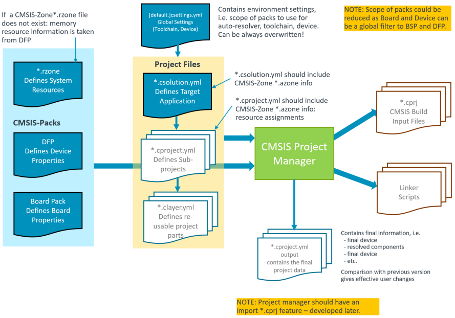
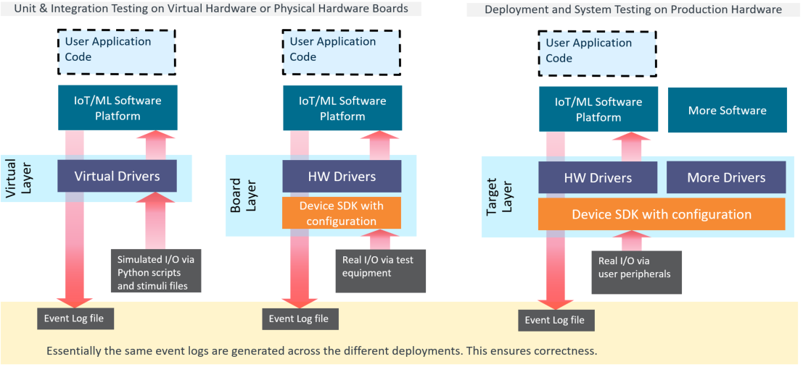
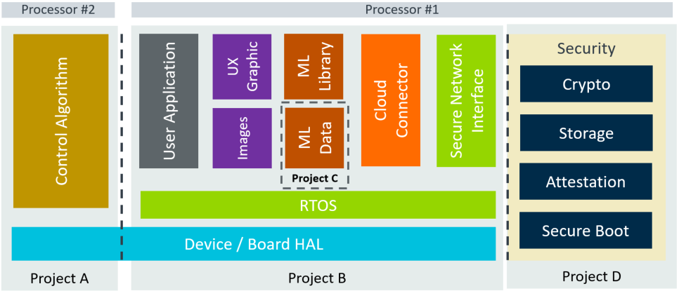

# [DRAFT] Overview



The **[Open-CMSIS-Pack](https://www.open-cmsis-pack.org/index.html) Project Manager** essentially uses **Project Files** and **CMSIS-Packs** to create self-contained
CMSIS-Build input files.

The software packs in *CMSIS-Pack Format* shown on the left side provide device setup (via Device Family Pack (DFP)), board configuration (via Board Support Pack (BSP)), and other reusable software components. It should be investigated if the CMSIS-Zone concept can be integrated into the CMSIS Project Manager.  The CMSIS-Pack files are typically not modified by an application programmer as they are provided by silicon vendors, board manufacturers, or the software industry.

The project setup uses YML Format. A schema file can add validation and "intellisense" during editing.

Project Files     | Order of processing and description
:-----------------|:---------------------------------------------------------------------------------
`*.csettings.yml` | 1. Default setup for project creation. For example, could provide build-types and a default board.
`*.csolution.yml` | 2. Container for related projects or image.
`*.cproject.yml`  | 3. Build description of an project that creates an independent image.
`*.clayer.yml`    | 4. Set of source files along with pre-configured components for reuse in different context.

The **CMSIS Project Manager** uses these *Project Files* along with the software packs in *CMSIS-Pack Format* to generate:
  - `*.cproject.yml` output files that contain the effective setting. When comparing to a previous generated version, this file shows the effective changes done by a user compared to the previous setup.
  - `*.cprj` files for CMSIS-Build where a reproducible build can be deployed to different host computers, for example a CI system.  It lists all packs, software components, etc. to recreate this project.
  - `script files` that are generated by a template engine (CMSIS-Zone concept) to setup linker and other application parameters (to be investigated).


# Project Examples

## Minimal Project Setup

Simple applications require just one self-contained file.

**Simple Project: `Sample.cproject.yml`**
```yml
default:
  device: LPC55S69
  optimize: size
  debug: on

groups:
  - group: My files
    files:
      - file: main.c

  - group: HAL
    files:
      - file: ./hal/driver1.c

components:
  - component: Device:Startup
```

## Project Setup for Multiple Targets and Test Builds

Complex examples require frequently slightly different targets and/or modifications during build, i.e. for testing. The picture below shows a setup during software development that supports:
 - Unit/Integration Testing on simulation models (call Virtual Hardware) where Virtual Drivers implement the interface to simulated I/O.
 - Unit/Integration Testing the same software setup on a physical board where Hardware Drivers implement the interface to physical I/O.
 - System Testing where the software is combined with more software components that compose the final application.

 

As the software may share a large set of common files, provisions are required to manage such projects.  The common way in other IDE's is to add:
  - **target-types** that select a target system. In the example this would be:
    - `Virtual`: for Simulation Models.
    - `Board`: for a physical evaluation board.
    - `Production-HW`: for system integration test and the final product delivery.
  - **build-types** add the flexibility to configure each target build towards a specific testing.  It might be:
    - `Debug`: for a full debug build of the software for interactive debug.
    - `Test`: for a specific timing test using a test interface with code maximal optimization.
    - `Release`: for the final code deployment to the systems.

It is required to generate reproducible builds that can deployed on independent CI/CD test systems. To achieve that, *.the CMSIS Project Manager generates *.cprj output files with the following naming conventions:

`<projectname>.<build-type>[~target-type].cprj` this would generate for example: `Multi.Debug~Production-HW.cprj`

This enables that each target and/or build type can be identified and independently generated which provides the support for test automation. It is however not required to build every possible combination, this should be under user control.

**Flexible Builds: `Multi.cproject.yml`**

```yml
target-types:
  - type: Board
    board: NUCLEO-L552ZE-Q

  - type: Production-HW
    device: STM32L552XY         # specifies device

  - type: Virtual
    board: VHT-Corstone-300     # Virtual Hardware platform (appears as board)
      
build-types:
  - type: Debug
    optimize: debug
    debug: on

  - type: Test
    optimize: max
    debug: on

  - type: Release
    optimize: max
    debug: off

groups:
  - group: My group1
    files:
      - file: file1a.c
      - file: file1b.c
      - file: file1c.c

  - group: My group2
      - file: file2a.c

  - group: Test-Interface
    include: .Test
      - file: fileTa.c

layers:
  - layer: NUCLEO-L552ZE-Q/Board.clayer.yml   # tbd find a better way: i.e. $Board$.clayer.yml
    include: ~Board

  - layer: Production.clayer.yml              # added for target type: Production-HW
    include: ~Production-HW

  - layer: Corstone-300/Board.clayer.yml      # added for target type: VHT-Corstone-300
    include: ~VHT-Corstone-300

components:
  - component: Device:Startup
  - component: CMSIS:RTOS2:FreeRTOS
  - component: ARM::CMSIS:DSP&Source          # not added for build type: Test
    exclude: .Test                           
```

## Project Setup for Related Projects

A solution is the software view of the complete system. It combines projects that can be generated independently and therefore manages related projects. It may be also deployed to different targets during development as described in the previous section under [Project Setup for Multiple Targets and Test Builds](#project-setup-for-multiple-targets-and-test-builds).

The picture below shows a system that is composed of:
  - Project A: that implements a time-critical control algorithm running on a independent processor #2.
  - Project B: which is a diagram of a cloud connected IoT application with Machine Learning (ML) functionality.
  - Project C: that is the data model of the Machine Learning algorithm and separate to allow independent updates.
  - Project D: that implements the device security (for example with TF-M that runs with TrustZone in secure mode).

In addition such systems may have a boot-loader that can be also viewed as another independent project.



To manage the complexity of such related a projects, the `*.csolution.yml` file is introduced. At this level the `target-types` and `build-types` may be managed, so that a common set is available across the system. However it should be also possible to add project specific `build-types` at project level.  (tdb: `target-types` might be only possible at solution level).

**Related Projects `iot-product.csolution.yml`**

```yml
target-types:
  - type: Board
    board: NUCLEO-L552ZE-Q

  - type: Production-HW
    device: STM32U5X          # specifies device
      
build-types:
  - type: Debug
    optimize: debug
    debug: on

  - type: Test
    optimize: max
    debug: on
    
solution:
  - project: /security/TFM.cproject.yml
    type: .Release
  - project: /application/MQTT_AWS.cproject.yml
  - project: /bootloader/Bootloader.cproject.yml
    exclude: ~Virtual
```

# YML Syntax

## Overall Structure

Keyword          | Allowed for following files..                  | Description
:----------------|:-----------------------------------------------|:------------------------------------
`default:`       | `[defaults].csettings.yml`, `*.csolution.yml`  | Start of the default section with [General Properties](./Overview.md#general-properties)
`target-types:`  | `*.csolution.yml`                              | Start of the [Target type declaration list](./Overview.md#target-and-build-types) that allow to switch between [different targets](./Overview.md#project-setup-for-multiple-targets-and-test-builds).
`build-types:`   | `[defaults].csettings.yml`, `*.csolution.yml`  | Start of the [Build type declaration list](./Overview.md#target-and-build-types) that allow to switch between different build settings such as: Release, Debug, Test.
`solution:`      | `*.csolution.yml`                              | Start of the [Collection of related Projects](./Overview.md#solution-collection-of-related-projects) along with build order.
`project:`       | `*.cproject.yml`                               | Start of a Project along with properties - tbd; used in `*.cproject.yml`.
`layer:`         | `*.clayer.yml`                                 | Start of a software layer definition that contains pre-configured software components along with source files.
`groups:`        | `*.cproject.yml`, `*.clayer.yml`               | Start of a list that adds [source groups and files](./Overview.md#groups-and-files) to a project or layer.
`layers:`        | `*.cproject.yml`                               | Start of a list that adds software layers to a project.
`components:`    | `*.cproject.yml`, `*.clayer.yml`               | Start of a list that adds software components to a project or layer.

**Note:** For stand-alone `*.cproject.yml` files that do not required a `*.csolution.yml` it is possible to use the *Keywords* that are allowed at `*.csolution.yml` file level.

## General Properties

The keywords below can be used at various levels in this file types: `[defaults].csettings.yml`, `*.csolution.yml`, and `*.cproject.yml`. 

Keyword         | Description
:---------------|:------------------------------------
`compiler:`     | Selection of the toolchain used for the project, i.e. `GCC`, `AC6`, `IAR`, optional with version, i.e AC6@6.16-LTS
`device:`       | Unique device name, optionally with vendor. Format: `[<vendor>::]<device>`. Examples: `NXP::LPC55S69` or `STM32L552RCT6`. When `device:` is null the device is derived from the `board:` device setting, but `device:` overrules the `board:` device setting. Boards frequently use a superset device and with this method it is possible to use a board layer during development, but target a smaller device variant.
`board:`        | Unique board name, optionally with vendor. Format: `[<vendor>::]<board>`. Examples: `NXP::LPCxpresso55S69` or `NUCLEO-L552ZE-Q`.
`optimize:`     | Generic optimize levels (max, size, speed, debug), mapped to the toolchain by CMSIS-Build.
`debug:`        | Generic control for the generation of debug information (on, off), mapped to the toolchain by CMSIS-Build.
`warnings:`     | Control warnings (could be: no, all, Misra, AC5-like), mapped to the toolchain by CMSIS-Build.
`defines:`      | [Symbol and path settings](#defines) for the code generation tools that are passed via the command line and result in #define.
`misc:`         | [Miscellaneous literal tool-specific controls](#misc) that are passed directly to the tools depending on the file type.

**Notes:**
 - `defines:` and `misc:` are additive. All other keywords overwrite previous settings.
 
## Target and Build Types

The section [Project setup for multiple targets and test builds](./Overview.md#project-setup-for-multiple-targets-and-test-builds) describes the concept of  `target-types` and `build-types`.  These *types* can be defined in the following files in the following order:
 1.  `default.csettings.yml`  where it defines global *types*, such as *Debug* and *Release* build.
 2. `*.csolution.yml` where it specifies the build and target *types* of the complete system.
 3. `*.cproject.yml` where it may add specific *types* for an project (tbd are target types allowed when part of a solution?)

The *`target-type`* and *`build-type`* definitions are additive, but an attempt to redefine an already existing type results in an error.

The settings of the *`target-type`* are processed first; then the settings of the *`build-type`* that potentially overwrite the *`target-type`* settings.

YML structure:
```yml
target-types:          # Start a list of target type declarations
  - type:              # name of the target type (required)
    board:             # board specification (optional)
    device:            # device specification (optional)         
    compiler:          # toolchain specification (optional) 
    optimize:          # optimize level for code generation (optional)
    debug:             # generation of debug information (optional)
    defines:           # symbol and path settings for code generation (optional)
    misc:              # Literal tool-specific controls

build-types:           # Start a list of build type declarations
  - type:              # name of the build type (required)
    compiler:          # toolchain specification (optional) 
    optimize:          # optimize level for code generation (optional)
    debug:             # generation of debug information (optional)
    defines:           # symbol and path settings for code generation (optional)
    misc:              # Literal tool-specific controls
```

**Example:**
```yml
target-types:
  - type: Board
    board: NUCLEO-L552ZE-Q

  - type: Production-HW
    device: STM32U5X          # specifies device
      
build-types:
  - type: Debug
    optimize: debug
    debug: on

  - type: Test
    optimize: max
    debug: on
```

## Include or Exclude

Depending on a *`target-type`* or *`build-type`* selection it is possible to include or exclude *items* in the build process.

Keyword      | Description
:------------|:------------------------------------
`include:`   | A *type list* that adds an *item* for a specific target or build *type* or a list of *types*.
`exclude:`   | A *type list* that removes an *item* for a specific target or build *type* or a list of *types*.

It is possible to specify only a `<build-type>`, only a `<target-type>` or a combination of `<build-type>` and `<target-type>`. It is also possible to provide a list of *build* and *target* types. The *type list syntax* for `include:` or `exclude:` is:

`[.<build-type>][~<target-type>] [, [.<build-type>]~[<target-type>]] [, ...]`

**Examples:**
```yml
include:  .Test                            # add item for build-type: Test (any target-type)
exclude:  ~Virtual                         # remove item for target-type: Virtual (any build-type)
exclude:  .Release~Virtual                 # remove item for build-type: Release with target-type: Virtual
include:  .Debug, .Release~Production-HW   # add for build-type: Debug and build-type: Release / target-type: Production-HW
```

The keyword `include:` or `exclude:` can be applied to the following list keywords:

Keyword      | Description
:------------|:------------------------------------
`project:`   | At `solution:` level it is possible to control inclusion of project.
`group:`     | At `group:` level it is possible to control inclusion of a file group.
`file:`      | At `file:` level it is possible to control inclusion of a file.
`layer:`     | At `layer:` level it is possible to control inclusion of a software layer.
`component:` | At `component:` level it is possible to control inclusion of a software component.


## Groups and Files

YML structure:
```yml
groups:                # Start a list of groups
  - group:             # name of the group
    include:           # include group for a list of *build* and *target* types.
    exclude:           # exclude group for a list of *build* and *target* types.
    optimize:          # optimize level for code generation (optional)
    debug:             # generation of debug information (optional)
    defines:           # symbol and path settings for code generation (optional)
    misc:              # Literal tool-specific controls
    groups:            # Start a nested list of groups
      - group:         # name of the group
         :
    files:             # Start a nested list of files
      - file:          # file name along with path
        include:       # include group for a list of *build* and *target* types.
        exclude:       # exclude group for a list of *build* and *target* types.
        optimize:      # optimize level for code generation (optional)
        debug:         # generation of debug information (optional)
        defines:       # symbol and path settings for code generation (optional).
        misc:          # Literal tool-specific controls
```

**Example:**

Add source files to a project or a software layer.  Used in `*.cproject.yml` and `*.clayer.yml` files.

```yml
groups:
  - group:  "Main File Group"
    exclude: .Release~Virtual, .Test-DSP~Virtual, ~Board
    files: 
      - file: file1a.c
      - file: file1b.c
        defines:
          - define: a=1
          - undefine: b
        optimize: size

  - group: "Other File Group"
    files:
      - file: file2a.c
        include: ~Virtual
        defines: 
          - define: test=2
      - file: file2a.c
        exclude: ~Virtual
      - file: file2b.c

  - group: "Nested Group"
    groups:
      - group: Subgroup1
        files:
          - file: file-sub1-1.c
          - file: file-sub1-2.c
      - group: Subgroup2
        files:
          - file: file-sub2-1.c
          - file: file-sub2-2.c
```

## Layers 

Add a software layer to a project.  Used in `*.cproject.yml` files.

YML structure:
```yml
layers:                # Start a list of layers
  - layer:             # path to the `*.clayer.yml` file that defines the layer (required).
    include:           # include layer for a list of *build* and *target* types (optional).
    exclude:           # exclude layer for a list of *build* and *target* types (optional).
    optimize:          # optimize level for code generation (optional).
    debug:             # generation of debug information (optional).
    defines:           # symbol and path settings for code generation (optional).
    misc:              # Literal tool-specific controls.
```

## Components

Add software components to a project or a software layer.  Used in `*.cproject.yml` and `*.clayer.yml` files.

YML structure:
```yml
components:            # Start a list of layers
  - component:         # name of the software component (see below).
    include:           # include layer for a list of *build* and *target* types (optional).
    exclude:           # exclude layer for a list of *build* and *target* types (optional).
    optimize:          # optimize level for code generation (optional).
    debug:             # generation of debug information (optional).
    defines:           # symbol and path settings for code generation (optional).
    misc:              # Literal tool-specific controls.
```

The proposed component name syntax is:
`[Cvendor::] Cclass [&Cbundle] :Cgroup [:Csub] [&Cvariant] [@[>=]Cversion]` 

```
`Cvendor`  is the name of the component vendor defined in <components> element of the software pack (optional).
`Cclass`   is the component class name  defined in <components> element of the software pack (required)
`Cbundle`  is the bundle name of component class defined in <bundle> element of the software pack (optional).
`Cgroup`   is the component group name  defined in <components> element of the software pack (required).
`Csub`     is the component sub-group name  defined in <components> element of the software pack (optional).
`Cvariant` is the component sub-group name  defined in <components> element of the software pack (optional).
`Cversion` is the version number of the component, with @1.2.3 that must exactly match, or @>=1.2.3 that allows any version higher or equal.
```

## Defines

Add or remove include paths and/or symbol #define statements at the command line of the development tools.

YML structure:
```yml
defines:                   # Start a list of define and undefine statements
  - define: name[=value]   # add a symbol with optional value.
  - undefine: name         # remove a symbol.
  - path_remove: {* ! include-path}  # remove all include paths or a specific path;
  - path: include-path     # add a include path.
```

## Misc

Add tool specific controls as literal strings that are directly passed to the individual tools.

YML structure:
```yml
misc:                      # Start a list of literal control strings that are directly passed to the tools.
  - compiler:              # select the toolchain that the literal control string applies too (AC6, IAR, GCC).
    C: string              # applies to *.c files only.
    CPP: string            # applies to *.cpp files only.
    C*: string             # applies to *.c and *.cpp files.
    ASM: string            # applies to assembler source files
    Link: string           # applies to the linker
    Lib: string            # applies to the library manager or archiver
```


## Solution: Collection of related Projects

The section [Project setup for related projects](#project-setup-for-related-projects) describes the collection of related projects.  The file `*.csolution.yml` describes the relationship of this projects.  This file may also define [Target and Build Types](#target-and-build-types) before the section `solution:`.

The YML structure of the section `solution:` is:

```yml
solution:                  # Start a list of projects.
  - project:               # path to the project file (required).
    include:               # include project for a list of *build* and *target* types (optional).
    exclude:               # exclude project for a list of *build* and *target* types (optional).
    compiler:              # specify a specific compiler
    optimize:              # optimize level for code generation (optional)
    debug:                 # generation of debug information (optional)
    defines:               # symbol and path settings for code generation (optional).
    misc:                  # Literal tool-specific controls
```

## Project Definition

Start of a project definition in a `*.cproject.yml` file (optional section)

The YML structure of the section `project:` is:
```yml
project:                     # do we need this section at all, perhaps for platform?
  description:
  processor:                 # specify processor  ??
  ....
```  


## Processor

The `processor:` keyword defines:
  - for multi-processor systems: the core that is used to execute the program part.
  - attributes such as trustzone and fpu register usage.

```yml
 processor:                # processor specific settings
    name: CM4              # processor name as defined it the DFP with `<processor Pname= >` attribute
    trustzone: secure      # TrustZone mode: secure | non-secure | off
    fpu: off               # control usage of FPU registers (S-Registers that are used for Helium and FPU hardware): on | off
```

todo - where can `processor:` used?


# Pre/Post build steps

Tbd: potentially map to CMake add_custom_command.

```yml
- execute: description      # execute an external command with description
  os: Linux                 # executed on which operating systems (if omitted on it is OS independent)
  run:                      # tool name that should be executed, optionally with path to the tool
  args:                     # tool arguments
  stop:                     # stop on exit code
```

Potential usage before/after build

```yml
solution:
  - execute: Generate Keys for TF-M
    os: Linux
    run: KeyGen.exe
  - project: /security/TFM.cproject.yml
  - project: /application/MQTT_AWS.cproject.yml
  - execute: Copy output files
    run: cp *.out .\output
```

Potential usage during build steps
```yml
groups:
  - group:  "Main File Group"
    files: 
      - execute: Generate file1a.c
        run: xyz.exe
        ....
      - file: file1a.c
```


## Layer Definition

Start of a layer definition in a `*.clayer.yml` file.

Todo: work on this

The YML structure of the section `layer:` is:
```yml
layer:
  description:
  ....
```  


# CMSIS-Zone Integration
Todo: