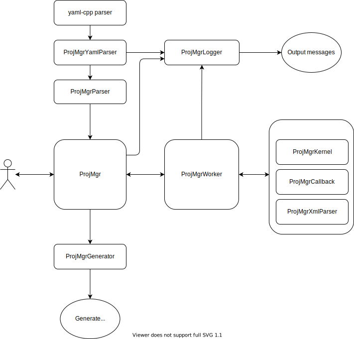
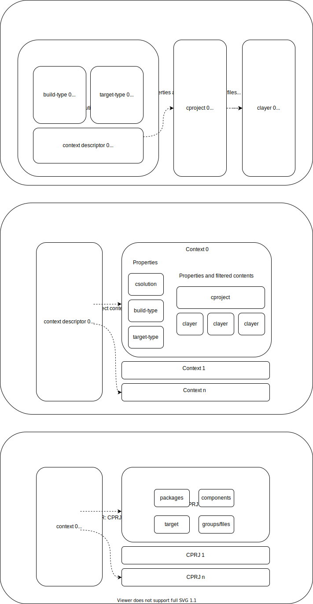
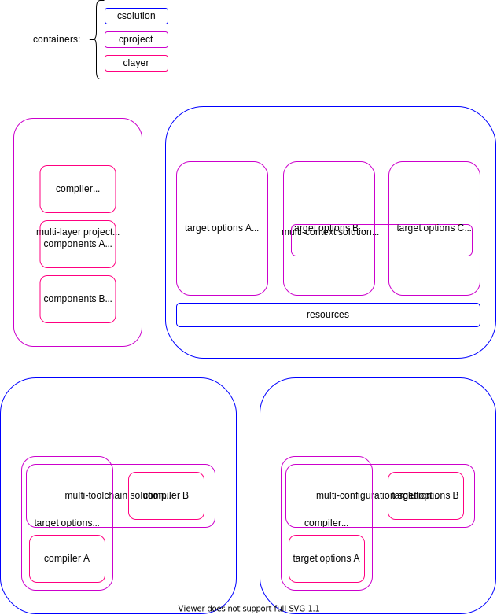

# CMSIS Project Manager - System Architecture [Draft]

## Table of Contents

[Introduction](#introduction)

[Classes Overview](#classes-overview)

[Data Flow](#data-flow)

[Layers Combinations](#layers-combinations)

## Introduction

The CMSIS Project Manager is a C++ utility provided as binary and as library with interfaces for the most common programming languages and platforms.
It leverages open source C++ libraries available in the [Open-CMSIS-Pack devtools](https://github.com/Open-CMSIS-Pack/devtools) repository.
The tool assists the embedded software developer in the project creation by exposing available features
from installed CMSIS Packs such as devices and components, allowing to search them using free text filters in addition to standard PDSC attributes. It also validates input files that are written in a
human friendly YAML format following pre-defined schemas and it checks the correctness of components selection and unresolved missing dependencies.

## Classes Overview

The following diagram illustrates the relations among the project's C++ classes:

## Data Flow

The data is parsed, processed and generated respectively by the Parser, Worker and Generator classes. The data structures inside these classes are shown below: 

## Layers Combinations

YAML files can be associated in different ways. In the
following diagrams some common combinations are illustrated.
Several other combinations are possible. 

  

### Multi-layer project
Everything is described in layers, there is no info at solution and
project level. This approach can be used to easily interchange parts
of project such as supported board, middleware or application.

### Multi-context solution
A bootloader, secure and non-secure projects are part of this
solution, as well as resource files for producing memory and
peripheral configuration via templates processing. Output
artifacts in a project can be labeled for easier integration
as input objects in another project.

### Multi-toolchain solution
In this solution the common parts are described at project level,
while the compiler selection is provided in layers. Any other
toolchain specific project item could be placed in a layer.

### Multi-configuration solution
In this case the target options are separated in layers, for example
Debug/Release configurations would have different compiler options
for optimization and for inclusion of debug information in the image. As in the previous example, any other specific configuration project item could be shifted to the layer level.
